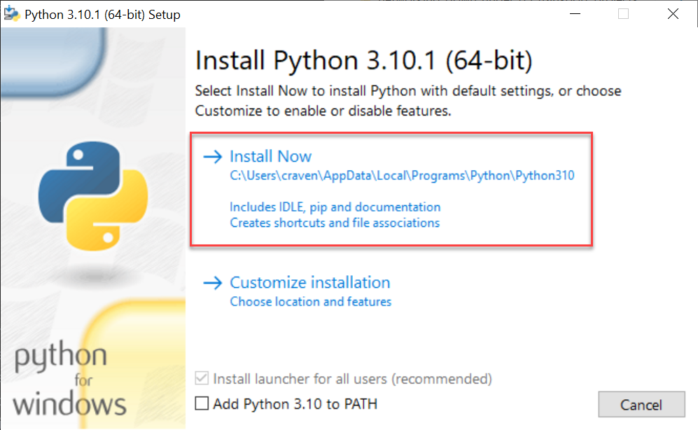
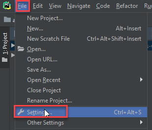
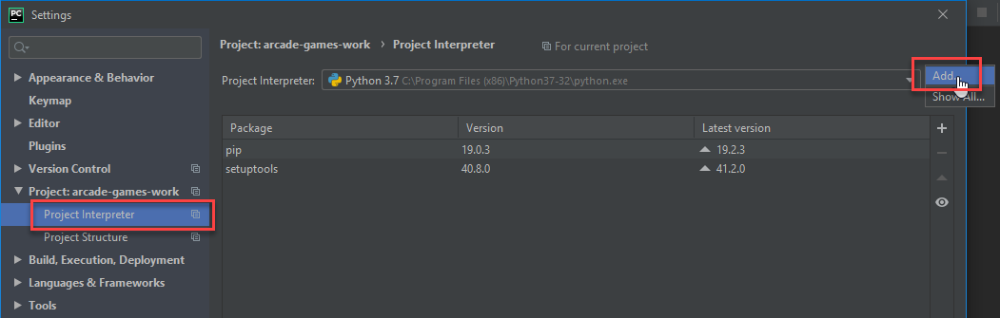
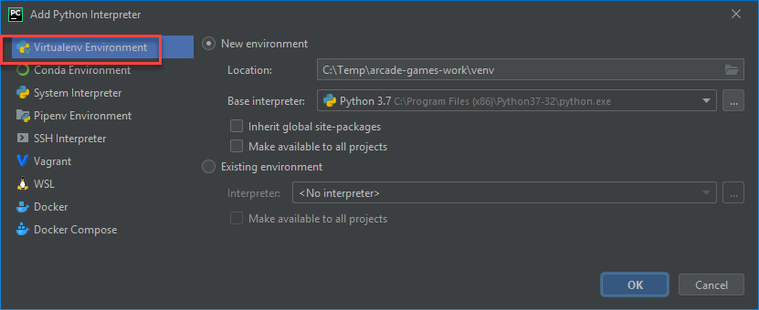
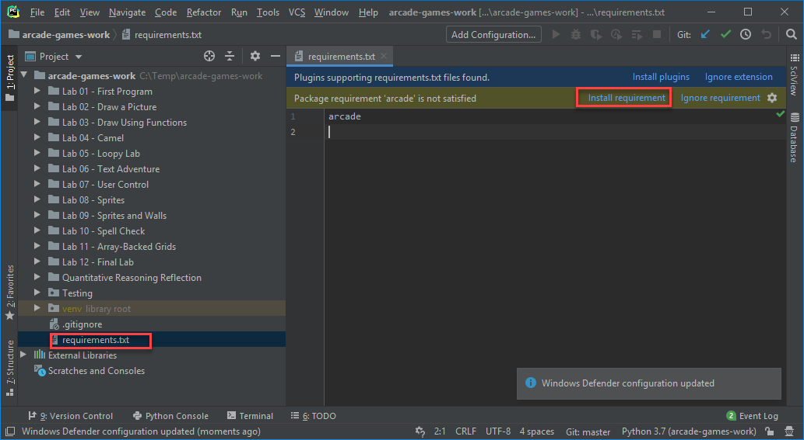

Windows
=======

To develop with the Arcade library, we need to install Python, then install
Arcade.

Step 1: Install Python
----------------------

Install Python from the official Python website:

https://www.python.org/downloads/

Run the downloader. From there, you can just click 'install'. If you aren't using an IDE like
PyCharm or Visual Studio, you might want to also mark the checkbox and add Python to the path.

Once installed, you can just close the dialog. There's no need to increase the path length, although it
doesn't hurt anything if you do.

Step 2: Install The Arcade Library
----------------------------------

If you install Arcade as a pre-built library, there are two options on
how to do it. The best way is to use a "virtual environment." This is
a collection of Python libraries that only apply to your particular project.
You don't have to worry about libraries for other projects conflicting
with your project. You also don't need "administrator" level privileges to
install libraries. Instructions for doing this with the PyCharm IDE are below:

.. _install-pycharm:

Install Arcade with PyCharm and a Virtual Environment
^^^^^^^^^^^^^^^^^^^^^^^^^^^^^^^^^^^^^^^^^^^^^^^^^^^^^

If you are using `PyCharm <https://www.jetbrains.com/pycharm/>`_,
(the community edition works great and is free)
setting
up a virtual environment is easy. Once you've
created your project, open up the settings:

Select project interpreter:

Create a new virtual environment. Make sure the venv is inside your
project folder.

Now you can install libraries. You can search for "Arcade" and install it.

Another way to do it is create a file called ``requirements.txt`` and just type ``arcade``
in that file. PyCharm will automatically ask any libraries in that file. It is a common
way to list dependencies for Python projects.

Install Arcade using the command line interface
^^^^^^^^^^^^^^^^^^^^^^^^^^^^^^^^^^^^^^^^^^^^^^^

If you prefer to use the command line interface (CLI),
then you can install Arcade directly using pip:

``pip3 install arcade``

If you happen to be using pipenv, then the appropriate command is:

``python3 -m pipenv install arcade``
