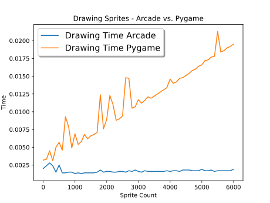
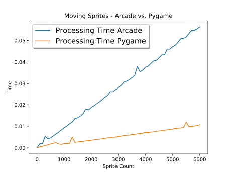
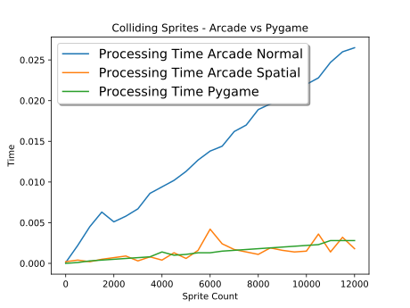

:orphan:

.. _arcade_vs_pygame_performance:

Arcade Performance Information
==============================

How does the Arcade library perform? Here are some benchmarks, and comparisons
to PyGame 1.9.4, another very popular 2D Python library.

.. _drawing_stationary_performance:

Drawing Stationary Sprites
--------------------------

Drawing the sprites contained in an Arcade :py:class:`arcade.sprite_list.SpriteList` class is a very fast
operation. You can
put almost as many sprites into a SpriteList as you want (I've had over 400,000)
and still keep 60 fps.

This is great for huge maps, as you can draw a lot of tiles before worrying about
optimization.

Pygame takes a lot longer to draw sprites, but it still can handle thousands of them
before you notice a slowdown. For many applications it is still enough.

    Figure 1: Drawing Stress Test

Figure 1 created was created by timing the **drawing** of:

*  `stress_test_draw_moving_arcade.py <https://github.com/pvcraven/arcade/blob/master/arcade/examples/perf_test/stress_test_draw_moving_arcade.py>`_ - For Arcade timings
*  `stress_test_draw_moving_pygame.py <https://github.com/pvcraven/arcade/blob/master/arcade/examples/perf_test/stress_test_draw_moving_pygame.py>`_ - For Pygame timings
*  `stress_test_charts.py <https://github.com/pvcraven/arcade/blob/master/arcade/examples/perf_test/stress_test_charts.py>`_ - To generate the graphs

Moving Sprites
--------------

The faster drawing speed of Arcade comes at a cost.
It takes longer to move sprites in Arcade than Pygame.

Why? Arcade not only stores the sprite location in the Python object, it also
stores the sprite location in a numpy data array managed by the SpriteList. This
numpy array gets passed to the graphics card. Changing a numpy value in the
array is much slower than changing a native Python value.

If a game has a large map made out of mostly unmoving tiles, then the faster
drawing speed is great.

Hopefully we will soon find a way to improve moving sprite speed. Using ctypes
might be faster, or some additional native code.

    Figure 2: Moving Sprite Stress Test

Figure 2 created was timing the **movement** of:

*  `stress_test_draw_moving_arcade.py <https://github.com/pvcraven/arcade/blob/master/arcade/examples/perf_test/stress_test_draw_moving_arcade.py>`_ - For Arcade timings
*  `stress_test_draw_moving_pygame.py <https://github.com/pvcraven/arcade/blob/master/arcade/examples/perf_test/stress_test_draw_moving_pygame.py>`_ - For Pygame timings
*  `stress_test_charts.py <https://github.com/pvcraven/arcade/blob/master/arcade/examples/perf_test/stress_test_charts.py>`_ - To generate the graphs

Collision Detection
-------------------

Pygame has fast collision detection as the rects are managed in C, and
that part of Pygame compiles natively to the computer.
The trade-off for not being pure Python is very fast collision detection,
even if it is an O(n) operation.

Arcade is much slower, as you can see from the blue line below.

The way to speed collision detection in Arcade to use turn on *spatial hashing*.
This can be done by including
``use_spatial_hash=True`` as a parameter when creating a SpriteList.
Spatial hashing allows us to group the sprites so that we only check sprites that
are nearby. For sprites that are spread out (like a map) we can do detection
closer to O(1).

Unfortunately, it take longer to move a sprite in a SpriteList with spatial
hashing enabled because the hash maps have to be updated. For applications like
map walls, wanter, etc. it works great since their location rarely changes.

You can specify points of a polygon (and even draw them using the TileMap editor)
for collision detection. Arcade first checks the spatial hash, then a rough
calculation based on sprite radius, then by the containing rect, and finally
checks the polygon with the earclip algorithm.

    Figure 3: Stress test for collisions

Figure 3 created was created by:

*  `stress_test_collision_arcade.py <https://github.com/pvcraven/arcade/blob/master/arcade/examples/perf_test/stress_test_collision_arcade.py>`_ - For Arcade timings
*  `stress_test_collision_pygame.py <https://github.com/pvcraven/arcade/blob/master/arcade/examples/perf_test/stress_test_collision_pygame.py>`_ - For Pygame timings
*  `stress_test_charts.py <https://github.com/pvcraven/arcade/blob/master/arcade/examples/perf_test/stress_test_charts.py>`_ - To generate the graphs

