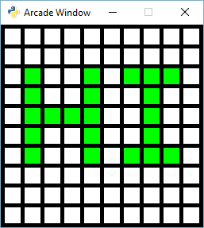

:orphan:

.. _array_backed_grid_sprites_2:

Grid Using Sprites v2
=====================

You may also want to look at:

* :ref:`array_backed_grid` - very slow but simple, uses drawing commands
* :ref:`array_backed_grid_buffered` - slow and uses buffered shapes
* :ref:`array_backed_grid_sprites_1` - super-fast and uses sprites. Resyncs to number grid in one function call
* :ref:`array_backed_grid_sprites_2` - (This program) super-fast and uses sprites. Keeps a second 2D grid of sprites to match 2D grid of numbers

.. literalinclude:: ../../arcade/examples/array_backed_grid_sprites_2.py
    :caption: array_backed_grid_sprites.py
    :linenos:
