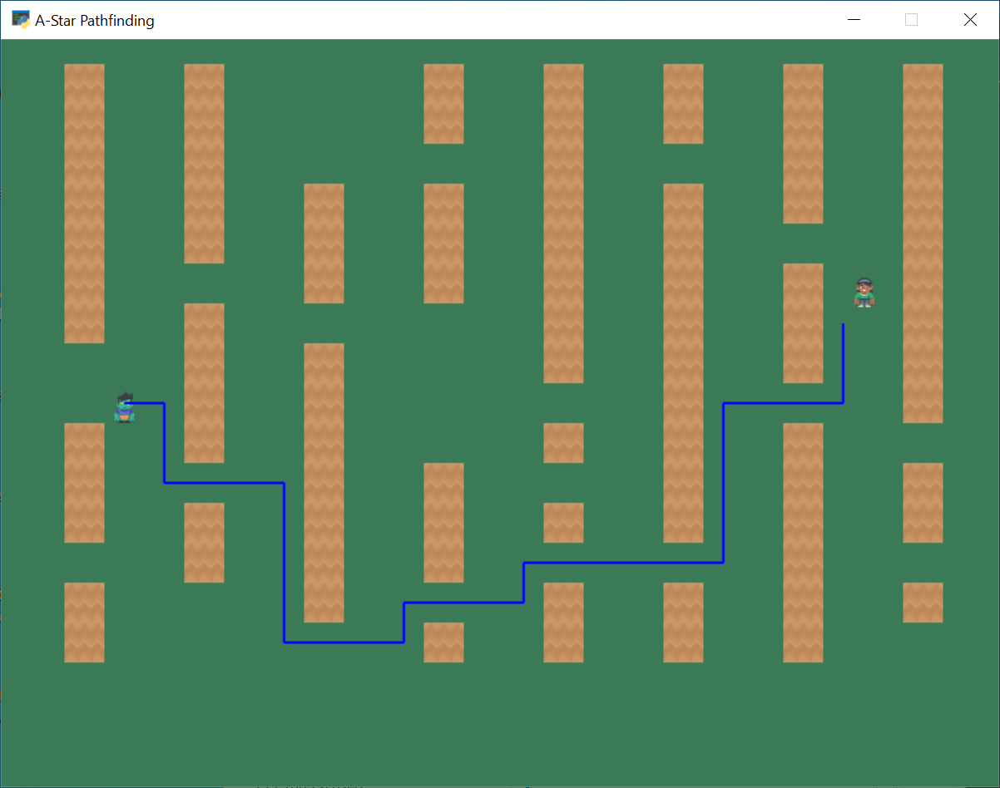

:orphan:

.. _astar_pathfinding:

A-Star Path Finding
===================

Explanation
-----------

A-star path finding can be used to find a way to go from one spot to another around barriers.
This example just draws the path, based on the coordinates returned. If you want the enemy to
follow that path, see :ref:`follow_path`.

Source
------
.. literalinclude:: ../../arcade/examples/astar_pathfinding.py
    :caption: astar_pathfinding.py
    :linenos:
