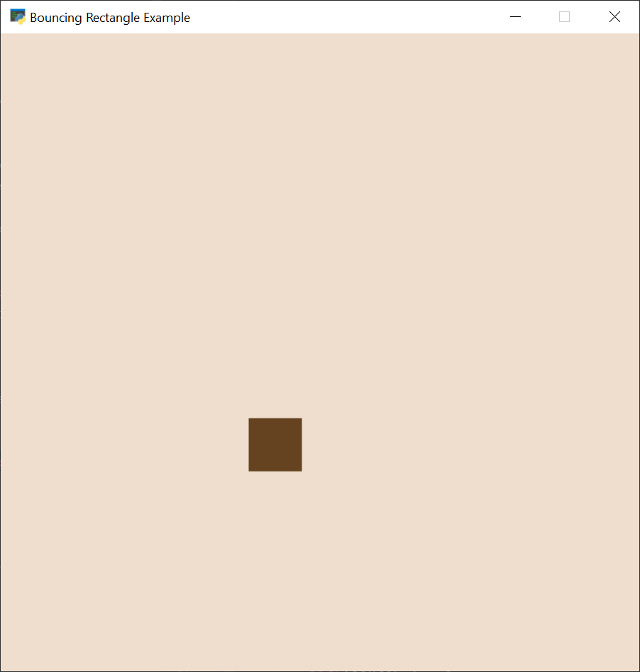

:orphan:

.. _bouncing_rectangle:

Bouncing Rectangle
==================

This shows how to animate an item you can draw using the drawing primitives.

.. literalinclude:: ../../arcade/examples/bouncing_rectangle.py
    :caption: bouncing_rectangle.py
    :linenos:
