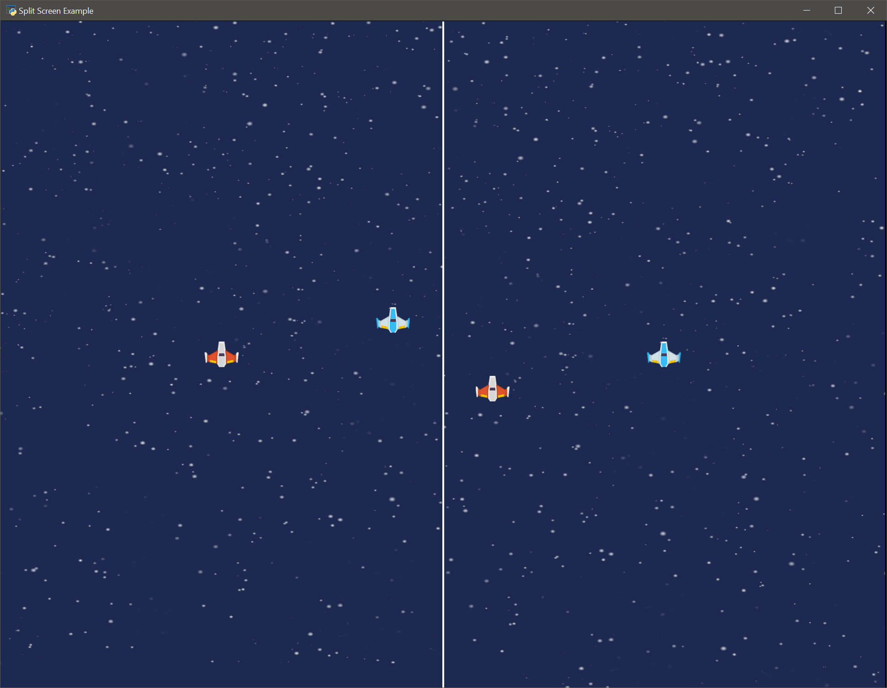

:orphan:

.. _camera2d_splitscreen:

Two Player Split Screen
=======================================

A game can create a split screen for each player using two :class:`arcade.Camera2D`
and each camera's viewport.

After we call :function:`arcade.Camera2D.use` on each :class:`arcade.Camera2D` instance
we then draw the sprites we want to render for that camera.

See also :ref:`sprite_move_scrolling_box`.

.. literalinclude:: ../../arcade/examples/camera2d_splitscreen.py
    :caption: camera2d_splitscreen.py
    :linenos:
    :emphasize-lines: 145-149, 206-228, 251-253, 256-260, 263-292
