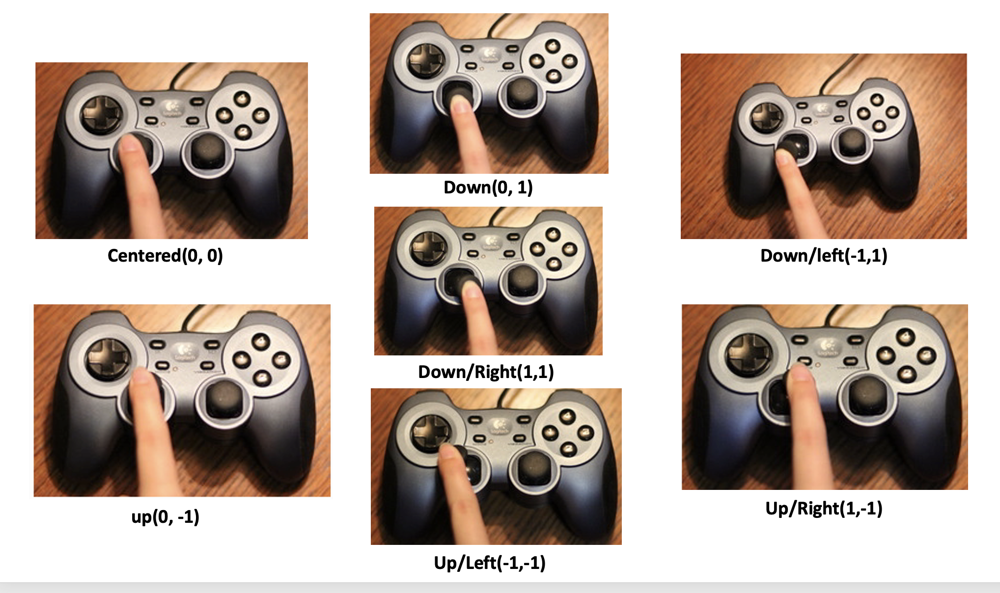

:orphan:

.. _controller:

How To Get Connected Controllers
================================
We can get a list of connected controllers by using :code:`arcade.get_controllers()`.

.. code-block:: python

      controllers = arcade.get_controllers()
      if controllers:
          self.controller = controllers[0]
          self.controller.open()
      else:
          print("There are no controllers.")
          self.controller = None
          
To simplify hot-plugging of Controllers, `the ControllerManager` class is available.
To use a ControllerManager, first create an instance:

.. code-block:: python

      manager = arcade.input.ControllerManager()
      
To handle controller connections, attach handlers to the following methods:

.. code-block:: python

      @manager.event
      def on_connect(controller):
          print(f"Connected:  {controller}")

      @manager.event
      def on_disconnect(controller):
          print(f"Disconnected:  {controller}")

Controllers Values
==================
The controllers values can be obtained by using :code:`self.controller.x` and :code:`self.controller.y`. This can be used to update the current positon of an object.

.. code-block:: python

    def update(self, delta_time):
          # Update the position according to the game controller
          if self.controller:
              print(self.controller.leftx, self.controller.lefty)

              self.object.change_leftx = self.controller.leftx
              self.object.change_lefty = -self.controller.lefty

How To Use Buttons
===================

Controllers have a strictly defined set of inputs. These inputs are the following:

+---------------+-------------------------------------------------------+
| Button/Action | Notes                                                 |
+===============+=======================================================+
| A             | The “south” face button                               |
+---------------+-------------------------------------------------------+
| B             | The “east” face button                                |
+---------------+-------------------------------------------------------+
| X             | The “west” face button                                |
+---------------+-------------------------------------------------------+
| Y             | The “north” face button                               |
+---------------+-------------------------------------------------------+
| LeftShoulder  |                                                       |
+---------------+-------------------------------------------------------+
| RightShoulder |                                                       |
+---------------+-------------------------------------------------------+
| Start         | Called “options” on some controllers                  |
+---------------+-------------------------------------------------------+
| Back          | Called “select” or “share” on some controllers        |
+---------------+-------------------------------------------------------+
| Guide         | Usually in the center, with a company logo            |
+---------------+-------------------------------------------------------+
| LeftStick     | Pressing in on the left analog stick                  |
+---------------+-------------------------------------------------------+
| RightStick    | Pressing in on the right analog stick                 |
+---------------+-------------------------------------------------------+
| DPLeft        |                                                       |
+---------------+-------------------------------------------------------+
| DPRight       |                                                       |
+---------------+-------------------------------------------------------+
| DPUp          |                                                       |
+---------------+-------------------------------------------------------+
| DPDown        |                                                       |
+---------------+-------------------------------------------------------+

An event is dispatched when any of the values of the buttons are changed. These events can be handle like this:

.. code-block:: python

      @controller.event
      def on_button_press(controller, button_name):
          if button_name == 'a':
              # start firing
          elif button_name == 'b':
              # do something else
      @controller.event
      def on_button_press(controller, button_name):
          if button_name == 'a':
              # start firing
          elif button_name == 'b':
              # do something else
 

The (-1.0 to 1.0) Values On Controller
======================================
* The values will be between -1 and +1, with 0 being a centered joystick.
* The x-axis numbers will be negative if the stick goes left, positive for right.
* The y-axis numbers will be opposite of what you might expect. Negative for up, positive for down.

.. list-table:: controller
   :widths: 25 25 50
   :header-rows: 1
   
   * - Left & Right
     - Centered
     - Up & Down
   * -   (-1, 1)
     -    0
     -   (-1, 1)

The controller Movements
^^^^^^^^^^^^^^^^^^^^^^^^^^^^^^^^

     
Deadzone
========
A centered controller might have a value not at 0, but at 0.0001 or some small number. This will make for a small “drift” on a person’s character. We often counteract this by having a “dead zone” where if the number is below a certain value, we just assume it is zero to eliminate the drift.

How we take care of the dead zone:

After 

.. code-block:: console

      import arcade

add the following line at the top of the code to define a constant :code:`DEAD_ZONE` :

.. code-block:: console

    DEAD_ZONE = 0.02

and adding the following code to the :code:`update`:

.. code-block:: python

    def update(self, delta_time):

            # Update the position according to the game controller
            if self.controller:

                # Set a "dead zone" to prevent drive from a centered controller
                if abs(self.controller.x) < DEAD_ZONE:
                    self.object.change_x = 0
                else:
                    self.object.change_x = self.controller.x * MOVEMENT_SPEED

                # Set a "dead zone" to prevent drive from a centered controller
                if abs(self.controller.y) < DEAD_ZONE:
                    self.object.change_y = 0
                else:
                    self.object.change_y = -self.controller.y * MOVEMENT_SPEED

Different Types Of Controllers
==============================             
Some types of controllers:

1. Joystick hats: the directional pads on game controller. It allows you to move in eight directions (up, down, left, right and the diagonals).

2. Xbox controller: This is a popular gamepad used with Xbox consoles and Windows PCs. It has two thumbsticks, a directional pad, and various buttons.

3. PlayStation controller: This is the gamepad used with PlayStation consoles. It has two thumbsticks, a directional pad, and various buttons.

4. Nintendo Switch controller: This is the gamepad used with Nintendo Switch consoles. It has two detachable Joy-Con controllers, each with a joystick, buttons, and motion sensors.

