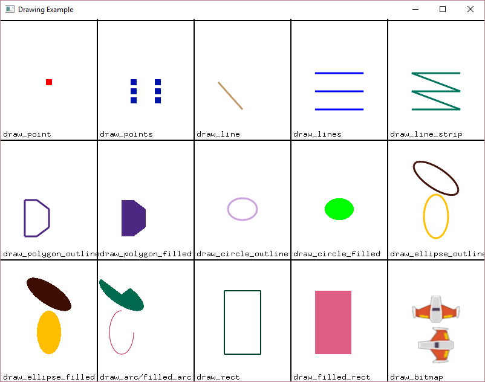

:orphan:

.. _drawing_primitives:

Drawing Primitives
==================

This example shows how to use the drawing commands. It is a good place
to start for new programmers because they do not need to know how to define
functions or classes before drawing images.

See :ref:`happy_face` for an example of drawing primitives in action.
To keep things simple, this example does not have many of the things commonly shown in the :ref:`starting_template`.

.. note::

   The method of drawing shown here is simple, but it is very slow. Modern graphics typically draw in a 'batch',
   a technique not shown in this example.

To look up all the available commands search for the Drawing Primitives in the :ref:`quick_index`.

.. literalinclude:: ../../arcade/examples/drawing_primitives.py
    :caption: drawing_primitives.py
    :linenos:
