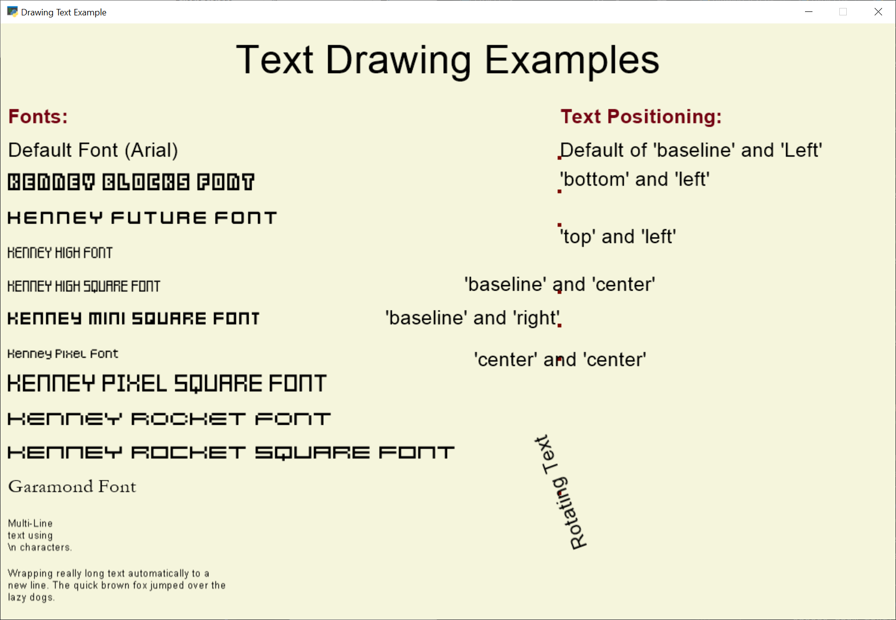

:orphan:

.. _drawing_text:

Slow but Easy Text Drawing
==========================

This example shows an easy but very slow way to draw text.

Its main benefit is ease of use. More complicated approaches
with :py:class:`arcade.Text` objects can run thousands of times
faster.

* See :ref:`drawing_text_objects` for a medium-performance approach
* See :ref:`drawing_text_objects_batch` if you want the best performance
  possible

.. literalinclude:: ../../arcade/examples/drawing_text.py
    :caption: drawing_text.py
    :linenos:
