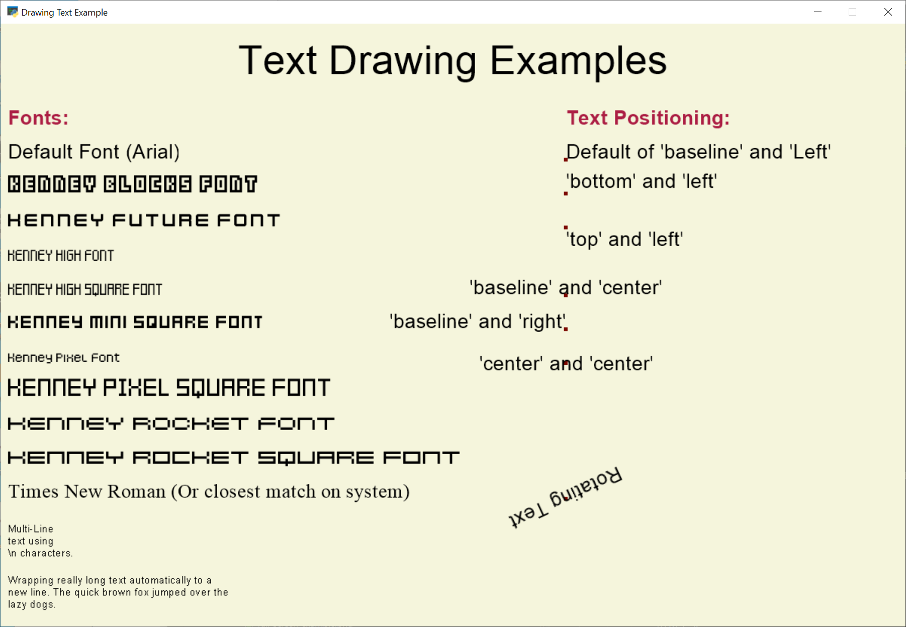

:orphan:

.. _drawing_text_objects:

Better Text Drawing with Text Objects
=====================================

This example shows how to draw text using "text objects." It can be many
times faster than using :py:func:`arcade.draw_text`.

* If you want to be as efficient as possible, see :ref:`drawing_text_objects_batch`.
* If you are looking for something simpler, see :ref:`drawing_text`.

.. literalinclude:: ../../arcade/examples/drawing_text_objects.py
    :caption: drawing_text_objects.py
    :linenos:
