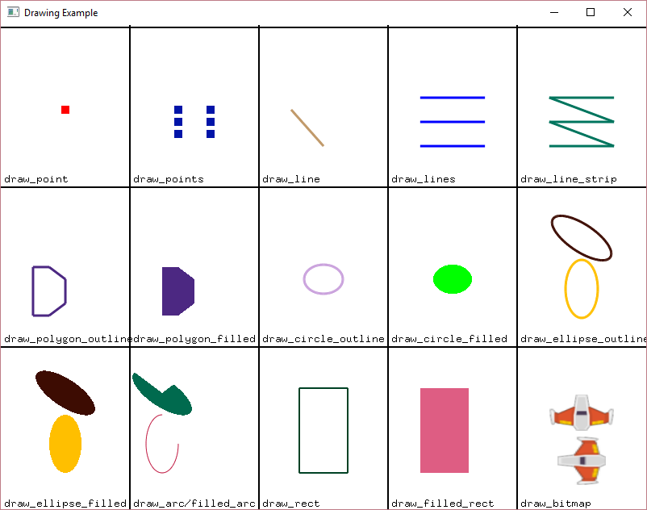

Example Code
============

array_backed_grid.py
--------------------
.. image:: how_to_examples/array_backed_grid.png

Source: :ref:`array_backed_grid`

This code sets up a grid displayed on-screen using a two-dimensional array. Each cell in the grid can be toggled between white and green by clicking on it. The grid is represented by a 2D list, where each element corresponds to a cell. The size and arrangement of the cells on the screen are defined by constants like row count, column count, width, height, and margin. The grid is rendered by looping through the 2D array and drawing rectangles filled with the corresponding color at the calculated positions.

array_backed_grid_buffered.py
-----------------------------
.. image:: how_to_examples/array_backed_grid_buffered.png

Source: :ref:`array_backed_grid_buffered`

This code creates a grid of cells that can be toggled on and off by clicking on them. It uses arcade library to display graphics. The grid is represented as a two-dimensional list where each cell is either 0 (white) or 1 (green) in color. Clicking on a cell changes its color and updates the grid display accordingly.

array_backed_grid_sprites_1.py
------------------------------
.. image:: how_to_examples/array_backed_grid_sprites_1.png

Source: :ref:`array_backed_grid_sprites_1`

The code uses a two-dimensional list to represent a grid on screen with colored cells. Grid size is defined by ROW_COUNT and COLUMN_COUNT. The grid is synced with a SpriteList for faster drawing. Clicking on a cell toggles its color between white and green.

array_backed_grid_sprites_2.py
------------------------------
.. image:: how_to_examples/array_backed_grid_sprites_2.png

Source: :ref:`array_backed_grid_sprites_2`

This code demonstrates creating a grid of sprites using a two-dimensional list in Arcade. Each sprite represents a cell in the grid, and its color can be toggled between white and green by clicking on it. The grid size, cell dimensions, and margin spacing are configurable.

astar_pathfinding.py
--------------------

Source: :ref:`astar_pathfinding`

This code implements an A-Star path-finding example using the Arcade library in Python. It sets up a game window with player and enemy sprites, walls, and path-finding logic. The player can move with arrow keys, and the enemy tries to reach the player using A-Star algorithm without diagonal movement. The game also includes scrolling functionality to keep the player and enemy in view.

asteroid_smasher.py
-------------------
.. image:: how_to_examples/asteroid_smasher.png

Source: :ref:`asteroid_smasher`

This code defines a game where the player controls a spaceship to shoot asteroids. It includes classes for the spaceship, asteroids, bullets, and the main game window. The game features movement, shooting, collision detection, score tracking, respawning, and game over conditions. The player can control the spaceship with arrow keys and shoot bullets with the space bar. When an asteroid is hit, it splits into smaller asteroids. The game continues until the player loses all lives.

background_blending.py
----------------------
.. image:: how_to_examples/background_blending.png

Source: :ref:`background_blending`

This program blends between two infinite scrolling backgrounds as the player moves horizontally, showcasing transitioning between different backgrounds.

background_groups.py
--------------------
.. image:: how_to_examples/background_groups.png

Source: :ref:`background_groups`

This code creates a scrolling background group in an arcade game. It allows multiple backgrounds to move together with the player controlled by arrow keys. The backgrounds are loaded from image files and scaled appropriately. The camera follows the player, ensuring the background is always visible.

background_parallax.py
----------------------

Source: :ref:`background_parallax`

The code implements a parallax scrolling effect using the Arcade library in Python. It demonstrates how to create a background with multiple layers that move at different speeds to give the illusion of depth. It also includes a player controlled by arrow keys and a camera to follow the player's movement. The code handles sprite scaling, background layer management, player movement, and camera positioning to achieve the parallax effect effectively.

background_scrolling.py
-----------------------
.. image:: how_to_examples/background_scrolling.png

Source: :ref:`background_scrolling`

This code creates a scrolling background effect in a game using the Python Arcade library. It includes a player sprite that moves around and controls to move the player up, down, left, or right. The background texture is constantly aligned with the screen and the texture offset is adjusted to create a moving illusion.

background_stationary.py
------------------------
.. image:: how_to_examples/background_stationary.png

Source: :ref:`background_stationary`

This program demonstrates how to create a stationary background using Arcade library in Python. It loads a background image from a file and allows the player sprite to move around on the screen. The camera follows the player to keep them centered in the window, ensuring the background is always visible. The player can move using arrow keys.

bouncing_rectangle.py
---------------------
.. image:: how_to_examples/bouncing_rectangle.png

Source: :ref:`bouncing_rectangle`

This code creates a simple animation of a rectangle bouncing around the screen using the Arcade library. The rectangle changes direction when it hits the screen edges.

camera_platform.py
------------------
.. image:: how_to_examples/camera_platform.png

Source: :ref:`camera_platform`

This code is an example of a game created using the Arcade library in Python. It demonstrates how to work with cameras in a 2D platformer game. The game includes features such as player movement, gravity, collision detection with coins and bombs, scoring, and a camera that follows the player. The code sets up the game window, loads the tile map, initializes the player sprite, handles user input for movement, updates the game state, and renders the game elements on the screen.

conway_alpha.py
---------------

Source: :ref:`conway_alpha`

This code implements Conway's Game of Life using sprites in the arcade library. It creates a grid of sprites representing cells, randomly initializes them as alive or dead, and updates them based on the game rules. The program switches between two layers to keep track of the current and next frame states of the grid. Each cell's state (alive or dead) is represented by the alpha value of the sprite. The 'on_update' function evaluates the neighbors of each cell and follows the rules of Conway's Game of Life to determine the next state of the cell.

drawing_primitives.py
---------------------

Source: :ref:`drawing_primitives`

This code uses the Arcade library to demonstrate various drawing primitives such as lines, points, polygons, circles, ellipses, rectangles, and images. It sets up a window, sets a background color, and then proceeds to draw different shapes and images using the provided functions from the Arcade library. Finally, it finishes the render and keeps the window open until manually closed.

drawing_text.py
---------------
.. image:: how_to_examples/drawing_text.png

Source: :ref:`drawing_text`

This code creates a window using the Arcade library to demonstrate drawing text on the screen. It shows examples of drawing text with different fonts, styles, alignments, and rotations. The text is drawn at specified positions with various options such as font style, multiline support, and text wrapping. The code defines a class `MyGame` that extends `arcade.Window` and implements methods for updating and drawing text on the screen. The `main()` function initializes the game window and starts the Arcade event loop.

drawing_text_objects.py
-----------------------

Source: :ref:`drawing_text_objects`

This code demonstrates how to draw text to the screen using Arcade's Text objects. It includes examples of different fonts, text positioning, multiline text, and rotating text. The `MyGame` class initializes the text objects, updates their angles, and renders them on the screen. The `on_draw` method clears the screen and draws the text objects using their `draw()` methods. Finally, the `main` function creates an instance of `MyGame` and runs the Arcade application.

drawing_text_objects_batch.py
-----------------------------
.. image:: how_to_examples/drawing_text_objects_batch.png

Source: :ref:`drawing_text_objects_batch`

This code defines a Pyglet batch to efficiently draw multiple text objects in an Arcade window. Text objects with different fonts, styles, and alignments are created and added to the batch for batch rendering. The game window displays various text examples, including multiline texts and different text positioning options. The text objects in the batch are drawn onto the window, and some reference points are indicated by drawing points at specific locations. The text can be updated and rotated during the game loop.

dual_stick_shooter.py
---------------------
.. image:: how_to_examples/dual_stick_shooter.png

Source: :ref:`dual_stick_shooter`

This code demonstrates a dual-stick shooter game using Python's Arcade library. It allows players to use a controller or keyboard for input. The game involves a player sprite that can move and shoot bullets, enemies that spawn at intervals and movement towards the player, collision detection for bullets hitting enemies, and game over conditions. The code initializes the game window, provides input handling for both controller and keyboard, and updates the game state on each frame.

easing_example_1.py
-------------------
.. image:: how_to_examples/easing_example_1.png

Source: :ref:`easing_example_1`

This code demonstrates how to use easing functions in Arcade to animate the movement of circles on the screen. Different easing functions are applied to the circles, creating smooth transitions. The code also includes the setup of the game window, creation of balls, lines, and text elements, and rendering of the screen.

easing_example_2.py
-------------------

Source: :ref:`easing_example_2`

This code demonstrates how to use easing functions for smooth movement of a player sprite's position and angle in an Arcade game. Easing functions like linear, ease in, ease out, and smoothstep are applied to gradual changes in angle and position based on user input. The player sprite's movement is updated in its `on_update` method, and easing functions are triggered by key presses to create smooth transitions.

follow_path.py
--------------
.. image:: how_to_examples/follow_path.png

Source: :ref:`follow_path`

This code creates a game where enemy sprites follow a predefined path. The enemy sprites move between set points on the screen at a constant speed. The player can control a character with the mouse cursor, and there is a background color. It uses the Arcade library for game development in Python.

full_screen_example.py
----------------------

Source: :ref:`full_screen_example`

This code creates a simple arcade game that allows the user to toggle between full-screen and windowed mode. It demonstrates sprite usage and basic game window functionality. The game window displays text instructions and draws boxes at the bottom of the screen using a sample image. It listens for key presses (F and S) to toggle between fullscreen modes and adjusts the viewport accordingly.

gradients.py
------------
.. image:: how_to_examples/gradients.png

Source: :ref:`gradients`

This code creates a window with various shapes filled with gradients and colors using the Arcade library. The shapes include rectangles with vertical and horizontal gradients, lines with changing colors, triangles with three different colors, and an ellipse with a gradient between the center and the outside.

gui_flat_button.py
------------------
.. image:: how_to_examples/gui_flat_button.png

Source: :ref:`gui_flat_button`

This is a Python code snippet that demonstrates how to create buttons and handle button events using the Arcade library. It includes three methods for processing button events: creating a child class to handle events, assigning a callback function to handle events, and using a decorator to handle events. The code also showcases creating buttons, adding them to a vertical layout, and managing a UIManager to handle UI elements and events.

gui_flat_button_styled.py
-------------------------

Source: :ref:`gui_flat_button_styled`

This code demonstrates how to style and display customized flat buttons using the Arcade GUI module. It defines different styles for normal, hover, press, and disabled states of a button. The buttons are then created and added to a vertical layout to align them. The code also includes event handling to enable and disable the UIManager for user interaction.

gui_ok_messagebox.py
--------------------
.. image:: how_to_examples/gui_ok_messagebox.png

Source: :ref:`gui_ok_messagebox`

This code creates a simple GUI application using the Arcade library in Python. It includes a button that, when clicked, opens a message box with the options "Ok" and "Cancel". The user's choice is displayed below the button. The UI is managed using the UIManager and various UI widgets such as buttons and labels.

gui_scrollable_text.py
----------------------

Source: :ref:`gui_scrollable_text`

This code creates a user interface with scrollable text and input fields using the Arcade library. It defines a custom view class `MyView` that includes a text area and two input fields. The text area uses a grey panel background and displays a long Lorem Ipsum text. The input fields have different styles - one with padding and a background, and the other with a border.

Additionally, it sets up the UIManager to manage the UI components and handles view visibility. Finally, it creates a window with the UI elements and runs the Arcade application.

gui_slider.py
-------------

Source: :ref:`gui_slider`

This code creates a GUI slider using the Arcade library. The slider's value is displayed as a label, and the label updates when the slider is dragged. The UIManager handles the UI widgets.

gui_widgets.py
--------------
.. image:: how_to_examples/gui_widgets.png

Source: :ref:`gui_widgets`

This code creates a graphical user interface (GUI) using the Arcade library in Python. It demonstrates how to create different UI widgets such as text labels, flat buttons, and texture buttons. The UI components are organized using a UIBoxLayout for alignment. Event handling is shown for button clicks. The UI is managed by a UIManager. The `MyView` class extends Arcade's `View` class and sets up the UI elements and event handling. The window background color is set, and the UI is drawn on the window.

happy_face.py
-------------
.. image:: how_to_examples/happy_face.png

Source: :ref:`happy_face`

This code draws a happy face using the Arcade library in Python. It sets up a window with a white background and then draws a yellow circle for the face, two black circles for the eyes, and a curved line for the smile. Finally, it renders the drawing and keeps the window open until the user closes it.

light_demo.py
-------------
.. image:: how_to_examples/light_demo.png

Source: :ref:`light_demo`

This code sets up a window for a game where lights are used for visual effects. Different types of lights are created and controlled, such as ambient light, colored lights, and a light following the player. The player character moves around and can toggle their attached light on and off. Scrolling is implemented to keep the player in view, and physics are used for collisions. Lights affect what is rendered by using separate layers for objects affected by lighting and those that are not.

lines_buffered.py
-----------------

Source: :ref:`lines_buffered`

This code creates a window displaying random lines with colors and a set of points using Vertex Buffer Objects. The points are defined using a list of coordinates, and the lines are created and added to a ShapeElementList. The window is updated to rotate and move the lines.

line_of_sight.py
----------------
.. image:: how_to_examples/line_of_sight.png

Source: :ref:`line_of_sight`

This code creates a game where the player controls a character that can move on a map filled with walls, and there are enemies positioned on the map. The player can move using the arrow keys. The game includes features like line of sight detection between the player and enemies, scrolling when the player reaches the edge of the screen, and collision detection with walls.

maze_depth_first.py
-------------------
.. image:: how_to_examples/maze_depth_first.png

Source: :ref:`maze_depth_first`

This code generates a maze using the depth-first search algorithm, allows a player to navigate the maze, and handles the visual representation of the maze. The maze is created by setting up a grid with walls and open passages. The player can move through the maze using arrow keys. The code also includes logic for scrolling the view to keep the player centered on the screen and displays information such as sprite count, drawing time, and processing time on the screen.

maze_recursive.py
-----------------
.. image:: how_to_examples/maze_recursive.png

Source: :ref:`maze_recursive`

This code creates a maze using the recursive division method. The maze is displayed in a window using Arcade library. The maze is divided into four sections with gaps created in three of the four walls recursively. The player can move around the maze, and scrolling functionality is implemented to keep the player in view.

minimap.py
----------
.. image:: how_to_examples/minimap.png

Source: :ref:`minimap`

This code sets up a game window using the Arcade library, where a player sprite can move around and collide with walls. It includes a minimap that shows the player's position within a larger map. The camera follows the player as they move, and the player can be controlled using the arrow keys.

minimap_camera.py
-----------------
.. image:: how_to_examples/minimap_camera.png

Source: :ref:`minimap_camera`

This code creates a mini-game utilizing the Arcade library in Python. It includes a player controlled by arrow keys, walls that the player can navigate through, and the ability to switch between a main camera and a minimap camera. The minimap provides an overview of the game world. The player sprite's movement is controlled by key presses, and the camera follows the player with a slight delay. Players can also adjust the zoom level and size of the minimap using specific keys.

music_control_demo.py
---------------------
.. image:: how_to_examples/music_control_demo.png

Source: :ref:`music_control_demo`

This code defines a music control demo using the Arcade library. It creates a GUI with buttons for controlling music playback (play/pause, volume up/down, and forward) and displays the current time and volume of the music player. The demo allows users to switch between two songs and handles events such as song ending, button clicks, and UI drawing.

net_process_animal_facts.py
---------------------------
.. image:: how_to_examples/net_process_animal_facts.png

Source: :ref:`net_process_animal_facts`

This code uses multiprocessing to run a service in the background that fetches random animal facts and images from different APIs. The main process displays these facts and images using the Arcade library. Users can request new facts, toggle fullscreen, and close the window using specific key commands. The service runs as a daemon process and communicates with the main process using queues for commands and data exchange.

particle_fireworks.py
---------------------
.. image:: how_to_examples/particle_fireworks.png

Source: :ref:`particle_fireworks`

This code creates a fireworks simulation using particle emitters in Python's Arcade library. It defines various functions for creating different types of fireworks displays with different visual effects like smoke trails, bursts, sparkles, and rings. The simulation involves launching rockets, generating smoke trails, explosions, and fading particles. The code handles the animation, gravity, and customization of particles within the fireworks display. The `FireworksApp` class sets up the window and manages the display of the fireworks.

particle_systems.py
-------------------
.. image:: how_to_examples/particle_systems.png

Source: :ref:`particle_systems`

This code demonstrates how to use the Emitter and Particle classes to create particle systems in the Arcade library. It provides various pre-defined emitter functions that showcase different particle effects, such as burst emission, interval emission, changing textures, sizes, angles, and lifetimes of particles. The MyGame class sets up a window where different emitters are displayed sequentially, and it allows for controlling the flow of emitters by switching to the next one after a certain timeout. The particle systems are updated and drawn in the game loop, with different visual effects produced by the emitters.

performance_statistics.py
-------------------------
.. image:: how_to_examples/performance_statistics.png

Source: :ref:`performance_statistics`

This code demonstrates performance profiling in an Arcade game. It creates a window where multiple sprites (coins) bounce around the screen, and it displays performance graphs and statistics using functions provided by Arcade, such as `arcade.enable_timings`, `arcade.PerfGraph`, `arcade.get_fps`, `arcade.print_timings`, and `arcade.clear_timings`. The number of sprites can be adjusted by changing the `COIN_COUNT` constant. The code tracks and displays FPS, event handler calls, and their execution times.

perspective.py
--------------
.. image:: how_to_examples/perspective.png

Source: :ref:`perspective`

This code demonstrates using the lower-level rendering API of Arcade to create a perspective effect by rendering content into a framebuffer and mapping it onto a texture that can be rotated in 3D. The code defines a `Perspective` class that inherits from `arcade.Window` and sets up shaders for rendering a textured plane with support for projection and model transformations. It also creates a framebuffer to render content into, sets up geometry for the plane, and includes functionality to draw sprites onto the offscreen texture. The `on_draw` method updates the offscreen texture and renders the plane with the rotated texture, while the `on_update` method handles updating the time for animation.

procedural_caves_bsp.py
-----------------------
.. image:: how_to_examples/procedural_caves_bsp.png

Source: :ref:`procedural_caves_bsp`

This Python code generates a random cave using Binary Space Partitioning (BSP). It splits the space into smaller sections recursively until a cutoff point is reached, then generates rooms within those sections. It connects these rooms with corridors to create a cave-like structure. The code also includes functionality for player movement, scrolling the viewport, and rendering the cave on the screen using sprites, with options for sprite merging for efficiency.

procedural_caves_cellular.py
----------------------------

Source: :ref:`procedural_caves_cellular`

This code generates a random cave using cellular automata and displays it using the Arcade library. It allows the player to move around within the cave environment. The cave map is created based on a grid, and each grid location is represented as a sprite. The player can move using arrow keys, and the camera scrolls to follow the player's movements. The program also includes timing for drawing and processing operations.

pymunk_box_stacks.py
--------------------
.. image:: how_to_examples/pymunk_box_stacks.png

Source: :ref:`pymunk_box_stacks`

This code sets up a simple game using the Pymunk physics engine in combination with the Arcade library. It creates a window where boxes and circles are stacked, allowing them to be dragged around with the mouse. Gravity affects the physics objects, and the game continues to run physics simulations and update the screen accordingly.

pymunk_demo_top_down.py
-----------------------

Source: :ref:`pymunk_demo_top_down`

This code demonstrates the usage of Pymunk Physics Engine in a top-down game environment using the Python Arcade library. It involves setting up a window, creating sprite lists for players, walls, bullets, rocks, and gems. The physics engine is then initialized with specific parameters like damping and gravity. Collision handlers are defined for bullet interactions with rocks and walls. Players are added to the physics engine with certain attributes such as friction and collision types. Forces are applied based on user input for player movement and shooting bullets. The update function controls the movement logic, and the draw function handles rendering the game elements on the screen.

pymunk_joint_builder.py
-----------------------
.. image:: how_to_examples/pymunk_joint_builder.png

Source: :ref:`pymunk_joint_builder`

This code is a PyMunk example using the Arcade library to create a physics simulation. It includes creating different shapes, joints, applying forces, dragging objects with the mouse, and key bindings for different modes. The simulation includes boxes, circles, pin joints, damped springs, gravity settings, and updating the physics in the game loop.

pymunk_pegboard.py
------------------
.. image:: how_to_examples/pymunk_pegboard.png

Source: :ref:`pymunk_pegboard`

This code implements a simulation of a pegboard game using the Pymunk physics engine. It creates pegs and balls that interact with each other based on physics. The pegs are represented by images and the balls fall from the top of the screen. The code handles rendering, updating physics, and moving sprites according to physics object positions.

radar_sweep.py
--------------
.. image:: how_to_examples/radar_sweep.png

Source: :ref:`radar_sweep`

This code creates a radar sweep animation using the Arcade library in Python. It defines a Radar class that updates the angle of the sweep and draws the radar line and outline. The MyGame class sets up the window and handles updating and drawing the radar. The main function initializes the game and starts the event loop.

resizable_window.py
-------------------
.. image:: how_to_examples/resizable_window.png

Source: :ref:`resizable_window`

This code defines a resizable Arcade window that displays coordinates and values along the x and y axes. The window will print its new size when resized and draw points and text labels along the axes.

sections_demo_1.py
------------------
.. image:: how_to_examples/sections_demo_1.png

Source: :ref:`sections_demo_1`

This code demonstrates how to create a screen divided into two sections where the user can interact with boxes. Each section is represented by a `ScreenPart` class containing a box (`Box`). Mouse events are handled within the sections, allowing the user to drag and release the boxes. The `GameView` class sets up the sections on the screen, with one on the left and the other on the right. The layout is drawn using Arcade library functions, creating a visual split between the sections.

sections_demo_2.py
------------------

Source: :ref:`sections_demo_2`

This code implements a basic Pong game for two players on the same computer using Python and the Arcade library. It consists of `Player` and `Pong` classes representing player paddles and the game logic, respectively. Players move paddles with keys and earn scores by hitting a ball. The game resets when the ball exits the screen. Sections and Views are used for organizing game elements on the screen.

sections_demo_3.py
------------------
.. image:: how_to_examples/sections_demo_3.png

Source: :ref:`sections_demo_3`

The code demonstrates how to use sections in an Arcade game. It features a moving ball that bounces within a defined area, with an info bar displaying information about the ball, a panel with buttons for user interaction, and a modal section that pops up for user input. Each section handles drawing, updating, and responding to events independently based on its configuration.

shapes.py
---------

Source: :ref:`shapes`

This code creates a simple animation where shapes move around the screen. It defines a base Shape class and subclasses for Ellipse, Rectangle, and Line shapes. The MyGame class sets up the shapes with random attributes and updates their positions and angles. The shapes are then drawn on the screen using Arcade library functions.

shape_list_demo_1.py
--------------------
.. image:: how_to_examples/shape_list_demo_1.png

Source: :ref:`shape_list_demo_1`

This program uses Python's Arcade library to draw a grid of squares without buffering, resulting in slow performance due to loading all points and colors each time. The grid consists of squares with specified width, height, and spacing. The `MyGame` class initializes the window and defines the drawing logic. It calculates the time taken to draw the grid and displays it on the screen. The main function creates an instance of `MyGame` and starts the Arcade application.

shape_list_demo_2.py
--------------------
.. image:: how_to_examples/shape_list_demo_2.png

Source: :ref:`shape_list_demo_2`

This code creates a grid of squares on the screen using buffered rectangles in the Arcade library. Each square has a specified width, height, and spacing. The `MyGame` class defines the window properties and handles drawing the squares. The setup method initializes the shape list with filled rectangles, and the on_draw method renders the rectangles on the screen. The main function sets up the game window and runs the application.

shape_list_demo_3.py
--------------------
.. image:: how_to_examples/shape_list_demo_3.png

Source: :ref:`shape_list_demo_3`

This code demonstrates drawing a grid of squares efficiently using a single buffer in the Arcade library. It calculates points for each rectangle, adds them to a list along with corresponding colors, and then draws all squares with a single command. The setup method creates rectangles by iterating over x and y coordinates, calculating points, and adding them to the lists. The on_draw method renders the screen by clearing it, drawing rectangles from the shape list, and displaying the drawing time per frame. The speed improvement comes from utilizing a single drawing command for all rectangles.

shape_list_demo_skylines.py
---------------------------
.. image:: how_to_examples/shape_list_demo_skylines.png

Source: :ref:`shape_list_demo_skylines`

This code generates a cityscape with stars and buildings using Arcade library. It creates a skyline with buildings of varying heights and colors, along with windows and a parallax effect. The skyline can be scrolled by dragging the mouse.

slime_invaders.py
-----------------
.. image:: how_to_examples/slime_invaders.png

Source: :ref:`slime_invaders`

This code defines a game called "Slime Invaders" using the Arcade library in Python. It includes features like moving sprites as a group, changing textures of sprites, shooting bullets, creating shields, and handling collisions. The game involves controlling a player sprite to shoot enemies while avoiding enemy bullets. The game state is managed, and different game elements are updated and rendered accordingly.

snow.py
-------

Source: :ref:`snow`

This code creates a simple snowfall animation using the Python Arcade library. It defines a Snowflake class to represent individual snowflakes and a MyGame class for the main application. Snowflakes are randomly positioned and fall from the top of the screen while moving side to side. The animation is updated in the on_update method and drawn on the screen in the on_draw method. Finally, the main function initializes the game window and starts the snowfall animation.

sound_demo.py
-------------
.. image:: how_to_examples/sound_demo.png

Source: :ref:`sound_demo`

This code demonstrates a sound panning feature using Arcade library in Python. It includes sound buttons with different panning levels and volumes. The `SoundButton` class stores settings for playing a sound, either as static or streaming. The `MyGame` class manages the game window, setting up sound buttons and handling user interactions. The program allows playing sounds with varying panning and volume levels by clicking on the corresponding buttons.

sound_speed_demo.py
-------------------
.. image:: how_to_examples/sound_speed_demo.png

Source: :ref:`sound_speed_demo`

This code demonstrates a sound speed demo using Python's Arcade library. It creates buttons that, when clicked, play a sound at different speeds and volumes. The buttons are positioned on the screen based on specified variations in speed and volume. The `SoundButton` class defines settings to play a sound, and the `MyGame` class sets up the game window, handles drawing/updating, and responds to mouse clicks on the buttons. The `main` function initializes the game and runs it when executed.

sprite_animated_keyframes.py
----------------------------
.. image:: how_to_examples/sprite_animated_keyframes.png

Source: :ref:`sprite_animated_keyframes`

This code defines a window displaying an animated sprite that moves based on keyframes. The sprite's animation consists of 8 walking frames for a female adventurer. The `TextureKeyframe` class is used to load the textures for each frame with a duration of 100ms per frame. The `TextureAnimation` class is initialized with these keyframes, and then a `TextureAnimationSprite` is created using this animation. The sprite is displayed in the window and updated based on the elapsed time.

sprite_bouncing_coins.py
------------------------
.. image:: how_to_examples/sprite_bouncing_coins.png

Source: :ref:`sprite_bouncing_coins`

This code sets up a game window with bouncing coins and walls. Coins move randomly and bounce off walls in a basic 2D environment. Walls are created as boundaries using sprites, and collisions are detected and handled to make the coins bounce off the walls.

sprite_bullets.py
-----------------
.. image:: how_to_examples/sprite_bullets.png

Source: :ref:`sprite_bullets`

This code creates a simple game where the player can move a sprite horizontally with the mouse and shoot bullets to hit coins falling from above. The player can earn points by shooting the coins. The game uses the `arcade` library for handling sprites, mouse input, sounds, and collision detection.

sprite_bullets_aimed.py
-----------------------
.. image:: how_to_examples/sprite_bullets_aimed.png

Source: :ref:`sprite_bullets_aimed`

This code creates a simple game using sprites and bullets in the Arcade library. The game involves shooting bullets towards the mouse click position to hit coins randomly placed on the screen. The player can move around and shoot bullets. Bullets are aimed based on the mouse click position and follow a trajectory towards that point. When a bullet hits a coin, it is removed, and the player's score increases. The game continues until the player closes the window.

sprite_bullets_enemy_aims.py
----------------------------
.. image:: how_to_examples/sprite_bullets_enemy_aims.png

Source: :ref:`sprite_bullets_enemy_aims`

This code sets up a game where enemies shoot bullets aimed at the player. The enemies track the player's position and rotate to face the player. Bullets are fired at the player's position with the calculated angle. The player controls a ship with the mouse.

sprite_bullets_periodic.py
--------------------------

Source: :ref:`sprite_bullets_periodic`

This code sets up a game where enemies periodically shoot bullets at the player's ship. Enemies are created with a time interval between shots and are updated to fire bullets when the interval elapses. The player can move their ship using the mouse. The game is displayed using the Arcade library in Python.

sprite_bullets_random.py
------------------------
.. image:: how_to_examples/sprite_bullets_random.png

Source: :ref:`sprite_bullets_random`

This code shows a simple game where enemies shoot bullets at random intervals. The player can move their ship horizontally using the mouse. The enemies appear at the top left and top right corners of the screen. Enemies shoot bullets downwards randomly. Bullets are removed when they go off-screen.

sprite_change_coins.py
----------------------
.. image:: how_to_examples/sprite_change_coins.png

Source: :ref:`sprite_change_coins`

This code creates a game where the player collects coins by moving a sprite over them. When a coin is collected, its sprite changes, but it remains on the screen. The score increases each time a coin is collected.

sprite_collect_coins.py
-----------------------
.. image:: how_to_examples/sprite_collect_coins.png

Source: :ref:`sprite_collect_coins`

This code creates a simple game using the Arcade library in Python. The game involves collecting coins with a player sprite that follows the mouse cursor. Coins are randomly placed on the screen, and when the player sprite collides with a coin, the score increases. The score is displayed on the screen, and it updates as coins are collected.

sprite_collect_coins_background.py
----------------------------------
.. image:: how_to_examples/sprite_collect_coins_background.png

Source: :ref:`sprite_collect_coins_background`

This code defines a simple game where a player sprite can collect coins by moving the mouse. The player sprite and coins are loaded with scaling and positioned randomly on the screen. The player can collect coins by colliding with them, increasing the score. The game window is initialized with a background texture, and the game logic is handled in different methods like setup, on_draw, on_mouse_motion, and on_update.

