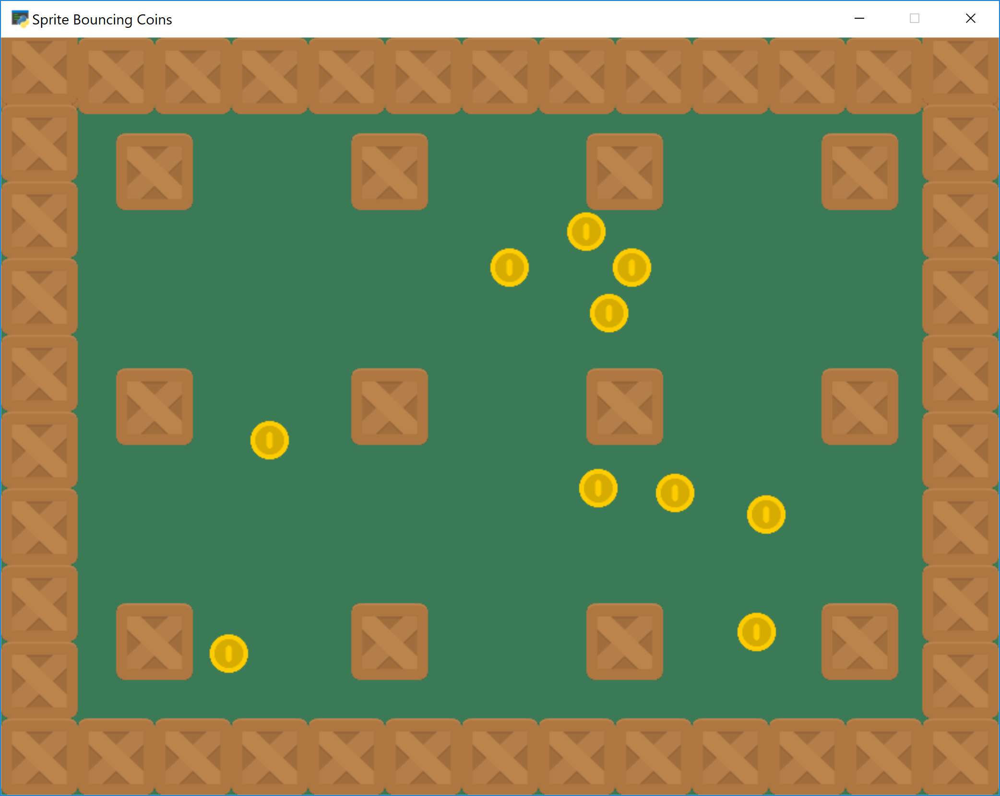

Example Code
============

array_backed_grid.py
--------------------
.. image:: how_to_examples/array_backed_grid.png

Source: :ref:`array_backed_grid`

This Python code demonstrates how to use a two-dimensional array to create and display a grid on the screen. The grid is represented as a list of lists, where each element in the outer list corresponds to a row and contains elements representing individual cells in that row. By iterating through the grid and drawing rectangles based on the values in the array, the code visually represents the grid state. Additionally, it shows how to handle mouse clicks to interact with the grid by toggling cell values between 1 and 0.

array_backed_grid_buffered.py
-----------------------------
.. image:: how_to_examples/array_backed_grid_buffered.png

Source: :ref:`array_backed_grid_buffered`

This example demonstrates how to use a two-dimensional list/array to create and display a grid on the screen using the Arcade library in Python. The grid consists of individual cells that can be toggled between different colors by clicking on them. The program sets up a 2D array to represent the grid, where each element corresponds to the color state of a specific cell. By updating the array and recreating the shapes based on these values, the display can be efficiently refreshed to reflect the changes made by the user interacting with the grid.

array_backed_grid_sprites_1.py
------------------------------
.. image:: how_to_examples/array_backed_grid_sprites_1.png

Source: :ref:`array_backed_grid_sprites_1`

This Python code demonstrates the concept of using an array-backed grid to display a grid on-screen with sprites in the Arcade library. The grid is represented as a two-dimensional list where each cell can be updated to display a white or green color by altering the values in the list. The code includes functions to sync the grid with the sprite colors, as well as to handle user input by allowing them to click on grid locations to toggle between colors. The use of a two-dimensional list to back the grid simplifies the grid management and rendering process in the game application.

array_backed_grid_sprites_2.py
------------------------------
.. image:: how_to_examples/array_backed_grid_sprites_2.png

Source: :ref:`array_backed_grid_sprites_2`

This piece of code demonstrates the concept of using a two-dimensional list/array to back the display of a grid on-screen using sprites in the Arcade library. Instead of directly changing the values in the array, the grid is represented by a collection of sprite objects. Each cell in the grid is a sprite, and when interacting with the grid (like clicking on a cell), the color of the corresponding sprite is changed, allowing for efficient updating of large grids without iterating through all cells. This technique improves performance by directly manipulating sprite properties instead of the underlying data structure.

astar_pathfinding.py
--------------------
.. image:: how_to_examples/astar_pathfinding.png

Source: :ref:`astar_pathfinding`

This code demonstrates the usage of the A* pathfinding algorithm in a game using the Arcade library in Python. A* (A-Star) is a popular pathfinding algorithm used to find the shortest path between two points on a grid while avoiding obstacles. In this example, the algorithm calculates a path for an enemy sprite to reach the player sprite, considering walls as barriers. The concept is particularly useful for implementing intelligent movement behaviors in games, such as enemy AI or pathfinding for player characters.

asteroid_smasher.py
-------------------
.. image:: how_to_examples/asteroid_smasher.png

Source: :ref:`asteroid_smasher`

This piece of code demonstrates the concept of creating a simple game using Python and the Arcade library. It shows how to create different sprites (such as the player spaceship and asteroids), handle user input for movement and shooting, manage collisions between sprites, update sprite positions, and handle game over conditions. The code also includes sound effects, sprite scaling, respawning mechanics, and score tracking, providing a comprehensive example of game development using the Arcade library.

background_blending.py
----------------------

Source: :ref:`background_blending`

This example demonstrates the concept of blending backgrounds in a game using the Arcade library. The program loads two infinite scrolling backgrounds and smoothly transitions between them when the player reaches a specific x position on the screen. The level of blending between the two backgrounds is controlled by the player's position, creating a visually appealing effect. Additionally, the program showcases camera movement to follow the player and ensure that the backgrounds and player sprite are displayed correctly on the screen as the player moves.

background_groups.py
--------------------
.. image:: how_to_examples/background_groups.png

Source: :ref:`background_groups`

This example demonstrates the use of background groups in Arcade, allowing multiple backgrounds to be drawn with a single draw call and enabling their textures to scroll together. Background groups facilitate moving backgrounds collectively by adding the position of the group to the position of each background, resulting in backgrounds that move together but may not be positioned together. By efficiently handling background elements, background groups contribute to creating visually appealing and interactive game environments in Arcade.

background_parallax.py
----------------------
.. image:: how_to_examples/background_parallax.png

Source: :ref:`background_parallax`

This example demonstrates how to implement parallax scrolling in a game using the Arcade library. Parallax scrolling is a technique where background layers move at different speeds to create an illusion of depth, adding visual interest and realism to a game environment. The code showcases how to use Arcade's ParallaxGroup to manage and display multiple background layers that scroll at varying speeds, giving the impression of depth and movement in the game world. It also includes features like adjusting the camera position, handling player movement, and creating a seamless, infinite scrolling effect by manipulating the background layers.

background_scrolling.py
-----------------------
.. image:: how_to_examples/background_scrolling.png

Source: :ref:`background_scrolling`

This example demonstrates how to create a scrolling background in a game using the Arcade library in Python. The program loads a texture from a file and creates a screen-sized background that moves continuously as the player navigates through the game. The background is aligned with the screen, and the texture offset is adjusted to give the appearance of movement, creating an engaging visual experience for the player. It also showcases how to incorporate player motion tracking and camera manipulation to center the view on the player sprite.

background_stationary.py
------------------------
.. image:: how_to_examples/background_stationary.png

Source: :ref:`background_stationary`

This Python code demonstrates the concept of implementing a stationary background in a game using the Arcade library. The background is loaded from a file and positioned behind the game elements. The 'pan_camera_to_player' function ensures that the camera stays centered on the player sprite as the player moves around the game world, giving the appearance of a stationary background while the player moves within the game environment.

bouncing_rectangle.py
---------------------
.. image:: how_to_examples/bouncing_rectangle.png

Source: :ref:`bouncing_rectangle`

This code demonstrates the concept of creating a simple animation in a game using the Arcade library in Python. It shows how to create a rectangle that moves around on the screen by changing its position and reversing its direction when it hits the edges of the window, creating a bouncing effect. The code also illustrates how to update the position of the rectangle in each frame and render it on the screen using the `update()` and `draw()` methods within a custom class.

camera_platform.py
------------------
.. image:: how_to_examples/camera_platform.png

Source: :ref:`camera_platform`

This example demonstrates how to implement a camera system in a 2D game using the Arcade library in Python. The camera follows the player's movements, ensuring that the player remains centered on the screen as they navigate a larger game world. The camera's viewport is defined to keep a margin between the player and the edge of the screen, providing a smooth visual experience for the player. The camera's panning and movement functions are utilized to update the camera position based on the player's location, creating a dynamic and responsive gameplay environment. The camera also includes features like shaking effects, which can be triggered by specific in-game events for added visual impact.

conway_alpha.py
---------------
.. image:: how_to_examples/conway_alpha.png

Source: :ref:`conway_alpha`

This code demonstrates how to implement Conway's Game of Life using sprites in a grid. It showcases how sprites' 'alpha' values can be used to represent the states of cells in the game (alive or dead), where cells are turned on/off by setting their alpha value to 255 (ALPHA_ON) or 0 (ALPHA_OFF) respectively. The game involves applying specific rules to the grid to simulate cell behavior and evolution over generations, reflecting the concept of cellular automaton and demonstrating how sprite manipulation can be utilized to visualize the game's dynamics.

drawing_primitives.py
---------------------
.. image:: how_to_examples/drawing_primitives.png

Source: :ref:`drawing_primitives`

This example code demonstrates the usage of drawing primitives in the Arcade library, such as drawing points, lines, polygons, circles, ellipses, arcs, and rectangles on a window. It showcases how to set the background color, draw different shapes, load and display an image on the screen, and finish the rendering process to display the final output to the user. The example provides a clear understanding of how to use various drawing functions available in Arcade for creating graphics in a windowed environment.

drawing_text.py
---------------
.. image:: how_to_examples/drawing_text.png

Source: :ref:`drawing_text`

This example demonstrates how to draw text to the screen in a graphical application using the Arcade library in Python. The code shows how to specify the text content, font size, color, position, alignment, and even rotation. It also includes features like drawing text in different fonts, handling multi-line text, and adjusting the text positioning using anchor points. By utilizing these text-drawing functionalities, developers can create visually appealing user interfaces, display game instructions, show scores, and provide feedback within their Arcade applications.

drawing_text_objects.py
-----------------------
.. image:: how_to_examples/drawing_text_objects.png

Source: :ref:`drawing_text_objects`

This example demonstrates how to efficiently draw text to the screen using Text objects in the Arcade library. Text objects provide a faster way to render text compared to using the `draw_text` method directly. The code showcases various features such as specifying text alignment, using different fonts, handling multi-line text with line breaks, positioning text using anchors, and even rotating text on the screen. This example highlights how Text objects can be utilized to create visually appealing and dynamic text elements in an Arcade application.

drawing_text_objects_batch.py
-----------------------------
.. image:: how_to_examples/drawing_text_objects_batch.png

Source: :ref:`drawing_text_objects_batch`

This code demonstrates the concept of using batches for drawing text efficiently in a game using the Arcade library. By utilizing pyglet's batch functionality, multiple arcade.Text objects are added to a single batch, allowing for the drawing of thousands of text objects with similar performance cost to drawing a single text object directly. This approach helps optimize the rendering process by reducing the number of draw calls required when rendering multiple text elements on the screen.

dual_stick_shooter.py
---------------------

Source: :ref:`dual_stick_shooter`

This Python code demonstrates the implementation of a dual-stick shooter game using the Arcade library. It illustrates how to handle player movement and shooting controls using both keyboard inputs and a dual-analog stick controller, showcasing how to interpret controller input values and translate them into in-game actions like player movement, rotating the player sprite, firing bullets, and controlling enemy sprites. The code also includes functionalities like spawning enemies, collision detection, game over conditions, and score tracking.

easing_example_1.py
-------------------

Source: :ref:`easing_example_1`

This piece of example Python code demonstrates the concept of using easing functions in animation using the Arcade library. Easing functions are mathematical equations that control the acceleration and deceleration of movement, creating more natural and visually appealing animations. In this example, different easing functions are applied to the movement of circles on the screen, showcasing various types of easing effects such as linear, ease-in, ease-out, smoothstep, elastic, and others. The code shows how to integrate these easing functions to smoothly update the position of objects over time, leading to more fluid and visually interesting animations.

easing_example_2.py
-------------------
.. image:: how_to_examples/easing_example_2.png

Source: :ref:`easing_example_2`

This example demonstrates the use of easing functions to create smooth transitions in position and angles for sprites in a game using the Arcade library. Easing functions are used to control the acceleration and deceleration of sprite movement, allowing for more visually appealing animation effects compared to linear movements. By applying different easing functions, such as linear, ease in, ease out, and smoothstep, developers can achieve varying levels of smoothness and realism in sprite movements within their games.

follow_path.py
--------------
.. image:: how_to_examples/follow_path.png

Source: :ref:`follow_path`

This code example demonstrates how to create a sprite in the Arcade library that follows a predefined path. The Enemy class defines a sprite that moves along a series of specified points. The update method calculates the angle and distance to the next point and updates the sprite's position accordingly. This concept of having a sprite follow a path is commonly used in game development to create movement patterns for enemy characters or other game entities.

full_screen_example.py
----------------------
.. image:: how_to_examples/full_screen_example.png

Source: :ref:`full_screen_example`

This piece of code demonstrates how to create a full-screen application using the Arcade library in Python. The example includes functionality to toggle between full-screen and windowed modes, as well as options to stretch or maintain the aspect ratio of the window. It showcases how to set the viewport based on the window size and adjust it accordingly when switching between different screen modes. The program also displays text and images on the screen to provide a visual representation of the changes happening based on user input.

gradients.py
------------
.. image:: how_to_examples/gradients.png

Source: :ref:`gradients`

This code demonstrates how to create and draw gradients using the Arcade library in Python. Gradients are smooth transitions between two or more colors, which can be applied to different shapes like rectangles, lines, triangles, or ellipses. By specifying the colors at different points of the shape, the code shows how to create visually appealing gradient effects. Additionally, it also illustrates the concept of creating shapes with varying transparency levels to achieve different visual effects.

gui_flat_button.py
------------------

Source: :ref:`gui_flat_button`

This code snippet demonstrates how to create a graphical user interface (GUI) using the Arcade library in Python. It showcases the creation of buttons and different ways to handle button click events. The example covers three methods: first, by creating a child class to handle events directly within the class itself; second, by assigning a callback function to handle events; and third, by using a decorator to handle events inline. This code also shows how to use a UIManager to manage UI elements and layout within a view. The UIManager enables the handling of window events and facilitates the creation of interactive GUI applications within an Arcade game or simulation.

gui_flat_button_styled.py
-------------------------
.. image:: how_to_examples/gui_flat_button_styled.png

Source: :ref:`gui_flat_button_styled`

This example code explains how to style and customize UI elements, specifically UIButton, in the Arcade library. It demonstrates how to define different visual styles for a button such as setting font size, font color, background color, border color, and width for normal, hover, press, and disabled states of the button. By customizing the styles, developers can create visually appealing and interactive user interfaces in their Arcade applications.

gui_ok_messagebox.py
--------------------
.. image:: how_to_examples/gui_ok_messagebox.png

Source: :ref:`gui_ok_messagebox`

This code demonstrates the implementation of a user interface (UI) component called `UIMessageBox` using the Arcade library. The `UIMessageBox` displays a message to the user and provides buttons for interaction. The example shows how to create a message box with options, handle user input events, and dynamically update the interface based on the user's actions. It also illustrates how to manage UI elements, such as buttons and labels, and how to control their visibility and layout within the window using the `arcade.gui` module in Arcade.

gui_scrollable_text.py
----------------------
.. image:: how_to_examples/gui_scrollable_text.png

Source: :ref:`gui_scrollable_text`

This example code demonstrates how to create a user interface (UI) using the Arcade library in Python. It shows how to use the UIManager class along with UIInputText and UITextArea elements to create interactive elements like text input boxes and scrollable text areas. The code also showcases features such as customizing the appearance of UI elements with textures and padding, as well as enabling and disabling the UIManager to handle window events when the view is shown or hidden.

gui_slider.py
-------------
.. image:: how_to_examples/gui_slider.png

Source: :ref:`gui_slider`

This piece of code demonstrates how to create a graphical user interface (GUI) slider using the Arcade library in Python. It shows how to set up a slider widget, display its value, and react to changes in the slider's value. The example also illustrates how to use the UIManager to manage the GUI widgets and handle user interface events effectively. The code highlights the process of binding an event that updates the label text whenever the slider position changes, ultimately showcasing how to create interactive elements in a graphical user interface using Arcade.

gui_widgets.py
--------------

Source: :ref:`gui_widgets`

This code demonstrates how to create and utilize various user interface (UI) widgets in a Python application with the Arcade library. It showcases the creation of text widgets, flat buttons, and texture buttons, along with handling click events for these widgets. Furthermore, it illustrates the organization of widgets using layout groups to align and structure the UI elements effectively on the screen. Additionally, it highlights the use of a UIManager to manage UI elements and events, enabling the interactive functionality of the widgets within the application's window.

happy_face.py
-------------
.. image:: how_to_examples/happy_face.png

Source: :ref:`happy_face`

This code demonstrates how to use the Arcade library in Python to create a simple drawing of a happy face. It covers concepts such as setting up a window, defining screen dimensions, setting background color, rendering shapes (circles and arcs) with specific attributes (such as filled circles and outlined arcs), and managing the display loop to keep the window open for user interaction. The example shows how to use basic Arcade functions to draw shapes and create a graphical output within a window.

light_demo.py
-------------

Source: :ref:`light_demo`

This piece of code demonstrates how to implement and manipulate lights in a game using the Arcade library. The example shows how to create different types of lights, such as ambient light and colored lights, add them to a light layer, and manipulate them in response to player actions. The code also covers how to control the visibility of lights by adding or removing them from the light layer, as well as how to position lights based on the movement of game objects, like the player character. Additionally, it illustrates how lights can be used to create dynamic and interactive visual effects in a gaming environment.

lines_buffered.py
-----------------
.. image:: how_to_examples/lines_buffered.png

Source: :ref:`lines_buffered`

This code example demonstrates how to use a Vertex Buffer Object (VBO) with lines in the Arcade library. A VBO is a GPU memory buffer that stores vertex data such as positions, colors, and texture coordinates. By using VBOs, the example efficiently renders a large number of lines by sending vertex data to the GPU once and then accessing it when needed for rendering, reducing the overhead of transferring data between the CPU and GPU. The code generates random lines with different colors and animates them by updating their positions and angles in an optimized manner, showcasing the performance benefits of utilizing VBOs for rendering graphics.

line_of_sight.py
----------------
.. image:: how_to_examples/line_of_sight.png

Source: :ref:`line_of_sight`

This code demonstrates the concept of creating a line of sight between two entities in a game using the Arcade library. The `on_draw` method uses the `arcade.has_line_of_sight` function to determine if there are any obstacles blocking the line of sight between the player and the enemy. If there are no obstacles, a red line is drawn between the player and the enemy to indicate visibility; otherwise, a white line is drawn. This concept is commonly used in game development for implementing visibility and obstruction mechanics.

maze_depth_first.py
-------------------
.. image:: how_to_examples/maze_depth_first.png

Source: :ref:`maze_depth_first`

The provided Python code demonstrates the creation of a maze using a depth-first search maze generation algorithm in the Arcade library. The algorithm involves recursively exploring the grid and carving passages between cells to generate a maze. Additionally, the code showcases the utilization of sprites to represent the maze walls and the player, along with scrolling functionality to keep the player within the visible portion of the screen as they move through the maze.

maze_recursive.py
-----------------

Source: :ref:`maze_recursive`

This piece of code demonstrates the concept of maze generation using the recursive division method. The algorithm involves splitting the maze into sections and creating openings within walls to form a complex maze structure. By recursively dividing the maze and adding gaps on walls, the code generates a maze with different paths for a player to navigate. This technique showcases how recursion can be used to efficiently create intricate maze layouts for games or other applications.

minimap.py
----------
.. image:: how_to_examples/minimap.png

Source: :ref:`minimap`

This code demonstrates how to implement a mini-map feature in a game using the Arcade library in Python. The mini-map provides a small overview of the game environment, allowing the player to see the entire map layout in a compact form. The code includes functionality to render the game environment and player position onto the mini-map, providing a visual aid for navigation and spatial awareness within the game. Additionally, it shows how to implement camera scrolling to keep the player centered on the screen, and how to manage multiple cameras for different purposes, such as sprite rendering and GUI elements.

minimap_camera.py
-----------------
.. image:: how_to_examples/minimap_camera.png

Source: :ref:`minimap_camera`

This Python code demonstrates the implementation of a mini-map feature using the Arcade library. The mini-map provides an overview of the game space, allowing players to see a smaller representation of the entire game area while being able to navigate and interact within the main game screen. The code showcases how to set up multiple cameras - one for the main game view and another for the mini-map view - and how to switch between them based on player input. Additionally, the code shows how to update and center the mini-map viewport on the player's position as they move within the game world, providing players with spatial awareness and aiding navigation.

music_control_demo.py
---------------------
.. image:: how_to_examples/music_control_demo.png

Source: :ref:`music_control_demo`

This code demonstrates how to create a simple music control demo using the Arcade library. It showcases the usage of Arcade's capabilities to load and play music files, create a user interface with buttons for controlling volume, play/pause, skip track, and update visual elements such as time and volume levels on the screen. The example also illustrates how to handle events like button clicks and end of sound (eos) to provide interactive user experiences in a graphical application.

net_process_animal_facts.py
---------------------------
.. image:: how_to_examples/net_process_animal_facts.png

Source: :ref:`net_process_animal_facts`

This example demonstrates the use of multiprocessing in Python, specifically for running a service in a separate process. The service continuously runs in the background, handling tasks such as fetching random animal facts and images. By using multiprocessing, the main process, which in this case may involve running a game loop, remains responsive while the service operates independently. This technique helps prevent blocking the main application while waiting for time-consuming operations to complete, contributing to a smoother user experience. Additionally, the example showcases the interchange of textures between processes, enabling the display of images fetched by the background service in the main process without impacting performance.

particle_fireworks.py
---------------------

Source: :ref:`particle_fireworks`

This Python code demonstrates how to create particle-based fireworks using the Arcade library. It covers concepts such as emitters, particles, textures, and custom particle effects. Emitters generate particles at specified intervals, while particles can have various properties such as textures, lifetimes, and mutation callbacks. The code showcases different types of fireworks (random, ringed, sparkling) with unique particle behaviors like gravity, fading, and movement. Additionally, it includes custom particle classes like `AnimatedAlphaParticle` and `RocketEmitter`, which allow for more advanced particle effects such as animating alpha levels and applying gravity to particles. Overall, the code provides a comprehensive example of utilizing particles and emitters to create dynamic visual effects like fireworks in a game or simulation.

particle_systems.py
-------------------
.. image:: how_to_examples/particle_systems.png

Source: :ref:`particle_systems`

This Python code demonstrates the concept of Particle Systems using the Arcade library. Particle systems are used to create visual effects like fire, smoke, explosions, etc., by creating and controlling a large number of small particles. In this code, different types of emitters and particles are created to showcase various effects such as burst emissions, interval emissions, particle lifetimes, velocities, textures, and more. Each emitter generates particles based on specific settings, resulting in diverse visual effects within the game window. The code provides a comprehensive example of how to implement and control particle systems in a game using the Arcade library.

performance_statistics.py
-------------------------
.. image:: how_to_examples/performance_statistics.png

Source: :ref:`performance_statistics`

This code demonstrates how to use performance profiling tools provided by the Arcade library to measure and display performance statistics while running a game. The example includes features like enabling timings to track event handler calls and their average execution time, displaying a performance graph to visualize FPS (Frames Per Second) and other performance metrics, getting FPS data for the last 60 frames, printing and clearing timings at specific intervals, and toggling timings on and off using key presses. Through these tools, developers can monitor and optimize the performance of their game by analyzing various aspects such as rendering, updating, and event handling.

perspective.py
--------------
.. image:: how_to_examples/perspective.png

Source: :ref:`perspective`

This example demonstrates how to use shaders and framebuffer in the Arcade library to create a perspective projection effect. By rendering content into a virtual screen and mapping it onto a texture that can be rotated in 3D space, the code showcases the efficient use of shaders to achieve perspective projection for elements like backgrounds. Concepts such as shaders, matrices for perspective projection, framebuffers, and rendering geometry using buffers are illustrated in this example.

procedural_caves_bsp.py
-----------------------
.. image:: how_to_examples/procedural_caves_bsp.png

Source: :ref:`procedural_caves_bsp`

This Python code demonstrates procedural cave generation using Binary Space Partitioning (BSP). The BSP technique involves recursively dividing a space into smaller sections until a stopping condition is met. In this specific example, the code generates a dungeon map by splitting the space randomly based on a specified threshold, carving out rooms within the sections, and connecting them with corridors. The BSP algorithm is utilized to create a maze-like structure with interconnected rooms, demonstrating a method to generate complex layouts dynamically. It leverages concepts of randomization, recursion, and spatial partitioning to construct unique cave systems within a game environment using the Arcade library.

procedural_caves_cellular.py
----------------------------
.. image:: how_to_examples/procedural_caves_cellular.png

Source: :ref:`procedural_caves_cellular`

This example demonstrates the concept of procedural generation using cellular automata to create random cave levels in a game. The cellular automata algorithm iterates through a grid, updating cell states based on certain rules (birth and death limits) and their neighbors' states. By applying this algorithm multiple times, it generates intricate cave structures in the game environment, giving a natural and unpredictable appearance to the levels. The player can interact with the generated cave system, moving around and exploring the environment within the game.

pymunk_box_stacks.py
--------------------

Source: :ref:`pymunk_box_stacks`

This example code showcases the integration of the Pymunk physics engine with the Arcade library in Python. It demonstrates the creation of physics-based sprites using Pymunk shapes, as well as interactions such as clicking and dragging objects with the mouse, applying forces to objects, handling collisions, and updating positions based on physics calculations. The Pymunk physics engine provides an efficient way to simulate physical interactions in 2D game development, bringing realism and dynamic behavior to the game world.

pymunk_demo_top_down.py
-----------------------
.. image:: how_to_examples/pymunk_demo_top_down.png

Source: :ref:`pymunk_demo_top_down`

This example demonstrates the integration of the Pymunk Physics Engine into an Arcade game. The code sets up various elements within the game, such as player movement, bullet shooting mechanics, collision handling, and physics simulation. The Pymunk Physics Engine is used to apply forces, manage damping, handle collisions, and simulate real-life physics interactions between game objects like the player, walls, bullets, rocks, and gems. The example showcases how Pymunk can be utilized to enhance the gameplay experience by incorporating realistic physics behaviors into a 2D game environment.

pymunk_joint_builder.py
-----------------------
.. image:: how_to_examples/pymunk_joint_builder.png

Source: :ref:`pymunk_joint_builder`

This Python code utilizes the Arcade library to demonstrate a physics engine integration using the Pymunk library. The example showcases creating shapes with physics properties such as mass and friction, setting up joint constraints like PinJoint and DampedSpring, handling mouse interactions to drag objects, and simulating physics behavior like gravity and collision detection. It also integrates sprite rendering with physics objects to visually represent the physical simulation. The code allows users to interactively create and manipulate physics-based objects on the screen, providing a hands-on illustration of how to incorporate physics simulations into games or simulations using Pymunk and Arcade in Python.

pymunk_pegboard.py
------------------

Source: :ref:`pymunk_pegboard`

This example demonstrates the integration of the Pymunk physics engine with the Arcade library to create a pegboard simulation. Pymunk is used to handle physics calculations like gravity, collisions, and movements of objects. The code sets up physics bodies, shapes, and constraints within the Pymunk space and then updates the positions of sprites based on the physics simulation. It also shows how to create circles, apply friction, and add forces, illustrating the concept of simulating physics in games using a physics engine like Pymunk in conjunction with Arcade for rendering and user interaction.

radar_sweep.py
--------------

Source: :ref:`radar_sweep`

This example demonstrates how to create an animation using the `Arcade` library in Python. Specifically, it showcases how to implement a radar sweep animation where a line rotates around a center point to simulate a radar scan. The code utilizes object-oriented programming to define a `Radar` class with methods for updating the angle of the sweep and drawing the radar line on the screen. By manipulating trigonometric functions like `sin` and `cos`, the animation creates a smooth rotating effect. Additionally, the `MyGame` class extends `arcade.Window` to manage the game loop, updating the animation, and rendering the graphics on the screen.

resizable_window.py
-------------------
.. image:: how_to_examples/resizable_window.png

Source: :ref:`resizable_window`

This code demonstrates how to create a resizable window using the Arcade library in Python. By setting `resizable=True` in the `__init__` method of the `MyGame` class, the window can be resized by the user. The `on_resize` method is automatically called when the window is resized, allowing you to adjust the content or layout based on the new dimensions. In this example, the method prints the new width and height of the window, showing how you can dynamically respond to changes in the window size.

sections_demo_1.py
------------------
.. image:: how_to_examples/sections_demo_1.png

Source: :ref:`sections_demo_1`

This code demonstrates how to implement a user interface with interactive sections using the Arcade library in Python. Each section of the screen is represented by a `ScreenPart` class, which contains its own logic for handling events like mouse input, updating a box sprite inside it, and displaying information. The code shows how to track mouse interactions within each section, select a section when the mouse enters it, drag and release a box within the section, and distinguish between sections independently. The concept of object-oriented programming is utilized to encapsulate behavior within each section, allowing for modular and reusable code.

sections_demo_2.py
------------------
.. image:: how_to_examples/sections_demo_2.png

Source: :ref:`sections_demo_2`

This code example showcases the use of Sections in the Arcade library, which are spaces on the screen where game objects or components can exist. In this implementation, each player in a Pong game is represented as a Section, allowing for separate control and management of their paddles and scores. Sections enable a structured way to organize game elements and interact with them, enhancing modularity and reusability in game development. The code also demonstrates how keyboard events can be directed to specific sections based on the pressed key, facilitating player input handling and gameplay mechanics.

sections_demo_3.py
------------------
.. image:: how_to_examples/sections_demo_3.png

Source: :ref:`sections_demo_3`

This example demonstrates the use of sections in the Arcade library, which allows for organizing code into isolated blocks that handle specific aspects of a game or application. Sections help in structuring code by dividing it into logical units that handle drawing, updating, and responding to events independently. Each section can have its own configuration, enabling easier event handling without the need to constantly check for conditions across the entire application. Additionally, the example includes modal sections, which draw last but capture all events and prevent other sections from updating, providing a way to create pop-ups or user input prompts.

shapes.py
---------
.. image:: how_to_examples/shapes.png

Source: :ref:`shapes`

This code demonstrates the use of classes and inheritance in Python to create a simple animation of multiple shapes (rectangles, ellipses, and lines) on the screen using the Arcade library. Each shape is defined as a class with methods for drawing and moving. By utilizing classes, the code achieves a clean and organized way to manage and animate multiple objects simultaneously, showcasing the power of object-oriented programming for game development and interactive visual applications.

shape_list_demo_1.py
--------------------
.. image:: how_to_examples/shape_list_demo_1.png

Source: :ref:`shape_list_demo_1`

This code demonstrates the concept of optimizing drawing in the Arcade library by reducing draw time. It shows the performance impact of not using buffering when drawing a grid of squares and explains the importance of minimizing the time to load points and colors to the graphics card. By timing the drawing process and understanding the inefficiencies when loading points and colors repeatedly, the code prompts the consideration of buffering techniques to improve rendering speed in Arcade applications.

shape_list_demo_2.py
--------------------
.. image:: how_to_examples/shape_list_demo_2.png

Source: :ref:`shape_list_demo_2`

This code demonstrates the concept of using buffered rectangles to efficiently draw a grid of squares on the screen in an Arcade application. By creating the rectangle shapes beforehand and then appending them to a shape list, the drawing process becomes faster compared to loading vertices and colors for each square individually. This technique optimizes the rendering performance by reducing redundant operations when drawing multiple shapes on the screen.

shape_list_demo_3.py
--------------------
.. image:: how_to_examples/shape_list_demo_3.png

Source: :ref:`shape_list_demo_3`

The provided example demonstrates how to efficiently draw a grid of squares using a single buffer in the Arcade library. By calculating the points for each rectangle and adding them to a point list, along with specifying colors for each point, all the squares are drawn with one drawing command, resulting in improved speed performance. This technique involves utilizing a ShapeElementList to manage and draw the shapes, demonstrating the power of optimization in drawing complex shapes efficiently in game development or graphical applications using the Arcade library in Python.

shape_list_demo_skylines.py
---------------------------
.. image:: how_to_examples/shape_list_demo_skylines.png

Source: :ref:`shape_list_demo_skylines`

This example demonstrates how to create a cityscape generator using the Arcade library in Python. It showcases the use of ShapeElementList and various shape creation functions like create_rectangle_filled and create_polygon to generate a skyline with buildings, windows, and stars. Additionally, it implements methods for updating the scene with a parallax scrolling effect and dragging the scene around by using mouse input. This example illustrates how to create and manipulate complex shapes and animations in Arcade for game or graphical applications.

slime_invaders.py
-----------------

Source: :ref:`slime_invaders`

This example demonstrates how to create a simple game using the Arcade library in Python. It covers concepts such as handling sprites, moving sprites as a group, changing textures of sprites, collision detection, firing projectiles, and overall game logic implementation. Additionally, it showcases how to set up different game states, create game levels, and manage game elements like shields and enemy movements.

snow.py
-------
.. image:: how_to_examples/snow.png

Source: :ref:`snow`

This code demonstrates how to create a simple animation of falling snowflakes using the Python Arcade library. It showcases the concept of creating custom classes, initializing object properties, updating object states over time, and rendering them on the screen. The implementation includes randomly positioning each snowflake, animating their falling movement, resetting their position when they go off-screen, and adding a slight side-to-side drift effect by modifying their x-coordinate based on a cosine function. The example also illustrates the usage of sprite lists and drawing filled circles as graphical elements to represent the snowflakes on the screen.

sound_demo.py
-------------
.. image:: how_to_examples/sound_demo.png

Source: :ref:`sound_demo`

This code demonstrates the concept of sound panning in game development using the Arcade library. Sound panning refers to the distribution of sound between left and right speakers. By adjusting the panning value of a sound, you can control the placement of the sound in the stereo field, creating a sense of direction and space within the game environment. The code showcases how to create sound buttons with different panning settings and volumes, allowing the player to interact with the sounds by clicking on the corresponding buttons. Additionally, it highlights the distinction between streaming and non-streaming sounds and the considerations when playing them in a game.

sound_speed_demo.py
-------------------

Source: :ref:`sound_speed_demo`

This code example demonstrates how to create a sound speed demo using the Arcade library in Python. Interactive buttons are set up to play the same sound sample at different speeds and volumes when clicked. By customizing the speed and volume parameters of the sound, users can experience variations in playback that create a dynamic and engaging auditory experience in a graphical user interface application.

sprite_animated_keyframes.py
----------------------------
.. image:: how_to_examples/sprite_animated_keyframes.png

Source: :ref:`sprite_animated_keyframes`

This code demonstrates how to use the TextureAnimationSprite class from the Arcade library to animate a sprite using keyframes. Keyframes are specific points in an animation sequence where a change in an object's position or appearance occurs. In this example, the code creates a TextureAnimationSprite object by loading a series of textures representing different frames of a walking animation for a character, specifying the duration for each frame, and then updating the sprite's animation based on the passage of time. This allows for smooth and controlled animation of sprites in a game or interactive application.

sprite_bouncing_coins.py
------------------------

Source: :ref:`sprite_bouncing_coins`

This code demonstrates the concept of sprite collision detection and response in a game using the Arcade library. It shows how to handle when sprites collide with walls by changing their direction when hitting the wall boundaries, simulating a bouncing effect. This technique is essential for creating interactive and dynamic games where objects need to interact with each other and the environment.

sprite_bullets.py
-----------------

Source: :ref:`sprite_bullets`

This Python code demonstrates the use of sprites and bullets in a game created using the Arcade library. Sprites are 2D images or animations that can be manipulated and displayed on the screen, and in this example, various sprites such as coins and bullets are utilized. The code shows how to create sprite lists, set up sprites with different images and scales, handle user input to shoot bullets from a player sprite, detect collisions between bullets and coins, and remove sprites when they go off-screen or collide. Additionally, the code includes sound effects to enhance the gameplay experience. Overall, this example illustrates how to effectively incorporate sprites and bullets into a game using the Arcade library.

sprite_bullets_aimed.py
-----------------------

Source: :ref:`sprite_bullets_aimed`

This code example demonstrates how to implement sprite bullets in a game using the Arcade library in Python. It showcases how to create bullets that are aimed based on the player's input (mouse click), calculate the angle of trajectory using trigonometry, handle the movement of the bullets, detect collisions with other sprites (coins in this case), and update the game logic accordingly (removing coins upon collision, tracking the score, removing bullets when they fly off-screen). By incorporating these elements, the example illustrates the concept of handling sprite interactions and creating a dynamic game environment.

sprite_bullets_enemy_aims.py
----------------------------

Source: :ref:`sprite_bullets_enemy_aims`

This code demonstrates how to implement a mechanism for enemies to shoot bullets aimed at the player in a game developed using the Arcade library. The concept involves calculating the angle between the enemy and the player to determine the direction in which the bullet should travel. By consistently updating the angle each frame and setting the bullet's velocity accordingly, the enemies can shoot bullets accurately towards the player's location. Additionally, the code includes logic to remove bullets when they move off-screen, enhancing the game's performance and ensuring efficient use of resources.

sprite_bullets_periodic.py
--------------------------
.. image:: how_to_examples/sprite_bullets_periodic.png

Source: :ref:`sprite_bullets_periodic`

This example demonstrates how to implement periodic shooting behavior for enemies in a game using the Arcade library in Python. The key concept here is utilizing a timer mechanism to track the time elapsed since the last shot was fired by an enemy. By comparing this elapsed time against a predetermined firing interval, the enemy sprite can be programmed to shoot bullets at regular intervals. This approach enables game developers to create dynamic and challenging gameplay scenarios where enemies shoot bullets in a controlled and consistent manner.

sprite_bullets_random.py
------------------------

Source: :ref:`sprite_bullets_random`

This example demonstrates how to create enemies that shoot bullets at random intervals in a game using the Arcade library. The code sets up enemy sprites positioned in the top-left and top-right corners of the screen. By looping through each enemy, the program randomly selects a 1 in 200 chance (adjusted based on delta time) for the enemy to shoot a bullet downwards. If the random selection triggers, a bullet sprite is created and added to the bullet list with specific properties to make it move. The bullets are updated each frame, and if they move off-screen, they are removed from the list. This concept showcases how to implement random behavior for enemy actions in a game.

sprite_change_coins.py
----------------------
.. image:: how_to_examples/sprite_change_coins.png

Source: :ref:`sprite_change_coins`

This example demonstrates how to change a sprite's appearance once it is interacted with, such as when a player collects an item in a game. By updating the texture of the sprite and keeping track of its state (in this case, whether it has been collected), the code illustrates a way to visually represent changes in sprite objects during gameplay without removing or eliminating them entirely.

