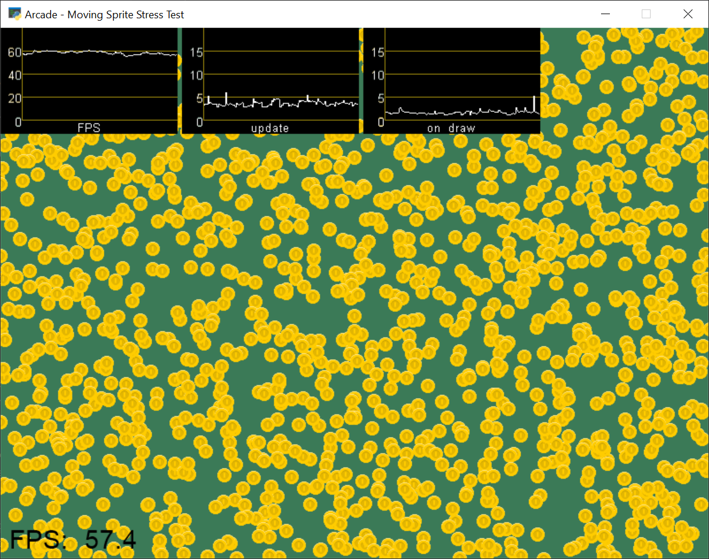
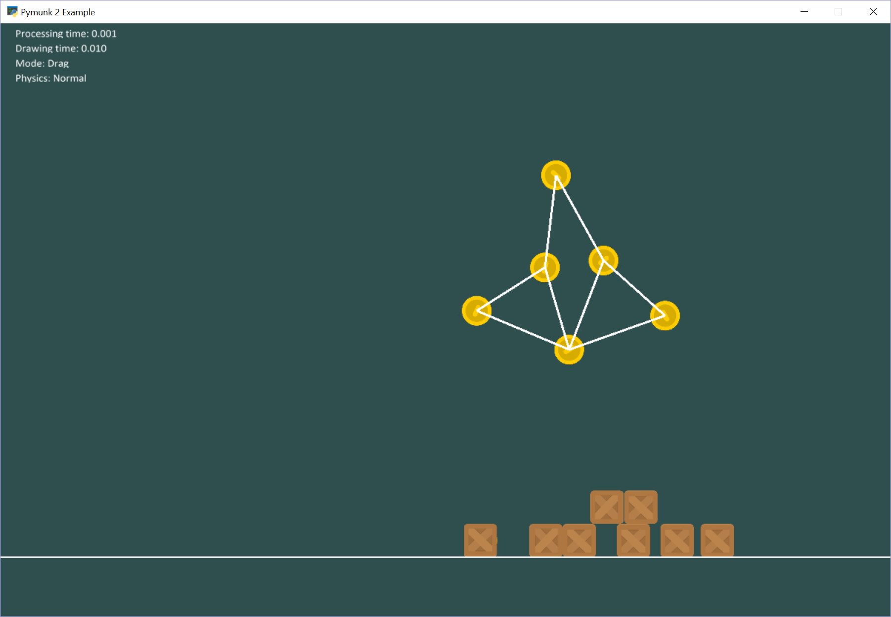
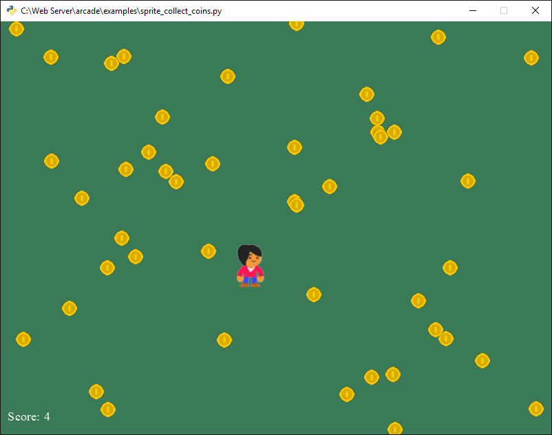
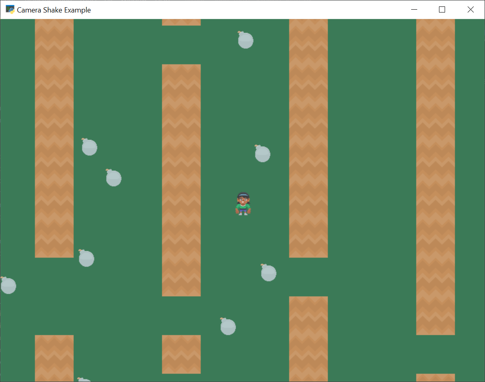
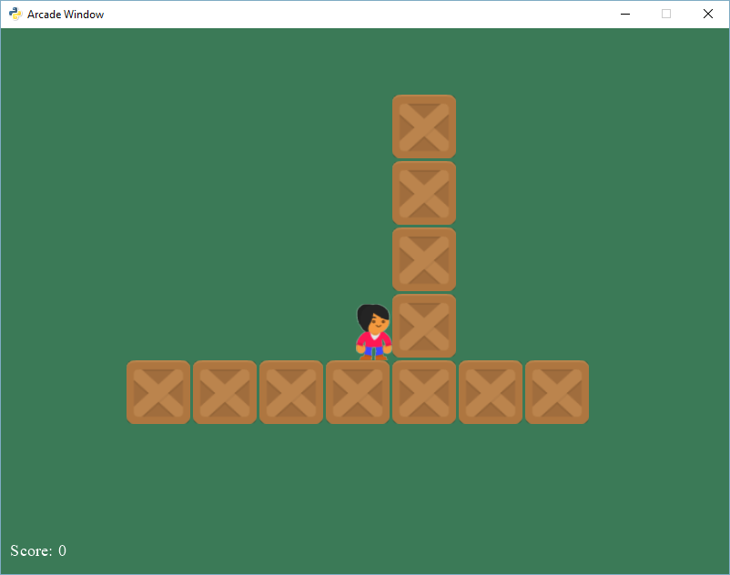

Example Code
============

array_backed_grid.py
--------------------
.. image:: how_to_examples/array_backed_grid.png

Source: :ref:`array_backed_grid`

This example demonstrates the use of a two-dimensional list or array (also known as a matrix) to create a visual grid on the screen application using the Python Arcade library. The code defines a grid with a certain number of rows and columns, each of a specific width and height. Each cell in the grid is represented by a number in the array, and these numbers can be updated to change the color of the corresponding cell. Mouse clicks on the screen are translated into cell coordinates so that the user can interact with individual cells. This mechanism can be used to build more complex visual applications like game boards or pixel art editors. The grid is drawn on the screen using Arcade's drawing functions, specifically, rectangles are used to represent cells.

array_backed_grid_buffered.py
-----------------------------
.. image:: how_to_examples/array_backed_grid_buffered.png

Source: :ref:`array_backed_grid_buffered`

This piece of Python code demonstrates the use of a 2-dimensional grid backed by a list of lists to represent and visualize grid-based information on screen using the Arcade library. The example creates a grid of cells where each cell can be toggled between two colors (white or green) by clicking on it. The code does this by maintaining a list of lists, where each element in the inner list corresponds to a grid cell and has a value of either 0 (white) or 1 (green). The example also computes the screen size required to display the grid with cells of given widths and heights, along with specified margins. Using Arcade's shape list, grid cells are drawn on the screen as rectangles of appropriate colors based on their values in the underlying 2D list. The code also handles mouse click events, converting screen coordinates into grid coordinates, toggling the value of the clicked grid cell, and rebuilding the shape list to update the grid display.

array_backed_grid_sprites_1.py
------------------------------
.. image:: how_to_examples/array_backed_grid_sprites_1.png

Source: :ref:`array_backed_grid_sprites_1`

This example demonstrates how to use a two-dimensional list or array to represent and manipulate the display of a grid on-screen using the Arcade library in Python. It creates a grid using a 2D list, where each cell can have a value of either 0 or 1, representing a white or green cell, respectively. The example then syncs the grid with a sprite list using the `resync_grid_with_sprites` method. This is a more efficient approach compared to rebuilding a shape list for every grid update. However, this implementation still requires inspecting every cell when the grid updates, which might be slow for large grids. The code also demonstrates how to handle user clicks on the grid and change cell values based on the click, updating the sprite colors to match the updated grid.

array_backed_grid_sprites_2.py
------------------------------

Source: :ref:`array_backed_grid_sprites_2`

This example demonstrates the use of a two-dimensional list or array to represent a grid of sprites on the screen using the Arcade library. The grid consists of rows and columns of sprites, which can be updated by simply changing the color of the relevant sprite. This technique allows for efficient handling of large grids while maintaining consistent performance. The example also shows how to handle mouse input to interact with the grid, converting the mouse click coordinates to grid coordinates and toggling the color of the relevant sprite in the grid. The code defines a custom class `MyGame` that inherits from `arcade.Window` and manages the grid of sprites, handling drawing and mouse events.

astar_pathfinding.py
--------------------
.. image:: how_to_examples/astar_pathfinding.png

Source: :ref:`astar_pathfinding`

This example demonstrates the A-Star pathfinding algorithm in a simple game using the Arcade library in Python. A-Star is a popular pathfinding algorithm often used in games to find the shortest path between two points while avoiding obstacles. In this game, there is a player character, walls, and an enemy. The player can move using arrow keys, and the enemy uses the A-Star algorithm to calculate the shortest path to the player while avoiding the walls. The game screen scrolls to keep the player in view, and when the player moves, the enemy updates its path. The example also illustrates the use of the PhysicsEngineSimple for basic collision detection with the walls and setting up the game window, sprites, and their rendering.

asteroid_smasher.py
-------------------

Source: :ref:`asteroid_smasher`

This example demonstrates a simple 2D game called "Asteroid Smasher" using the Arcade library in Python. In this game, the player commands a spaceship to shoot and destroy incoming asteroids. The game uses various features of the Arcade library, including sprite management for spaceship, asteroids, bullets, and lives, keyboard input handling for spaceship control, and collision detection between sprites. Furthermore, the game includes scoring and asteroid count updates, sound effects, off-screen wrapping for the spaceship and asteroids, and a life system for the spaceship with respawning mechanics. The example showcases the use of object-oriented programming techniques for creating custom sprite classes and managing game state within a main game class.

background_blending.py
----------------------
.. image:: how_to_examples/background_blending.png

Source: :ref:`background_blending`

The provided Python code using the Arcade library is an example of background blending in a game scenario. This technique involves loading and managing two scrolling game backgrounds, and automatically transitioning or blending between the two when the player sprite reaches a specific position on the x-axis. The blending effect is controlled with blend_layer method. The game player's movements are managed with keyboard inputs, and a simple camera system is used to ensure the rendered view always centers on the Player Sprite. The code also includes logic to manage window resizing, ensuring an adequate background coverage for different screen sizes.

background_groups.py
--------------------
.. image:: how_to_examples/background_groups.png

Source: :ref:`background_groups`

The given Python code using the Arcade library demonstrates the use of background groups and simple cameras in creating a game. The code defines a game window class and specifies properties such as screen height, width, and title. It also sets up player controls for motion. The primary concept this code highlights is how to handle multiple background images, allowing them to be drawn with a single draw call and move or scroll together as a group. It also demonstrates how to utilize a simple camera to keep the player in view, panning as needed to follow the player�s movements.

background_parallax.py
----------------------
.. image:: how_to_examples/background_parallax.png

Source: :ref:`background_parallax`

This example demonstrates the use of parallax scrolling in the Arcade library to create a visually appealing, seemingly endless background for a 2D game. Parallax scrolling is a technique where multiple layers of images move at different speeds, creating an illusion of depth and a more immersive experience for the player. The Arcade library provides the ParallaxGroup class to easily implement this technique. In this example, a car moves horizontally across a background consisting of four layers - sky, buildings, palms, and a highway - each moving at a different depth, giving the illusion of distance. The SimpleCamera class in Arcade neatly encapsulates the camera's position, allowing for the seamless tracking and panning of the player's car across the screen. When resized, the background ensures it still occupies the full width of the new screen size.

background_scrolling.py
-----------------------
.. image:: how_to_examples/background_scrolling.png

Source: :ref:`background_scrolling`

The given code demonstrates the implementation of a scrolling background using the Arcade library in Python. It utilizes the Arcade.experimental.background module to create a screen-sized background texture that is constantly aligned to the camera viewport and changes its texture offset, giving the illusion of movement. The example code also includes a player sprite that the user can control with arrow keys, and the camera is smoothly panned to keep the player at the center of the screen. The scrolling background is achieved by updating the background's position and texture offset to stay in sync with the camera position. This concept and technique can be particularly useful in creating side-scrolling or top-down video games that involve continuous movement through a large environment.

background_stationary.py
------------------------
.. image:: how_to_examples/background_stationary.png

Source: :ref:`background_stationary`

The provided Python code is a small game application that demonstrates how to implement a stationary background using Python's Arcade library. It details how to load a background image from a file and draw it in a window, with camera functionality that pans to center on the player sprite as it moves around the screen based on user commands. The setup involves creation of a player sprite and tracking its motion with keyboard inputs. Additionally, it ensures that the camera positioning does not allow the player to move off the visible area of the background. This code is a clear example of handling a game's graphical objects, user inputs, and real-time updates to a game's state - mainly the player's movement and the camera view, in an event-driven context.

bouncing_rectangle.py
---------------------
.. image:: how_to_examples/bouncing_rectangle.png

Source: :ref:`bouncing_rectangle`

This example demonstrates how to create a simple animation using the Arcade library in Python, specifically bouncing a rectangle within the confines of a window. It defines a class 'Item' that represents a rectangle with properties like its position, dimensions, and movement along with methods to update its position and draw it on the screen. The main game class, 'MyGame', uses the Arcade Window class to create a window where the rectangle object is animated. The 'on_update' method of the 'MyGame' class is responsible for updating the item's position, while the 'on_draw' method is responsible for rendering it to the screen. The code sets up a basic game loop, continuously calling 'on_update' and 'on_draw' methods to animate the bouncing rectangle.

camera_platform.py
------------------
.. image:: how_to_examples/camera_platform.png

Source: :ref:`camera_platform`

This Python code is a demonstration of a platform game using the Arcade library. It starts with defining some constants related to the viewport, physics, and layers of the game map. The 'MyGame' class then sets up and manages the game, with functions for initializing, setting up the game, rendering the display, handling key-press events, panning the camera view for a scrolling effect, and updating the game state. Key features include loading a tile map, creating and controlling a player sprite, implementing game physics, collision detection with coins and bombs, and a constantly updating score count. It also includes a game over condition when the player reaches the end of the map. Furthermore, camera movement is managed to create an effect of scrolling viewport, maintaining the player sprite in view during gameplay. The concept of 'Frames per Second' (FPS) is demonstrated by repeatedly calculating and displaying the FPS. This case also includes the creation and utilization of cameras to handle the viewport, and how to shake the camera upon specific events like hitting a bomb.

conway_alpha.py
---------------
.. image:: how_to_examples/conway_alpha.png

Source: :ref:`conway_alpha`

This piece of Python code illustrates how to create and manipulate a grid of sprites using the Arcade library. It's an implementation of Conway's Game of Life, a cellular automaton devised by the British mathematician John Horton Conway. The code sets up a grid of sprites, using a two-dimensional list for grid access and a one-dimensional list for drawing. The 'alpha' value of the sprites is used to toggle them 'on' or 'off', simulating live and dead cells in the Game of Life. The game follows a set of rules to decide on the state of a cell in the next generation, based on its current state and the states of its neighboring cells. Each cell in the grid is a sprite that can either be 'alive' (visible) or 'dead' (invisible), thus creating an interactive visual representation of Conway's Game of Life. The simulation updates and displays the grid with each new generation of cells.

drawing_primitives.py
---------------------
.. image:: how_to_examples/drawing_primitives.png

Source: :ref:`drawing_primitives`

This Python code demonstrates how to use the Arcade library to draw various geometric shapes and lines, how to fill them with color, and how to draw text fields. It uses multiple Arcade functions including draw_line, draw_point, draw_circle_outline, draw_rectangle_filled, draw_ellipse_outline, draw_arc_filled, and more. Each item is drawn on a 600x600 window, with a white background. The code uses a loop to draw a grid onto which the various shapes are positioned. The code also includes examples of how to load and render image textures onto the screen with specified scales and rotation. Notably, every drawing should be enclosed between "start_render" and "finish_render" for it to appear on screen. The script ends with an infinite loop that keeps the window open until it's manually closed. This implementation is a great starting point for basic 2D game design and computer graphics in Python.

drawing_text.py
---------------
.. image:: how_to_examples/drawing_text.png

Source: :ref:`drawing_text`

This example demonstrates how to draw text in various fonts, styles, positions, and orientations using the Arcade library in Python. It covers various text-related features such as choosing different fonts, including built-in and system fonts; setting font size, bold, and italics properties; and adjusting text alignment using anchor points. Additionally, it shows how to use multiple lines in text using newline characters, automatic text wrapping, and rotating text by updating its angle on every frame update. The example creates a window with two columns of text displaying a variety of these text-drawing techniques, making it easier for users to understand how to use the Arcade library to manipulate and display text on the screen.

drawing_text_objects.py
-----------------------
.. image:: how_to_examples/drawing_text_objects.png

Source: :ref:`drawing_text_objects`

This code is a detailed example on how to use the Arcade library in Python for displaying various forms of text in a created window. The text displays can be both static and dynamic (such as the rotating text in the example), and includes the utilization of different fonts, sizes, colors, multiline text, text positioning and more. The Arcade Text object is utilized and demonstrated here to be highly efficient in rendering text in a graphics window. The example also showcases the method of updating the state of text based on elapsed time in the on_update function and rendering them in the on_draw function. A 'dot' is used to clearly indicate relative positioning of the text. This is not only an example of text rendering, but also indirectly shows object oriented programming and how to structure a game using the Arcade library in Python.

drawing_text_objects_batch.py
-----------------------------
.. image:: how_to_examples/drawing_text_objects_batch.png

Source: :ref:`drawing_text_objects_batch`

This example demonstrates the efficient drawing of text using the Arcade library and pyglet's batch functionality. It showcases different styles, fonts, alignments, and rotations of text objects, as well as multiline text and wrapping. By adding the arcade.Text objects to a batch, the example allows for drawing thousands of text objects at nearly the same cost as drawing a single one directly. The MyGame class initializes various text objects with different properties, updates the rotation of a text object, and draws all the text objects alongside red points to indicate their starting positions. This example is beneficial for understanding how to work with various text styling and formatting options while optimizing performance using batch rendering.

dual_stick_shooter.py
---------------------
.. image:: how_to_examples/dual_stick_shooter.png

Source: :ref:`dual_stick_shooter`

This example is a demonstration of game development using the Arcade library in Python. It depicts the creation of a dual-stick shooter game where players can use either a game controller, if present, or keyboard controls. The game involves a player sprite that moves and shoots at spawning enemy sprites, scoring points for each enemy defeated. The player sprite's movement and shooting directions are managed either by the controller or keyboard inputs. If an enemy reaches the player sprite, the game is over. The example employs a variety of concepts such as object-oriented programming (creation of Player, Enemy, and Game classes), usage of internal library functions for sprite list creation, collision detection, scheduled tasks, keyboard and controller input mapping, and rendering game visuals.

easing_example_1.py
-------------------
.. image:: how_to_examples/easing_example_1.png

Source: :ref:`easing_example_1`

The given Python code explains the utilization of easing functions for positioning using the Arcade library. Easing functions are used to give a dynamic or 'animation-like' motion to a static object in programming. It does not simply move the object from one point to another but adds a bit of realism to its movement by accelerating and decelerating it. The example also shows how to use easing for angles. It covers various easing types like linear, ease out, ease in, smoothstep, ease in/out, ease out elastic, ease in back, and many more. These easing types decide the speed of the object at different instances producing various motion effects. This script displays balls moving across the screen using these different types of easings to illustrate their effects and compare them visually.

easing_example_2.py
-------------------
.. image:: how_to_examples/easing_example_2.png

Source: :ref:`easing_example_2`

This example demonstrates the use of easing functions in the Arcade library to create smooth animations for position and angles. Easing functions provide a way to interpolate between two points or angles, which allows for gradual changes in position or angle over time. The code includes a `Player` class that has methods for updating the sprite's angle and position using different easing functions, and a `MyGame` class that implements the game window and user input. When a user presses numbered keys from 1 to 9, the example demonstrates different easing functions such as linear, ease-in, ease-out, and smoothstep for both angle and position. This helps to understand how different easing functions can affect the game object's motion and rotation, creating more visually appealing and varied animations.

follow_path.py
--------------

Source: :ref:`follow_path`

This example demonstrates how to create a sprite, specifically an enemy sprite, that follows a predetermined path in a game using the Arcade library. It defines an `Enemy` class that inherits from the `arcade.Sprite` class and implements an update function to control the sprite's movements along a specified list of positions. The path is determined by a list of (x, y) coordinates, and the sprite's speed is also taken into account to ensure smooth transitions between path points. The sprite calculates the angle and distance to the next point in its path and uses trigonometry functions to update its position accordingly. When the sprite reaches the end of the path, it loops back to the beginning. In this particular example, the player sprite follows the mouse cursor, and a robot enemy sprite moves along a square-shaped path.

full_screen_example.py
----------------------
.. image:: how_to_examples/full_screen_example.png

Source: :ref:`full_screen_example`

This piece of Python code provides an example of how the Arcade library can be used to create a basic windowed or full-screen mode application with a tile-based interface. The script uses sprites for creating the platform and elements. It demonstrates how to load a sprite, how to draw sprites on the screen, and how to handle key press events to switch between fullscreen and windowed modes. In particular, it highlights the use of fullscreen and viewport features of the arcade.Window class, where 'viewport' refers to the portion of coordinates that are displayed on-screen. You can see it in action with the full screen and windowed modes toggles. The Arcade library facilitates smooth transition between the two modes by adjusting the viewport to match the window size. This example further shows how to use Arcade�s drawing functions to provide instructions to the user about interaction with the display modes.

gradients.py
------------

Source: :ref:`gradients`

This example demonstrates the use of gradients in the Arcade library for drawing various shapes with smooth transitions between colors. It showcases gradients applied to a full-screen background, a smaller rectangle, a pair of lines, a triangle, and an ellipse. The colors and transparency in the gradients are defined by specifying the colors at the vertices of each shape. The gradient effect is achieved by interpolating colors between the defined vertices. The example highlights the flexibility in applying different gradient patterns to shapes, such as transitioning between two colors, fading transparency, or using gradients in the combination of multiple shapes.

gui_flat_button.py
------------------
.. image:: how_to_examples/gui_flat_button.png

Source: :ref:`gui_flat_button`

This example demonstrates how to create a functional Graphical User Interface (GUI) using the Arcade library in Python. It specifically showcases the creation of a button and three different methods to handle button click events. The example sets up a series of 'Start Game', 'Settings' and 'Quit' buttons using FlatButton from Arcade's GUI widget library. The buttons are placed inside a vertical BoxLayout for alignment. The first method of handling click events uses a child class (QuitButton), which overrides the on_click method. The second method assigns a callback function (on_click_start) to the start_button's on_click property. Lastly, the third method utilizes a decorator with the on_click event for the settings_button. This code also demonstrates the use of UI events and management. The UIAnchorLayout is used to center the buttons on the screen, and the UIEnabler and UIDisabler methods are called to manage the UI element based on the view's active state.

gui_flat_button_styled.py
-------------------------
.. image:: how_to_examples/gui_flat_button_styled.png

Source: :ref:`gui_flat_button_styled`

This example demonstrates the use of the Arcade library for creating and styling graphical user interface elements, specifically UIFlatButtons. It shows how to create custom styles for buttons using the UIFlatButton.UIStyle class and how to apply these styles to different button states, such as 'normal', 'hover', 'press', and 'disabled'. The example also illustrates creating a vertical box layout using UIBoxLayout, which aligns the buttons with a specified space between them, and UIAnchorLayout to center the buttons within the window. The UIManager is used in conjunction with these UI elements to handle window events and manage the overall user interface.

gui_ok_messagebox.py
--------------------
.. image:: how_to_examples/gui_ok_messagebox.png

Source: :ref:`gui_ok_messagebox`

This Python code demonstrates how to create and manage a simple graphical user interface (GUI) using the Arcade library. It particularly focuses on the utilization of a message box and a button within this interface. An instance of the "MyView" class, which extends Arcade's "View" class, is established. This class is designed to showcase an 'OK' message box and its behavior. The code creates a GUI box that is centered and contains an actionable button titled, "Show Message Box". Upon clicking this button, it is made invisible and a message box with "Ok" and "Cancel" buttons appears. The chosen option from the message box is displayed once the message box is dismissed.  The Arcade's 'UIManager' is used to manage and handle the UI elements and events such as drawing the UI, clicking the button and enabling/disabling the UI when the view is shown/hidden.

gui_scrollable_text.py
----------------------
.. image:: how_to_examples/gui_scrollable_text.png

Source: :ref:`gui_scrollable_text`

This Python code using the Arcade library demonstrates the creation and usage of a graphical user interface (GUI) using UIManager, UIInputText, and UITextArea, along with nine-patch textures. It creates a resizable application window and adds various UI elements to it, including two editable text input fields and a non-editable multi-line text field displaying lorem ipsum content. The UI elements feature a background texture with a nine-patch texture to handle resizing correctly. This code also shows the lifecycle methods of an arcade view (on_show and on_hide_view) being used to enable and disable the UIManager, resulting in catching window events only when the UI is active. This demonstration showcases advanced concepts of using the Arcade library to create an interactive user interface in a Python application.

gui_slider.py
-------------
.. image:: how_to_examples/gui_slider.png

Source: :ref:`gui_slider`

The given example demonstrates the creation and usage of a GUI slider in the Arcade library for Python. It shows how to use the UIManager to handle UI widgets, create a UISlider with specific dimensions and initial value, and create a UILabel to display the current value of the slider. The example also illustrates how to update the displayed value using the on_change event by changing the label's text whenever the slider is dragged. Furthermore, the code sets up a UIAnchorLayout to position the widgets on the screen, and properly handles enabling and disabling the UIManager when the view is shown or hidden.

gui_widgets.py
--------------
.. image:: how_to_examples/gui_widgets.png

Source: :ref:`gui_widgets`

This example demonstrates how to create and manage various graphical user interface (GUI) elements using the Arcade library in Python. It showcases the creation, configuration, and usage of UI widgets, such as labels, buttons, and layouts. The UIManager class is used to manage and handle UI events. A UIBoxLayout is used to vertically align the UI elements, and a UIAnchorLayout is used to center the child widgets within the window. Different types of widgets, such as UITextArea, UIFlatButton, and UITextureButton, are created, configured, and then added to the layouts. Event handling is done using the on_click function decorators to define actions that occur when the respective UI elements are clicked. This example teaches users how to create a simple UI using the Arcade library and demonstrates the behavior and appearance of different UI elements.

happy_face.py
-------------
.. image:: how_to_examples/happy_face.png

Source: :ref:`happy_face`

This python code using the Arcade library provides a simple demonstration of how to create graphics and shapes in a display window. The specific shapes drawn in this example form a depiction of a happy face. First, the code establishes the window size with "SCREEN_WIDTH" and "SCREEN_HEIGHT", gives it a title, and sets the background color. Then the "start_render" function is called to start the drawing process. Following this, multiple 'draw' functions are used to create the face, eyes, and smile of the happy face using circles and an arc for the smile. Each shape requires specific parameters to define their size, position, and color. After the drawing process, the "finish_render" function is used to display the result. The 'run' function keeps the window open until the user closes it.

light_demo.py
-------------
.. image:: how_to_examples/light_demo.png

Source: :ref:`light_demo`

The provided code illustrates advanced lighting concepts that can be used in games developed with the Arcade library in Python. The script sets up a basic 2D game world with different kinds of light sources, including ambient light, player-centered light, hard and soft lights of varying colors, as well as lights with varying radii. The concept of layering is also emphasized with the use of a light layer, to which different light sources are added or removed in order to control the lighting effects. The code also demonstrates how to handle light layer resizing with changes in the game window size, as well as how to control character movement and screen scrolling. The program also includes methods for handling user interactions, such as turning the player light on or off by pressing the spacebar, and moving the player character around using the arrow keys. This aspect of the code demonstrates the importance of inputs in controlling the game's conditions and aspects like lighting.

lines_buffered.py
-----------------
.. image:: how_to_examples/lines_buffered.png

Source: :ref:`lines_buffered`

The provided Python code is an example of using Vertex Buffer Objects with lines in the Arcade library. It demonstrates how to create more complex, colorful objects rendered through vertex buffer objects using drawing primitives such as lines, points, and polygons. After setting up the arcade.Window, random lines are generated using the create_line_strip function to select the points and choose a color from the available color options in the Arcade library. All these random lines are added to the ShapeElementList object, which is a container for draw-awable geometry. The example also shows how to handle the on_draw and on_update events to animate the randomly populated lines around the center of the screen. The principles demonstrated here are fundamental to creating dynamic, visually complex programs or games in Python using the Arcade library.

line_of_sight.py
----------------
.. image:: how_to_examples/line_of_sight.png

Source: :ref:`line_of_sight`

This Python code demonstrates how to use the Arcade library to create a simple video game where the player character can interact with enemies and a changing environment. It showcases key concepts in game development like sprites, game physics, movement controlled by key presses, and view port management for scrolling. The key aspect demonstrated by this script is the 'line of sight' mechanic. An interactive line is drawn between the player and each enemy, changing color if there is an obstruction in the path - such as a wall. This allows the player to visually assess whether their character's line of sight is blocked or not.

maze_depth_first.py
-------------------
.. image:: how_to_examples/maze_depth_first.png

Source: :ref:`maze_depth_first`

This example demonstrates how to create a maze using the depth-first search algorithm in the Arcade library. It generates a random maze of specified width and height with walls and empty cells. The player can navigate through the maze using keyboard input. The example also showcases scrolling and viewport management, ensuring the player remains visible and centered on screen while moving through the maze. Additionally, the code presents two methods for drawing the maze: one that keeps separate sprites for each wall cell and another that uses repeating texture for consecutive cells to reduce the number of sprites. Finally, it includes a performance measurement for processing time and drawing time.

maze_recursive.py
-----------------
.. image:: how_to_examples/maze_recursive.png

Source: :ref:`maze_recursive`

This example Python code implements a maze game utilizing the Arcade library, a modern library for 2D graphics with support for Python 3.6+ and PyPy3. The maze is generated with a recursive division method, a technique used to create complex and perfect (i.e., without loops or isolated walls) mazes. The player can navigate through the maze using the arrow keys, and a simple physics engine is employed for collision detection. The game uses sprite-based graphics, where each tile of the maze is a sprite. Various features such as viewport scrolling, sprite merging for more efficient rendering, and player placement within boundaries are demonstrated. Additionally, the game also computes and shows metrics like the sprite count, drawing time, and processing time for performance analysis.

minimap.py
----------

Source: :ref:`minimap`

This example demonstrates the use of the Arcade library in Python to create a game with a mini-map displaying the player's location and surrounding walls in a larger game world. The game window is resizable, and the main game view updates as the player moves around the map, with the mini-map showing an overview of the entire game area. The example features the creation and management of sprite lists, camera implementation to follow the player's movement, and a physics engine for simple object interaction and collision. Additionally, it shows how to render and update the mini-map using a separate dedicated camera, handle keyboard inputs for character movement, and resize event management for updating the viewport when the window size changes.

minimap_camera.py
-----------------
.. image:: how_to_examples/minimap_camera.png

Source: :ref:`minimap_camera`

This example demonstrates the use of the Arcade library to create a game with a main screen and a mini-map. It includes the implementation of viewport cameras, such as `camera_sprites` for the main screen, `camera_minimap` for the mini-map, and `camera_gui` for the unscrolled view. The code allows you to switch between cameras and adjust the zoom level using keyboard inputs, and it handles window resizing. In the game, the player navigates through a maze of walls while the mini-map provides a smaller, real-time overview of the player's position within the larger game map. The example showcases the versatility and ease of working with multiple views and cameras in an Arcade game.

music_control_demo.py
---------------------
.. image:: how_to_examples/music_control_demo.png

Source: :ref:`music_control_demo`

This example demonstrates the usage of the Arcade library for playing, pausing, and controlling the volume of music in a simple graphical user interface (GUI) with buttons. It uses the Arcade GUI module to create custom buttons with different textures for their normal, hovered, and pressed states. It also showcases how to manage multiple songs, switching between them using the forward button and displaying the current playback time and volume. The buttons control actions such as play/pause, volume up, volume down, and skip forward in the song. The program also handles the end of a song by automatically switching to the next one in the playlist. This is a good example of using the Arcade library for audio playback control and integrating it into custom GUI interfaces.

net_process_animal_facts.py
---------------------------
.. image:: how_to_examples/net_process_animal_facts.png

Source: :ref:`net_process_animal_facts`

This example demonstrates the use of the Arcade library with multiprocessing to run a background service that fetches random animal facts and images from various APIs and displays them on the screen. The service runs in a separate process, ensuring that the main game loop runs smoothly while waiting for data. Additionally, textures are shared between processes so that the fetched images can be displayed. The code also includes features such as a spinning loading indicator, a progress bar to show time until the next fact is requested, and various controls for user interaction. The example highlights external content fetching, multiprocessing, and the use of various UI elements provided by the Arcade library.

particle_fireworks.py
---------------------
.. image:: how_to_examples/particle_fireworks.png

Source: :ref:`particle_fireworks`

This example demonstrates the use of the Arcade library to create a particle-based fireworks simulation. It utilizes Emitters and Particles to form various firework types that explode when launched, resulting in visually impressive displays. The program combines multiple particles, such as smoke, sparks, and flashes to produce realistic fireworks effects. Emitters control the particle generation with different strategies like EmitBurst, EmitterIntervalWithTime, and EmitMaintainCount for various visual effects. Overall, this example showcases the potential for creating complex and engaging visual displays using particles and emitters in the Arcade library.

particle_systems.py
-------------------
.. image:: how_to_examples/particle_systems.png

Source: :ref:`particle_systems`

This Python code illustrates how to use Particle Systems using the Arcade library - demonstrating the use Emitter and Particle classes to create varied effects. The example demonstrated creates a series of different particle emitters, with each variation differing slightly from the previous through changes in settings. These diverse emitters include random particle textures, velocity changes, fading particles, etc. To display these particle effects various emitter functions have been defined, with each function generating a different particle effect. In addition, the script creates a window using the Arcade library's Window class, and the movement and update of these particle systems are controlled by the overriden methods within the custom MyGame class. This example provides a rich display of the potential applications of particle systems in Python-based game development.

performance_statistics.py
-------------------------

Source: :ref:`performance_statistics`

This example demonstrates the usage of performance profiling tools provided by the Arcade library in a simple game application where a large number of coin sprites bounce around the screen. The tools used include arcade.enable_timings, arcade.PerfGraph, arcade.get_fps, arcade.print_timings, and arcade.clear_timings. These performance profiling tools help track the number of event handler calls, average execution time for each event type, Frames Per Second (FPS), and update or clear timings for optimization. The example also showcases how to display the performance statistics on-screen and how to manage the game objects using the arcade.Window and arcade.SpriteList classes. Additionally, it allows the user to toggle the profiling tools on and off using the space key.

perspective.py
--------------
.. image:: how_to_examples/perspective.png

Source: :ref:`perspective`

This example demonstrates the use of perspective projection and shaders to create a 3D effect in an Arcade game. The code creates a virtual framebuffer for off-screen rendering, maps the content onto a texture, and rotates the texture in 3D space using perspective projection. A simple texture shader is used to project and model the matrix, as well as scroll texture coordinates. The example code sets up a geometry buffer for a textured plane and adds sprites to the scene. The on_draw() method updates the offscreen texture, clears the window, applies transformations to the plane's position and rotation, and scrolls the texture coordinates. Finally, the draw_offscreen() method renders the sprites into the framebuffer's texture, and the on_resize() method updates the perspective projection as needed. This technique can be used to create 3D backgrounds or other visual elements in a 2D Arcade game.

procedural_caves_bsp.py
-----------------------
.. image:: how_to_examples/procedural_caves_bsp.png

Source: :ref:`procedural_caves_bsp`

This example demonstrates the procedural generation of random cave systems using Binary Space Partitioning (BSP) combined with the Arcade library. The program generates dungeons using a grid-based algorithm that repeatedly splits the space into regions and carves rooms and corridors between them. The resulting cave systems are then visualized using the Arcade library, rendering walls and the player character as sprites within the environment. The player can navigate the caves using keyboard controls as the camera adjusts its viewport to follow the player. This showcases one method for creating procedural dungeons in a grid-based game while maintaining performance and practicality.

procedural_caves_cellular.py
----------------------------
.. image:: how_to_examples/procedural_caves_cellular.png

Source: :ref:`procedural_caves_cellular`

This example demonstrates the procedural generation of a random cave system using the Python Arcade library and cellular automata. The program initializes a 2D grid, populates it with "alive" cells based on a predetermined chance, and iteratively refines the grid using a cellular automaton, which applies rules for "birth" and "death" to various cells based on the number of neighbor cells. The refined grid is then converted into a set of sprites, with the "alive" cells constituting walls and obstacles. The player's avatar is randomly positioned on the map, and camera scrolling is employed to keep the player at the center of the viewport as they navigate the procedurally generated cave.

pymunk_box_stacks.py
--------------------
.. image:: how_to_examples/pymunk_box_stacks.png

Source: :ref:`pymunk_box_stacks`

This example demonstrates the integration of the Pymunk physics engine with the Arcade library to create a 2D physics simulation. In this simulation, boxes are stacked in a grid, and users can interact with the simulation by clicking and dragging the boxes or shooting a heavy coin using the right mouse button. The code follows the typical structure of an Arcade application, defining a custom window class, `MyGame`, with methods for handling various events like drawing, mouse input, and updating the state of the simulation. The `PhysicsSprite`, `CircleSprite`, and `BoxSprite` classes are custom sprite classes that associate the Pymunk shapes with the Arcade sprite objects. The `on_draw` method draws the sprites and any additional static elements such as the floor. The `on_mouse_*` methods define how the simulation should respond to user input, while the `on_update` method updates the physics simulation and synchronizes the positions and angles of the sprites with the Pymunk shapes.

pymunk_demo_top_down.py
-----------------------
.. image:: how_to_examples/pymunk_demo_top_down.png

Source: :ref:`pymunk_demo_top_down`

This example demonstrates the use of the Pymunk Physics Engine within the Arcade library to create a top-down game. The game consists of a player character that can move around a screen with a boundary of walls, push a set of rocks and gems, and shoot bullets. The bullets have different attributes such as mass, damping, friction, elasticity, and collision effect). The game world has variable damping and friction for all objects, which control how objects slow down over time. The player's movement is controlled through keyboard inputs, where a force is applied to the player's character in the direction of the key pressed. The example also includes collision handlers for when a bullet hits a rock or wall. The physics engine takes care of all the movement, forces, and collision calculations, making it easier to develop complex physical interactions in the game world.

pymunk_joint_builder.py
-----------------------

Source: :ref:`pymunk_joint_builder`

The provided example demonstrates how to create a physics simulation using the Arcade library combined with the Pymunk library in Python. It covers the use of various physics properties (like gravity, damping, and friction) and interaction with objects in the simulation through mouse controls. The example has different modes such as drag mode, creation of boxes and circles, and the creation of pin joints and damped springs to connect objects. The example is built with a main application class where methods are used to create shapes, handle user inputs, manage the physics engine, and render the scene. Users can also change the physics environment by toggling between "Normal," "Outer Space," and "Layout" gravity and damping settings, and shoot coins using the right mouse button.

pymunk_pegboard.py
------------------
.. image:: how_to_examples/pymunk_pegboard.png

Source: :ref:`pymunk_pegboard`

This Python code provides an example of how to utilize the Arcade library and the Pymunk physics engine together to create a dynamic and interactive simulation. The application displays a grid of static circles (similar to a pegboard), and constantly drops balls at random horizontal positions from the top of the screen. The balls are subject to gravity and bounce off the static circles, the floor, and the walls on the sides. The class `CircleSprite` is used to couple a graphical representation (or sprite) from the Arcade library with a physical body from the Pymunk engine. All the balls and pegs are instances of this class. The main game class `MyGame` includes methods for updating the physics, drawing all the objects on screen, and handling events. This explains how to combine the 2D graphics of the Arcade library with the physical simulations of the Pymunk engine, providing an example of how to implement a more realistic and interactive game or display. The code also demonstrates how to time different events and how to manage and update different game components.

radar_sweep.py
--------------
.. image:: how_to_examples/radar_sweep.png

Source: :ref:`radar_sweep`

The given Python code demonstrates a radar sweep animation using the Arcade library. It creates a simulation of a radar screen with a rotating sweep line and a circular outline to represent the radar's range. The Radar class contains an update method to adjust the angle of the sweep line and a draw method to render the line and circular outline on the screen. The MyGame class inherits from arcade.Window to create a window with custom dimensions and title, and it overrides the on_update and on_draw methods to update and draw the radar sweep, respectively. The main function initializes the MyGame class and starts the animation by calling arcade.run(). This example provides a visually appealing way to understand trigonometry in motion, specifically the use of sine and cosine functions to move an object in a circular path.

resizable_window.py
-------------------
.. image:: how_to_examples/resizable_window.png

Source: :ref:`resizable_window`

The snippet is an example of how to handle window resizing in Python using the Arcade Library. It defines a simple game window that can be resized, with its dimensions output to the console each time a resize occurs. The code defines an "on_resize" method to achieve this; this method is automatically called whenever the game window is resized, updating the window dimensions accordingly. Besides that, the "on_draw" method is overridden to customize the drawing/display on the window: it draws x and y labels at regular intervals along the two axes. When run, the snippet creates an instance of this game window with the specific screen width, screen height, and screen title, and the Arcade game engine is run.

sections_demo_1.py
------------------

Source: :ref:`sections_demo_1`

The python code demonstrates how to create and manage sections of a screen using the Arcade library. It creates a window which is divided into two sections (left and right). Each section is designated with a certain color and action. The "Box" class represents an object in each section. The "ScreenPart" class represents a section of the screen, it can handle its own events (such as mouse clicking, dragging, entering, and leaving). It also updates and draws the section and the box object in it. The "GameView" class manages the view of the game -- it initializes the game window, divides the window into 2 sections, and draws a line separating these sections. The code shows the encapsulation of game logic within individual classes, and how each class handles its events independently, making the code modular and easy to maintain.

sections_demo_2.py
------------------
.. image:: how_to_examples/sections_demo_2.png

Source: :ref:`sections_demo_2`

The provided example features an elementary two-player Pong game, which illustrates the use of Sections in the Arcade library, a Python library for creating 2D video games. In this game, each player's motion range on the screen is depicted as a Section. The concept of Sections, which do not need to occupy the entire screen, is unique to this library. Keyboard events can be directed to each Section based on the button pressed, thus enabling two players to play on the same computer. The game also demonstrates the use of Views, as well as the creation, updating, and drawing of sprites (in this case, paddles and a ball), keyboard event handling, collision detection, and game logic implementation (i.e., keeping score and ending the game).

sections_demo_3.py
------------------

Source: :ref:`sections_demo_3`

The code describes how to create a game using the Arcade library in Python. It demonstrates the usage of the Arcade sections to segregate and manage elements in a game's user interface. Arcade Section isolates the piece of code that moves together in the view and receives events only as per section configuration. Distinct game elements such as the ball, the information bar, the panel, the popup window and map for game objects, are all implemented as separate classes each inheriting from the arcade's Section class. They can capture, update, and manage events that concern them. The main game view orchestrates these sections and handles their individual functionality. It highlights how to prevent event dispatching, draw interfaces, use section properties for interactivity, use modal sections, handle key presses, and mouse events.

shapes.py
---------
.. image:: how_to_examples/shapes.png

Source: :ref:`shapes`

The provided Python code demonstrates the use of object-oriented programming (OOP), specifically class inheritance and instance methods, to create and manipulate shapes within the Arcade graphics library. A parent class "Shape" is defined, with child classes "Ellipse", "Rectangle", and "Line" inheriting its properties. Additionally, it shows how to use lists to manage and manipulate multiple instances of objects (in this case, shapes) simultaneously. The code also exemplifies how to use the Arcade window methods for game state updating and rendering. A "MyGame" class is defined which inherits from the arcade.Window class, and overrides the on_update and on_draw methods to update the position of the shapes and draw them respectively. The script creates randomly sized, colored, and placed shapes that move in random directions, providing an understanding of how to create basic animations with multiple objects in Arcade.

shape_list_demo_1.py
--------------------
.. image:: how_to_examples/shape_list_demo_1.png

Source: :ref:`shape_list_demo_1`

This example demonstrates the inefficient method of drawing a grid of squares on the screen using the Arcade library without any optimization or buffering techniques. By individually drawing each square instead of using more efficient techniques such as sprite batching or shape lists, the process becomes time-consuming, resulting in a slower frame rate. The script also measures and displays the time taken per frame to draw the grid to give an idea of the performance impact caused by this approach. This serves as a starting point to demonstrate the importance of optimization in rendering complex scenes using Arcade or other similar libraries.

shape_list_demo_2.py
--------------------
.. image:: how_to_examples/shape_list_demo_2.png

Source: :ref:`shape_list_demo_2`

This example demonstrates the use of the Arcade library to efficiently draw a grid of squares on the screen using buffered rectangles. It does so by creating a ShapeElementList and appending filled rectangle shapes to it with specified positions, dimensions, and colors. The shape_list is then drawn on the screen, effectively rendering the grid. The example also measures and displays the drawing time of each frame to showcase the efficiency of using buffered rectangles in comparison to loading vertices and colors for each frame. This method provides a more optimized rendering process, especially when handling multiple shapes or large grids.

shape_list_demo_3.py
--------------------
.. image:: how_to_examples/shape_list_demo_3.png

Source: :ref:`shape_list_demo_3`

The given Python code illustrates the concept of using buffer to improve the performance of rendering in Arcade library. It creates a grid of square shapes and draws them on the screen using a single draw call, instead of performing multiple draw commands for each square. The square shapes along with their properties such as color and position coordinates are stored in a shape list. When it comes to rendering these squares, all are drawn in one go using the `shape_list.draw()` method, improving the speed and efficiency of the rendering process. The `timeit` module is used to keep track of the time taken for each frame to render. Consideration for the order of the points as well as color gradients is also taken into account. This technique can significantly increase the performance when working with many objects that need to be rendered simultaneously.

shape_list_demo_skylines.py
---------------------------

Source: :ref:`shape_list_demo_skylines`

This Python code demonstrates the use of Python's Arcade library to create a simple graphics application that generates a starry city skyline. The code creates an arcade window and implements a cityscape generation feature, complete with buildings and a star field. It takes a procedural approach to create the city skyline, making the height, width, and gap between buildings random. Additionally, the code includes features such as window lights on some buildings and random star locations for a realistic look. The window dragging feature, implemented in the 'on_mouse_drag' function, adds interactivity to the code. This code also illustrates the application of object oriented principles in creating games or simulations. Thus, it highlights the features of the Arcade library, procedural generation and basic user interaction.

slime_invaders.py
-----------------
.. image:: how_to_examples/slime_invaders.png

Source: :ref:`slime_invaders`

This Python code demonstrates a basic yet complete 2D game implementation using the Arcade library. It takes inspiration from the classic "Space Invaders" game and uses slimes as enemies. The code covers techniques such as sprite and texture handling (for both player and enemies), sprite list management, collision detection, and handling player input. The game has states, represented by 'GAME_OVER' and 'PLAY_GAME', affecting whether, for example, player movement is allowed. It incorporates sound effects for actions like shooting and hitting enemies. The game has a scoring system that increases as enemies are shot, represented on the screen. The implementation further integrates a shield feature designed from a 2D grid of solid color sprites. Unique aspects include making only the bottom-most enemies in a column fire lasers and moving enemies as a coordinated group.

snow.py
-------
.. image:: how_to_examples/snow.png

Source: :ref:`snow`

This example code demonstrates how to create a simple snowfall animation using the Arcade library in Python. The code defines a Snowflake class to represent individual snowflakes as filled-circles with properties such as position, size, speed, and angle. It further defines a MyGame class that inherits from the arcade.Window class and implements the game loop responsible for handling the snowfall animation. The snowflake instances are stored in a list, and the on_draw() method iterates through the list to render each snowflake on the screen. The on_update() method updates the position of the snowflakes, allowing them to fall at varied speeds and move in a side-to-side motion. The main() function initializes the MyGame class, starts the snowfall, and runs the game loop using arcade.run().

sound_demo.py
-------------

Source: :ref:`sound_demo`

This Python code gives a demonstration of how to handle audio playback using the Arcade library. It demonstrates streaming and non-streaming audio and how each is controlled differently. Using the concept of sprites, it associates each sprite (button) with a different sound that can be played when the button is clicked. For non-streaming audio, the code showcases how to control the panning (distribution of sound in the left and right speakers) and volume. It incorporates error handling, warning users not to play a streaming sound that's already playing by intentionally crashing the demo. For streaming audio (long files), it warns that only one instance can be playing at a time, any additional play request while the sound is still playing raises an exception. This example code enables learning about sound handling, exception handling, and user interaction with audio in Python game development.

sound_speed_demo.py
-------------------
.. image:: how_to_examples/sound_speed_demo.png

Source: :ref:`sound_speed_demo`

This Python code example demonstrates how to use the Arcade library to work with and manipulate sound in a graphical user interface (GUI). Specifically, it presents an interactive demo in which users can control the speed and volume of a sound effect by clicking on buttons. Each button is associated with a specific speed and volume setting, thanks to the concept of object-oriented programming. The code involves the creation of a "SoundButton" class, which extends the 'arcade.SpriteSolidColor' class and possesses attributes for sound, speed, volume, and position. When a button is clicked, it uses these attributes to play the sound accordingly. The usage of sprite lists and collision detection to manage and detect button input is also demonstrated in the code. The extent to which the Arcade library allows for the easy assemblage of interactive and media-intensive programs is encapsulated well here.

sprite_animated_keyframes.py
----------------------------
.. image:: how_to_examples/sprite_animated_keyframes.png

Source: :ref:`sprite_animated_keyframes`

This example demonstrates the use of the TextureAnimationSprite class in the Arcade library to create an animation using keyframes. It showcases how to load multiple frames of a walking character animation and set their duration. The example then initializes a TextureAnimationSprite object using these keyframes, making the spriteanimated. The on_draw() and on_update() methods are used to render the sprite on the screen and update its animation based on the elapsed time. This technique allows for the creation of smooth and time-based sprite animations in Arcade games.

sprite_bouncing_coins.py
------------------------
.. image:: how_to_examples/sprite_bouncing_coins.png

Source: :ref:`sprite_bouncing_coins`

This example introduces the concept of sprite collision and bouncing in Arcade, a library used for 2D game development in Python. The provided code creates a game window with walls, represented as box images, and "coins" which bounce off of the walls. It demonstrates how to establish a game environment, add sprites to a sprite list, and manage sprite interaction in the game loop. For each coin, the code checks for collision with any of the walls and if detected, it reverses the coin's direction, giving a bouncing effect. The mechanics of this bouncing effect work for both horizontal and vertical angles.

sprite_bullets.py
-----------------
.. image:: how_to_examples/sprite_bullets.png

Source: :ref:`sprite_bullets`

This example demonstrates the use of sprites and collision detection in the Arcade library to create a simple shooting game. The player controls a character who can shoot bullets upwards to collect coins, which appear randomly on the screen. The player's score increases each time a bullet successfully hits a coin. The example also showcases the loading and playing of sound effects for gunfire and coin collection. The game window displays the player's current score and updates the game state based on user input (mouse movements and clicks) and object collisions.

sprite_bullets_aimed.py
-----------------------
.. image:: how_to_examples/sprite_bullets_aimed.png

Source: :ref:`sprite_bullets_aimed`

The given Python code makes use of the Arcade library to create a simple game involving sprite usage. The game has a player at a constant position who can shoot bullets (another sprite) towards the mouse click location. There are also coin sprites randomly positioned across the game window. When the user clicks the mouse, the bullet moves towards the click location and any coin hit by the bullet is removed increasing the player's score. The game incorporates concepts of object-oriented programming for the game and sprite setups, collision detection between sprites and the usage of arcade's drawing functions for displaying the coins, player, and bullet information. Furthermore, it also involves some basic mathematical calculations to correctly orient and guide the bullet towards the desired click location. The game design is modular with separate functions dedicated to setup, drawing objects on screen, updating states, and handling mouse click events.

sprite_bullets_enemy_aims.py
----------------------------
.. image:: how_to_examples/sprite_bullets_enemy_aims.png

Source: :ref:`sprite_bullets_enemy_aims`

This example demonstrates how to create enemies that shoot bullets aimed at the player using the Arcade library in Python. The code defines a game with a player-controlled spaceship that can be moved using the mouse, and enemy ships at the top, that rotate to face the player each frame. Every 60 frames, the enemies fire bullets aimed at the player's current position. To achieve this, the code calculates the angle between the enemy and the player in radians, rotates the enemy to face the player, and then angles the bullet sprite accordingly. The bullet's change_x and change_y are calculated based on the angle and bullet speed, and the bullet_list is updated accordingly. The game screen is rendered with the player, enemies, and bullets.

sprite_bullets_periodic.py
--------------------------
.. image:: how_to_examples/sprite_bullets_periodic.png

Source: :ref:`sprite_bullets_periodic`

This example demonstrates how to create enemy sprites in an Arcade game that shoot bullets at specified time intervals. It sets up a game window with a player sprite at the bottom and enemy sprites at the top. Each enemy has a timer that tracks the time since it last fired a bullet, as well as a time interval for firing bullets. The `on_update` method in the `EnemySprite` class updates the timer and checks if it's time to fire a new bullet. If the firing time has elapsed, the timer is reset, a new bullet is created, and added to the bullet list. The `MyGame` class handles drawing the sprites, updating their positions, and removing bullets that have gone off the screen. The player's sprite movement is controlled by the mouse's x-axis position.

sprite_bullets_random.py
------------------------
.. image:: how_to_examples/sprite_bullets_random.png

Source: :ref:`sprite_bullets_random`

This example demonstrates how to create a simple game using the Arcade library, where enemy ships shoot bullets at random intervals. The provided code sets up a game window with a player-controlled ship and two enemy ships positioned at the top-left and top-right corners. The enemy ships fire bullets at random intervals based on a 1 in 200 odds adjustment. The game logic and rendering are managed using the Arcade library's functions, including sprite lists, collision detection, and drawing on the screen. The player's ship position is controlled by the movement of the mouse. This code showcases how to create and manage sprites, calculate random intervals for actions (such as shooting bullets), and update the game state accordingly using delta time.

sprite_change_coins.py
----------------------

Source: :ref:`sprite_change_coins`

This example demonstrates how to change a sprite's appearance upon collision with another sprite using the Arcade library in Python. The code creates a simple game where the objective is to collect coins by moving the player (controlled by the mouse) and colliding with them. Instead of eliminating coins upon collision, their appearance is changed to a different image. The `Collectable` class is created to represent an object the player can collect, and it extends the `arcade.Sprite` class with an additional `changed` attribute to track if the sprite has been collected. The main game logic is in the `MyGame` class, which handles sprite updates, collisions, and drawing. The code takes care of updating the player's score and changing the image of a coin upon successful collision using the `on_update` function.

sprite_collect_coins.py
-----------------------

Source: :ref:`sprite_collect_coins`

This Python script is a simple game utilizing the Arcade library, demonstrating the creation and usage of sprites. The game consists of a player and certain number of coins. The player sprite moves around the screen via mouse movements, while coins are randomly placed around the screen. Each coin that the player sprite intersects with, a collision, will be removed from the game window and the player's score increments by one. The game concepts covered in this script include sprite creation and interaction, sprite collision detection, score tracking, mouse handling for game control, and the game's methodology structure like initialization, setup, drawing, and updating. The Arcade library in Python offers an easy and convenient way to address these aspects.

sprite_collect_coins_background.py
----------------------------------
.. image:: how_to_examples/sprite_collect_coins_background.png

Source: :ref:`sprite_collect_coins_background`

This Python code showcases sprite usage with a simple game implemented using the Arcade library. The game simulates a scenario in which a player, represented by an avatar, collects coins while navigating across a field. Every coin collected increases the player's score. The code details how sprites are instantiated from images, scaled, and positioned in specific locations on the screen. Features used include collision detection, where the game checks if the player's avatar has collected a coin or not, and sprite list operations such as adding or removing sprites. In addition, the Arcade library's methods are employed to handle mouse events to control the player movement, update display elements, and render the 2D game scenario.

sprite_collect_coins_diff_levels.py
-----------------------------------
.. image:: how_to_examples/sprite_collect_coins_diff_levels.png

Source: :ref:`sprite_collect_coins_diff_levels`

This Python code is a gamified demonstration of sprite usage in the Arcade library. The game involves a player-controlled sprite collecting coins in three levels. In the first level, the coins are stationary and randomly placed. In the second level, coins fall down from the top, reappearing at the top when they disappear at the bottom. In the final level, coins rise from the bottom. Each time a coin is collected (that is, when a collision between player and coin sprites occurs), the score increases. Transitioning between levels is determined by the total number of coins collected. The game implements mouse movement to control the player's position and draws the player sprite, coin sprites, score, and level on the screen.

sprite_collect_coins_move_bouncing.py
-------------------------------------

Source: :ref:`sprite_collect_coins_move_bouncing`

This example demonstrates the use of the Arcade library to create a simple game with sprite usage. The game consists of a player character controlled by the mouse movement, bouncing coins that move around the screen, and collision detection. The player must collect coins by colliding the character's sprite with the coin's sprite to increase their score. The Coin class inherits from the arcade.Sprite class and contains its movement and bouncing logic. The MyGame class handles game initialization, sprite creation, drawing, and updating game logic like collision detection and score calculation. The game window is created, and the game loop runs using the arcade.run() function.

sprite_collect_coins_move_circle.py
-----------------------------------

Source: :ref:`sprite_collect_coins_move_circle`

This example demonstrates the use of the Arcade library to create a simple game where the player collects coins orbiting in circles. The game begins by initializing and setting up the game window, creating the player's sprite, and generating a number of coins that move in circular orbits with varying radius, center, and speed. The main game loop involves updating all sprites, handling mouse movement to control the player's position, detecting collisions between the player and coins, and increasing the player's score for each collected coin. Additionally, the game renders the player and coin sprites, and displays the current score on the screen. This example showcases the usage of sprite creation, custom sprite classes, updating sprite positions using math functions, collision detection, and handling user input for a basic interactive game.

sprite_collect_coins_move_down.py
---------------------------------
.. image:: how_to_examples/sprite_collect_coins_move_down.png

Source: :ref:`sprite_collect_coins_move_down`

This provided Python code is a simple graphical game made with the Arcade library. The game generates a player along with multiple coin sprites randomly across the screen. The player moves with the mouse cursor, and the objective is to collect coins by moving the player sprite over them. Each time a coin is collected, it disappears and the player's score increases by one. The code demonstrates fundamental concepts in game design such as sprite initiation, collision detection and screen updating. For instance, when a coin is collected, a collision event is triggered and the corresponding sprite is removed from the sprite list. The code also uses object-oriented programming where each component of the game (the player, the coins, the window) are represented as classes.

sprite_collect_rotating.py
--------------------------

Source: :ref:`sprite_collect_rotating`

This example demonstrates the use of the Arcade library to create a simple game, where a player collects rotating coins with their character controlled by mouse movement. It showcases the creation of custom sprite classes, specifically for the player and the coin, and how to perform different actions such as sprite movement, rotation, and collision detection. The example also includes the usage of sprite lists for managing multiple instances of the same sprite type (coins) and how to display the game's score on the screen. Overall, this code snippet is a basic example of how to develop a game using the Arcade library, manage sprites, and implement game logic.

sprite_enemies_in_platformer.py
-------------------------------

Source: :ref:`sprite_enemies_in_platformer`

This example demonstrates how to create and control enemy sprites in a platformer game using the Arcade library. It shows how to draw various game elements like walls, platforms, crates, and enemies (worms), while also updating their positions and handling collisions between the player and the enemies. It sets up the player's movement with a physics engine and utilizes collision detection to reverse an enemy's direction when it hits a boundary or wall. Additionally, the example checks for collisions between the player and the enemy sprites, ending the game if a collision occurs. Overall, this code snippet showcases how to implement basic enemy interaction and movement in a platformer game using the Arcade library.

sprite_explosion_bitmapped.py
-----------------------------

Source: :ref:`sprite_explosion_bitmapped`

This Python script demonstrates how to create and animate an explosion in a video game using the Arcade library in Python. First, it defines a class Explosion which contains a series of textures, each representing a different frame of the explosion animation. The game window is then initialized with a series of bitmapped resources, including the sprite lists for the game objects - player, coins, bullets, and explosion. Whenever a bullet hits a coin, it triggers an explosion at the coin's location and increments the score. The script constantly checks for events such as game initialization, mouse movements, mouse clicks, and the game update cycle, responding to these events with appropriate actions like creating bullets, moving the player, and animating explosions. Additionally, playing sounds for shooting and explosions is also demonstrated, enhancing the gaming experience.

sprite_explosion_particles.py
-----------------------------

Source: :ref:`sprite_explosion_particles`

The given code demonstrates a simple arcade game using the Arcade library in Python. The game involves a player moving a spaceship and shooting at randomly placed coins. Each successful hit generates a 'particle effect', visually represented as an explosion and audibly as a sound effect. Two classes, 'Smoke' and 'Particle', are used to generate special effects of smoke and explosion particles when a coin is hit by a bullet. These classes use various adjustable parameters like fade rate, speed, color, gravity, and more to control their behavior. The 'MyGame' class implements the game logic, including handling user input, collision detection between sprites, score tracking, and sprite updates. The game uses several sprite lists to manage different types of sprites. Additionally, 'arcade.draw_text()' is used to display the score on screen during the game.

sprite_face_left_or_right.py
----------------------------
.. image:: how_to_examples/sprite_face_left_or_right.png

Source: :ref:`sprite_face_left_or_right`

This Python code illustrates the usage of sprite movements and adjustments based on user inputs in the Arcade library. It shows how to create a sprite, add it to the screen, and change its position or texture based on certain conditions. Specifically, it creates a game where the sprite image can face left or right determined by the direction keys. Using texture indices, the sprite's texture is set depending on the movement direction. The program also defines game aspects like screen dimensions, sprite scaling, or movement speed and implements methods to handle key press and release events to adjust the sprite's position on screen. Moreover, the 'on_update' function ensures the sprite's position is updated each frame based on the latest user input.

sprite_follow_simple.py
-----------------------

Source: :ref:`sprite_follow_simple`

The provided Python code demonstrates how to create a game using the Arcade library, with a focus on having Sprites -- objects on the screen -- following the player (in this case, following the mouse cursor). The player and coins are represented by instances of the arcade.Sprite class, with various properties such as their position(on screen) and image that is rendered. Multiple coins sprites are generated and added to a list, each coin independently follows the player with the help of the follow_sprite function in the Coin class. The program handles logic for sprite collisions; if a player collides with a coin, the coin is removed from the list of sprites and the overall game score is increased by 1. The game also handles mouse movement to move the player sprite, and has an on_draw method to continuously render the game graphics onto the screen.

sprite_follow_simple_2.py
-------------------------

Source: :ref:`sprite_follow_simple_2`

The given Python code demonstrates the use of the Arcade library to create a simple game where a player, controlled by the mouse, moves around the screen to collect coins. The coins follow the player in a more sophisticated manner by calculating a vector towards the player and randomly updating it based on the player's location. This creates a more engaging and dynamic gaming experience compared to a static coin position. The code also utilizes the concept of sprites, specifically the Arcade Sprite class to represent the player and the coins in the game. The program updates the score and manages collisions between the player and the coins by removing the collected coins and incrementing the score.

sprite_health.py
----------------
.. image:: how_to_examples/sprite_health.png

Source: :ref:`sprite_health`

This Python code provides a detailed demonstration of how to create a game using the Arcade library. The game involves a player sprite that avoids being hit by bullets fired by an enemy sprite. The player sprite's health, represented by an indicator bar, decreases by a fixed damage amount each time the player is hit by a bullet. The indicator bar accurately reflects the player's remaining health by adjusting its fullness. The player can move their sprite using the mouse. The program utilizes various components of the Arcade library, which includes sprite creation and manipulation, collision detection, game logic for sprite interaction (such as bullet firing and movement, updating player health), and gameplay control (such as setting up the game, updating sprite properties, and rendering the game screen). The code follows the object-oriented paradigm, with the creation of different classes representing game elements. This includes the 'Player', 'Bullet', 'IndicatorBar', and 'MyGame' classes. The 'main' function serves as the entry point to the game.

sprite_minimal.py
-----------------
.. image:: how_to_examples/sprite_minimal.png

Source: :ref:`sprite_minimal`

This example demonstrates the use of the Arcade library to create and draw a minimal sprite on the screen. It showcases the process of creating a custom `WhiteSpriteCircleExample` class that inherits from `arcade.Window`. The `setup` method initializes a `SpriteList`, creates a white circle sprite with a 30-pixel radius, sets its position to the center of the screen, and appends the sprite to the `SpriteList`. The `on_draw` method is responsible for drawing the sprite on the screen by calling the `draw()` method on the `SpriteList`. The program creates an instance of `WhiteSpriteCircleExample` and runs the game window, displaying a single white circle sprite in the center of the window.

sprite_move_angle.py
--------------------

Source: :ref:`sprite_move_angle`

This example demonstrates how to use the Arcade library to create a simple game with a sprite that moves based on angle and speed. It includes a custom 'Player' class that inherits from 'arcade.Sprite' with an 'update' method to handle sprite movement based on its speed, angle, and user input. The 'MyGame' class is responsible for managing the game state, such as creating and updating sprites, handling user inputs, and drawing the screen. The example showcases how to create and manipulate sprites, handle keyboard events, and use math functions (trigonometry) to calculate the new position of the sprite based on its angle and speed.

sprite_move_animation.py
------------------------

Source: :ref:`sprite_move_animation`

This example demonstrates the usage of the Arcade library for creating a basic game with sprite animation and movement. It showcases loading and animating a player character sprite, handling keyboard input for player movement, detecting and responding to collisions between the player and items (coins), and managing game state such as score. The code defines a custom PlayerCharacter class, which extends the arcade.Sprite class, and a MyGame class, which handles the game's main functionality including user input, animation updates, collisions, and game logic. The example uses some external resources, such as images from the Kenney.nl asset pack, and handles flipping between image sequences or walking and idle animations depending on the user input and the direction in which the player character is facing.

sprite_move_controller.py
-------------------------
.. image:: how_to_examples/sprite_move_controller.png

Source: :ref:`sprite_move_controller`

This example demonstrates how to use the Arcade library to control a sprite's movement using a game controller. The Player class, which is a subclass of arcade.Sprite, is designed to handle controller input events and move the player sprite accordingly. The main application class, MyGame, sets up the game environment and initializes the player sprite. The player sprite's position is updated based on the controller's input values for the x and y axes. The example also provides a fallback for keyboard input if there are no controllers connected. The code showcases how to respond to button presses, button releases, and stick movements using Arcade's built-in methods for controller handling.

sprite_move_keyboard.py
-----------------------

Source: :ref:`sprite_move_keyboard`

This example demonstrates how to move a sprite on the screen using keyboard input in a simple 2D game created with the Arcade library. It creates a Player class that inherits from the arcade.Sprite class, and overrides the update method for custom movement logic. The MyGame class inherits from arcade.Window, and in this class, the player sprite is created, drawn, and updated with user input. The on_key_press and on_key_release methods of the MyGame class are utilized to detect key-presses and key-releases, respectively, and update the player's movement speed accordingly. The Player class takes care of moving the sprite and keeping it within the bounds of the game window, preventing it from moving off-screen.

sprite_move_keyboard_accel.py
-----------------------------
.. image:: how_to_examples/sprite_move_keyboard_accel.png

Source: :ref:`sprite_move_keyboard_accel`

This Python code demonstrates how to implement basic game mechanics like acceleration and friction in a game setting without the help of a physics engine. It uses the Arcade library. The code defines sprites and sprite characteristics, and then applies both friction and acceleration to manipulate the sprite's velocity. Friction is applied whenever player sprite is moving, slowing it down progressively when no keys are being pressed. Acceleration is applied when keys corresponding to directions (up, down, left, right) are pressed, increasing the sprite's velocity in the pressed direction up to a maximum speed. The code also ensures that the player sprite does not move out of the window boundaries. Lastly, the velocity in each direction (x and y) is constantly displayed on the screen.

sprite_move_keyboard_better.py
------------------------------
.. image:: how_to_examples/sprite_move_keyboard_better.png

Source: :ref:`sprite_move_keyboard_better`

The given Python code demonstrates how to use the Arcade library to create a sprite and move it on the screen with the keyboard. It shows an improved version of a sprite move keyboard concept. The position of the sprite is updated based on the currently pressed keys, without abrupt moves or stops. The sprite does not move off the screen, if the sprite is moving off the screen, it's position is set to the screen edge. The sprite artwork is not present in the code, but it suggests that it can be obtained from the website kenney.nl. In the game, the sprite movement is updated based on the status of key press. If a key is continuously pressed, the sprite will move in that direction until the key is released. It also defines a main function to initiate the arcade environment, run the game setup, and start the game engine.

sprite_move_scrolling.py
------------------------
.. image:: how_to_examples/sprite_move_scrolling.png

Source: :ref:`sprite_move_scrolling`

This Python example code demonstrates the use of the Arcade library to create a scrollable game window that has its camera follow the player around a map. A player's sprite can move within a boundary that's larger than the screen. Wall sprites are generated and placed around the screen for the player to navigate around. Player controls are handled with keyboard input resulting in directional movement around the game space. Further, the code describes the creation of two cameras: one for the player sprite and another for the GUI, which allows the player sprite to move independently of the GUI. A 'scroll_to_player' function is implemented that ensures the camera follows the player sprite around the game world. This code outlines the essential aspects of creating a game environment where the game view follows the user's character around the screen, providing a larger exploration space compared to the screen size.

sprite_move_scrolling_box.py
----------------------------

Source: :ref:`sprite_move_scrolling_box`

The given Python code is a rather comprehensive demonstration of Arcade library to create a simple 2D video game. More specifically, it showcases how to make a scrolling screen around a player sprite that moves based on the key inputs by the user. The game environment is sufficiently sizable, so the camera follows the player's movement to keep the player always visible on the screen conditionally keeping the player a certain margin away from the screen edge. Not only that, this code also illustrates how to resize the game window and manipulate the scrolling proportionally according to the new window size, creation and management of sprite lists to hold the player and wall sprites, and use of a physics engine for collision detection. The entire game logic resides in a class named MyGame that inherits from the arcade.Window class, the main application class for making games with Arcade.

sprite_move_scrolling_shake.py
------------------------------

Source: :ref:`sprite_move_scrolling_shake`

This example demonstrates the use of the Arcade library in a simple 2D game with a scrolling screen and camera shake effect. The player controls a character moving around a large playing field with walls and bombs. The camera follows the player and keeps them in view by smoothly panning around the playing field. The shake effect is applied when the player's character collides with a bomb. The effect is achieved by randomly choosing a direction and amplitude for the shake, then applying a damping factor to the shake speed. The game also features basic collision detection using the physics engine to prevent the character from moving through walls and to recognize collisions with bombs.

sprite_move_walls.py
--------------------

Source: :ref:`sprite_move_walls`

This example demonstrates the use of sprites and the Arcade library in Python to create a simple game where a player's character can move around a screen with walls. The code sets up a window and initializes various sprite lists, including a player sprite and walls, to show how movement is enabled and how collision between the player and walls is handled. It uses the Arcade PhysicsEngineSimple to manage these interactions. The example also includes user input via arrow keys to control the player's movement direction. Lastly, it defines event handlers for key presses/releases and updates, while the screen is rendered, implementing the core game loop.

sprite_moving_platforms.py
--------------------------

Source: :ref:`sprite_moving_platforms`

The given Python code is an example of a 2D platform game built using the Arcade library. It presents a sprite (character) moving over static and moving platforms, demonstrating how to create and animate sprites, handle keyboard input for character control, ensure sprite and platform collisions, and implement a scrolling camera. The script also shows the use of a physics engine for realistic movements. The character can move left or right, as well as jump up. The camera follows the character across the game world. Additionally, the game includes a feature to display the distance traveled by the character. When the user interacts with keyboard keys, the character performs appropriate movements, providing an interactive gaming experience.

sprite_no_coins_on_walls.py
---------------------------

Source: :ref:`sprite_no_coins_on_walls`

This Python script explains the concept of creating and managing sprites using the Arcade library, a package that allows the creation of 2D games. Specifically, it illustrates how to place sprites (in this case, coin images) within a game environment in a way that prevents overlap with other sprites, in this case, the player and the walls. The program forms part of a simple game in which the coins are distributed randomly across the screen. The application has key press handlers to control player movement and an update method to refresh gameplay. The code exemplifies sprite collision checking where each coin's position is validated to be free of any walls or other coins before being finally placed, ensuring 'clean', non-overlapping sprite placement. This is achieved through iteration and the use of Arcade's built-in collision checking function.

sprite_properties.py
--------------------

Source: :ref:`sprite_properties`

This example demonstrates how to store and manipulate custom properties on sprites using the Arcade library in Python. In the given code, a simple game is created where a player sprite can interact with coin sprites and a trigger sprite. When the player sprite touches a coin sprite, its custom property 'intensity' is set to 'bright' and its alpha value is increased to 255, making it more visible. If the player sprite touches the trigger sprite, it destroys all coin sprites with 'intensity' set to 'bright'. The example also showcases how to display dynamic text on the screen, in this case, showing instructions and the status of the coin sprites in terms of their 'intensity' property. The custom property illustrated in the example can be a powerful way to store game-specific information on sprites and modify them accordingly.

sprite_rooms.py
---------------

Source: :ref:`sprite_rooms`

This Python script demonstrates the creation of a game with multiple rooms using the Arcade library. There are two rooms in the game where each room has a different layout of walls constructed by a set of tiles. The player can move between rooms and interact with their environment. Arcade's PhysicsEngineSimple class is used to manage the physics interactions between the player sprite and the environment. The state of the room and the player are updated in each frame depending on the player's actions and the frame rate. The code is structured in an object-oriented way which makes it modular and reusable. This program can easily be extended to a more complex game with more rooms and sprites.

sprite_rotate_around_point.py
-----------------------------

Source: :ref:`sprite_rotate_around_point`

The provided Python code illustrates the usage of the Arcade library to implement sprite rotation around a specific point. Sprites, commonly used in gaming, are graphic objects that can be moved independently within a game. The code creates a subclass "RotatingSprite" from the "arcade.Sprite" class that includes a method which allows the sprite to rotate around a specific point to a certain degree. Furthermore, the code demonstrates the usage of this subclass within an Arcade window. The example includes two sprites; a laser and a platform, rotating around defined positions at different speeds. Both the speed of rotation and angle of the sprite upon rotation can be modified within the code, providing flexibility for various gaming scenarios.

sprite_rotate_around_tank.py
----------------------------
.. image:: how_to_examples/sprite_rotate_around_tank.png

Source: :ref:`sprite_rotate_around_tank`

This example demonstrates the implementation of rotation around a point in a 2D game using the Arcade library in Python. The code features a player-controllable tank with a barrel that follows the mouse cursor. The barrel can be rotated correctly (with the barrel's rear against the tank's center) and incorrectly (around the barrel's center pinned to the tank's center) by pressing the 'P' key. The example uses a subclass of the arcade.Sprite called RotatingSprite to enable rotating sprites around a specific point. Additionally, it includes keyboard controls for movement (WASD keys) and displays text on the screen to indicate the current rotation mode (correct or incorrect) and control instructions. This example is useful for understanding how to implement rotation for objects like gun turrets in 2D games.

sprite_tiled_map.py
-------------------

Source: :ref:`sprite_tiled_map`

This example demonstrates how to load and display a Tiled map using the Arcade library in Python. Additionally, it shows how to handle player movements and interactions with objects on the map, as well as implement basic game logic and physics. The example sets up an Arcade window with a specified size and title, initializes sprite lists for the player, walls, and coins, and creates a physics engine to handle platformer-style gravity and collisions. The map is loaded from a JSON file and the necessary sprite lists are created. The game updates the player's position based on input from arrow keys, checks for collisions with coins, and keeps track of the player's distance and score. The camera is set to pan smoothly to the player, ensuring the player remains visible on the screen as they navigate the level. The example also includes code for rendering animated text on the screen, such as displaying "Game Over" when the player reaches the end of the map.

sprite_tiled_map_with_levels.py
-------------------------------

Source: :ref:`sprite_tiled_map_with_levels`

The provided example is a platformer game created using the Arcade library in Python. This game loads tile-based maps with different levels and includes a player character that the user controls. The user can make the player jump and move left or right on the screen. The game also incorporates basic physics concepts such as gravity and checks if the player character has hit the edges of the viewport to move the view and simulate scrolling in the game. The player's movements and interactions are governed by a simple physics engine. This game also keeps track of and displays statistics like the frame rate and the distance covered by the player. It also features game-over condition if all levels have been completed.

starting_template.py
--------------------

Source: :ref:`starting_template`

This example demonstrates the use of the Arcade library to create a basic game structure in Python. It serves as a starting template upon which users can build their own games. The template consists of a class named `MyGame` that inherits from `arcade.Window`. This class contains various methods for handling game-related events such as setting up the game, drawing on the screen, updating game logic, detecting keyboard and mouse inputs. The provided template initializes the game window with its width, height, and title, sets the background color and includes placeholders for users to customize the game with their own sprites, logic, and event handling. The `main` function creates a game instance using this class, sets it up, and then starts the game loop via `arcade.run()`. Upon execution, this code sets up a basic game window where users can build and modify their own game components.

template_platformer.py
----------------------

Source: :ref:`template_platformer`

This Python code is an example of a basic platformer game using the Arcade library. It demonstrates various aspects of implementing a platformer game, such as maintaining game states, using a tile map for creating a game level, handling user input, implementing player movement physics, and collision detection between player and other game objects. The code also incorporates a simple camera system that keeps the player at the center of the screen and a scoring system to track the player's progress. Additionally, the example supports screen resizing, which adjusts the game camera to maintain an optimal view of the game world. Overall, this template can be used as a starting point to create a more complex platformer game with additional features, levels, and interactivity.

tetris.py
---------
.. image:: how_to_examples/tetris.png

Source: :ref:`tetris`

This piece of Python code demonstrates how to build a simple clone of the game Tetris using the Arcade library. It creates a grid for the game, defines the shapes of the blocks (tetrominoes), defines their movements (left, right, down, rotation), and handles the game logic which includes generating new blocks, checking for collision between blocks as well as the block and the grid edges, and removing complete rows from the grid. The Arcade library allows the code to easily maintain a game loop, detect keyboard inputs, and draw on screen. A grid is maintained as a 2D list to track occupied and unoccupied cells. Each frame updates the game state and redraws the board, ensuring smooth gameplay. The game ends when a new block cannot be placed on the screen without colliding with existing blocks.

text_loc_example.po
-------------------
.. image:: how_to_examples/text_loc_example.png

Source: :ref:`text_loc_example`

The provided example demonstrates the usage of localization in Python projects, specifically using Arcade library. Localization allows developers to adapt their software to different languages and regions, making the user interface more accessible and user-friendly to non-English speakers. In this example, text from the script is translated from English to another language (e.g., "Simple line of text in 12 point" to "Línea simple de texto en 12 puntos."). This involves using gettext calls to retrieve the appropriate translation, and storing translation data in separate files, thus making it easy to manage and maintain translations for different languages.

text_loc_example.pot
--------------------
.. image:: how_to_examples/text_loc_example..png

Source: :ref:`text_loc_example.`

The provided Python code example pertains to the usage of gettext, a localization (l10n) and internationalization (i18n) library. In software development, l10n and i18n methodologies aim to adapt software to different languages, regional differences, and technical requirements of a target locale. The code piece specifically represents a PO (Portable Object) file template, used by gettext for translation. The metadata at the top includes the project version, dates, translator information, language team, and encoding details. Further, a text string, "Simple line of text in 12 point", is displayed to be translated (indicated by the msgid), with the translation to be placed in the msgstr field.

text_loc_example_done.py
------------------------
.. image:: how_to_examples/text_loc_example_done.png

Source: :ref:`text_loc_example_done`

This Python code demonstrates how to display text on the screen using the Arcade library. It sets up a basic game window and uses the gettext module to provide localization, enabling the translation of the displayed text into different languages based on the user's locale. The main class defines an initialization method, an update method for rotating the text, and a draw method for rendering the screen. A point is marked as the start for the text, and the draw_text method is used to print the localized text onto the screen from that point. The 'run()' function of the arcade module starts the game, and this is placed in the main function, which is called when the script is run.

text_loc_example_start.py
-------------------------
.. image:: how_to_examples/text_loc_example_start.png

Source: :ref:`text_loc_example_start`

This example demonstrates how to draw text on the screen using the Arcade library in Python. It creates a window with a white background and displays a simple line of text using the `arcade.draw_text()` function. The text is displayed at a specific starting point (start_x, start_y), indicated by a blue dot, and updates the angle of the text over time using the `on_update()` method. The main focus of this example is illustrating how to use the Arcade library to render text on the screen, and to show the relation of the displayed text in respect to the specified start x and y coordinates.

timer.py
--------

Source: :ref:`timer`

This Python code demonstrates how to create an on-screen timer using the Arcade library. The script sets up a window with a specific width, height, and title, and initializes a "MyGame" class, extending the library's "Window" class. The class has a text object to display the time and a "total_time" variable to keep track of the elapsed time. The "on_update" method accumulates total time and converts this time into minutes, seconds, and hundreds of seconds using division and modulus operations, displaying the time on-screen with string formatting. Every frame, the timer's time updates, and the timer text is redrawn with its new time. This example could be used in a game where time tracking is necessary, such as a speed-run game or countdown timer.

transform_feedback.py
---------------------
.. image:: how_to_examples/transform_feedback.png

Source: :ref:`transform_feedback`

The given Python code is an illustration of a concept known as Transform Feedback in the context of a graphics rendering pipeline in Arcade game library. In this case, it implements a basic physical simulation where a group of points behave under a pseudo gravitational force. Transform feedback mainly allows the output of vertex shader operations to be captured in buffer objects. This approach can be extensively used for implementing simulations, complex animations, and procedural geometry as it permits processing of the original geometry to output new geometry. In this example, a gravity shader simulates the effect of gravity on a set of randomly initialized points. The positions and velocities of these points are stored in two buffers and the gravity program updates these values following gravity simulation. This technique of updating between two buffers is often referred to as 'ping-ponging'. The render process visualizes the points in updated positions. The buffers are swapped at the end of each frame, yielding a perpetual update and render cycle with real-time motion of points under gravity.

transitions.py
--------------
.. image:: how_to_examples/transitions.png

Source: :ref:`transitions`

This example demonstrates how to create and transition between different views in a Python program using the Arcade library. It showcases a simple structure of a game with a menu, a game view, and a game over view. The transitions between each view are achieved by using a fading effect, which is implemented in the FadingView class. The FadingView class is then inherited by the other view classes (MenuView, GameView, and GameOverView) to handle the fading and updating of views. Pressing the spacebar key initiates the fade out effect, and upon completion, the next view is displayed with a fade in effect. The main function sets up the window, creates a MenuView instance, and starts the Arcade event loop.

turn_and_move.py
----------------

Source: :ref:`turn_and_move`

This Python code demonstrates the use of the Arcade library to create a simple game where a tank is controlled by the user through mouse clicks. The game is set up in a window with a specified width, height, and title. In the game, the tank (or Player class) can be moved to any point in the gaming window by right-clicking your mouse. It utilizes the principle of trigonometry to calculate the angle and distance between the current position of the tank and the destination point, and adjusts the speed and rotation accordingly for the tank to reach the desired location. The Player class also includes methods for updating the game state according to user input and the game's rules to reflect changes in player state and position. The MyGame class defines the game window, initializes the game variables, updates the state of the game, and handles user mouse clicks. Finally, the main function is responsible for running the game.

view_instructions_and_game_over.py
----------------------------------

Source: :ref:`view_instructions_and_game_over`

This example demonstrates how to use separate views for different screens or stages of a game using the Python Arcade library. It covers how to create instruction screens, display "Game Over" text, allow the user to restart the game, and pass data between different views. The example utilizes multiple classes that inherit from arcade.View, each representing a separate screen (e.g., MenuView, InstructionView, GameView, and GameOverView). These classes have their own draw, update, and window event methods to update and render each screen accordingly. It also shows how data can be passed between views or stored on a shared window object.

view_pause_screen.py
--------------------

Source: :ref:`view_pause_screen`

The provided code demonstrates how to create a pause screen in a game without resetting the game state, using the Arcade library in Python. It does this by defining separate classes for each screen or view in the game, such as "MenuView," "GameView," and "PauseView", which inherit from the arcade.View class. Each view class has its own draw, update, and window event methods. Switching between views is done by creating a view instance and using the "self.window.show_view(view)" method. The example showcases a game with a moving sprite that can be paused and resumed using the Escape key without losing the sprite position and with the possibility to return to the main menu and restart the game.

view_screens_minimal.py
-----------------------

Source: :ref:`view_screens_minimal`

This example demonstrates how to use the Arcade library to display a sequence of screens in a game by utilizing the 'arcade.View' class. Each screen is managed by a separate class that inherits from 'arcade.View', and has its own draw, update, and window event methods. These views can be easily switched by creating a new view object and setting it with the 'self.window.set_view(view)' method. The example includes a menu screen, a game screen, and a game over screen, each with their own user input events and background colors. This approach makes it simpler to organize and manage screen-specific code and data in the game development process.

