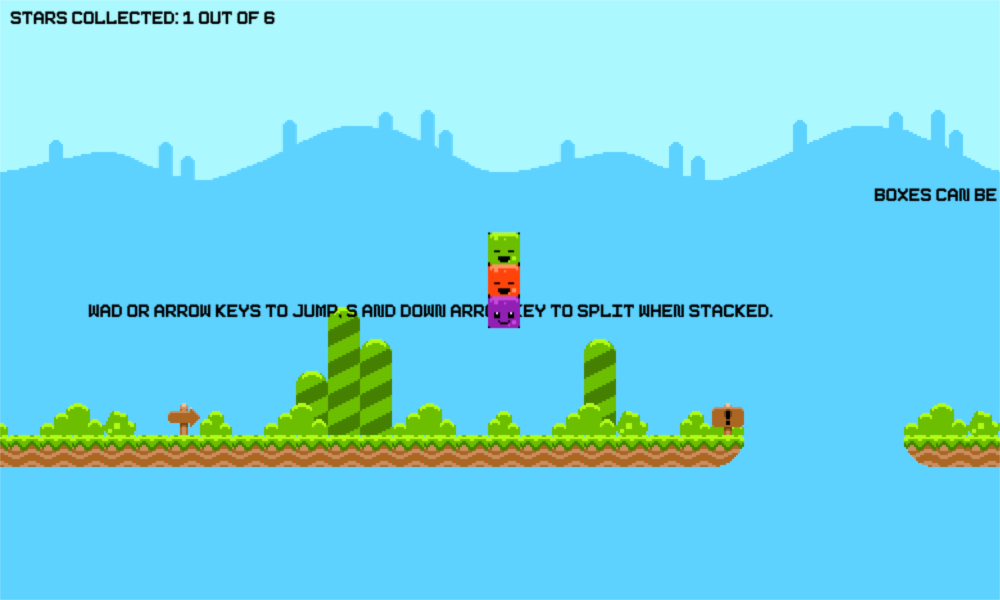
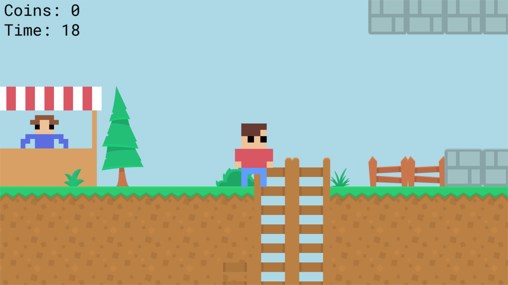
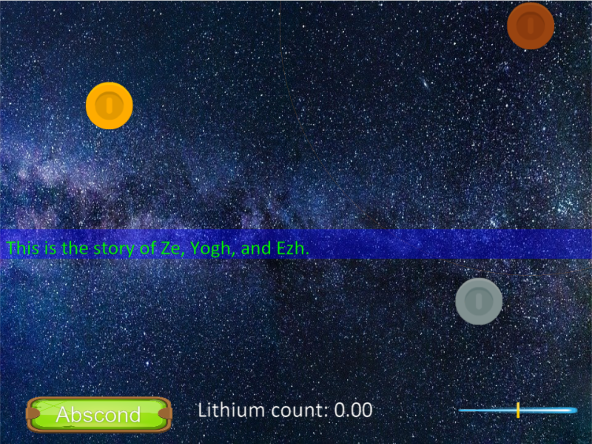
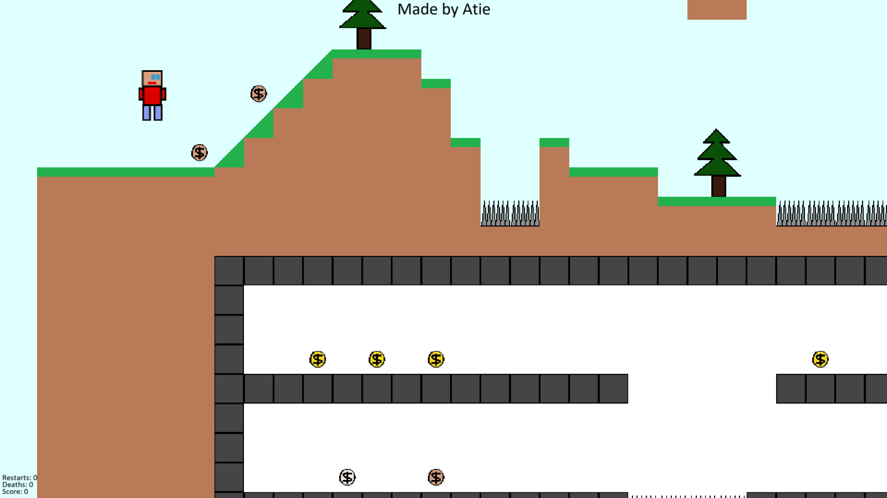

:orphan:

.. _2020_game_jam:

Python Discord GameJam 2020
===========================

The `Python Discord <https://pythondiscord.com/>`_ 2020 Game Jam finished on
April 26, 2020. Participants completed a game in one week. Twenty-three teams
completed games, all of which are on the `Game Jam 2020 GitHub <https://github.com/python-discord/game-jam-2020>`_.

We played the top 10 games on the
`Game Jam live-stream <https://youtu.be/KkLXMvKfEgs>`_, which is available for
replay.

Here are the games that made it to the top 10:

.. figure:: https://raw.githubusercontent.com/python-discord/game-jam-2020/master/Finalists/Score_AAA/ressources/Screenshot_full.png
    :target: https://github.com/python-discord/game-jam-2020/tree/master/Finalists/Score_AAA
    :width: 45%

    1st Place: `3 Keys on the Run <https://github.com/python-discord/game-jam-2020/tree/master/Finalists/Score_AAA>`_

    2nd Place: `Triple Blocks <https://github.com/python-discord/game-jam-2020/tree/master/Finalists/gamer_gang>`_

.. figure:: /images/image_not_available.png
    :target: https://github.com/python-discord/game-jam-2020/tree/master/Finalists/monkeys-and-frogs-on-fire
    :width: 45%

    3nd Place: `Triple Vision <https://github.com/python-discord/game-jam-2020/tree/master/Finalists/monkeys-and-frogs-on-fire>`_

.. figure:: https://raw.githubusercontent.com/python-discord/game-jam-2020/master/Finalists/KTGames/rd_images/OpeningScreen.png
    :target: https://github.com/python-discord/game-jam-2020/tree/master/Finalists/KTGames
    :width: 45%

    Honourable Mention: `Hatchlings <https://github.com/python-discord/game-jam-2020/tree/master/Finalists/KTGames>`_

.. figure:: https://raw.githubusercontent.com/python-discord/game-jam-2020/master/Finalists/artemis/assets/tutorial.gif
    :target: https://github.com/python-discord/game-jam-2020/tree/master/Finalists/artemis
    :width: 45%

    Honourable Mention: `Gem Matcher <https://github.com/python-discord/game-jam-2020/tree/master/Finalists/artemis>`_

.. figure:: https://raw.githubusercontent.com/python-discord/game-jam-2020/master/Finalists/TriChess/assets/hex_board.PNG
    :target: https://github.com/python-discord/game-jam-2020/tree/master/Finalists/TriChess
    :width: 45%

    `Tri-Chess <https://github.com/python-discord/game-jam-2020/tree/master/Finalists/TriChess>`_

.. figure:: https://raw.githubusercontent.com/python-discord/game-jam-2020/master/Finalists/beanoculars/submission/images/screen1.png
    :target: https://github.com/python-discord/game-jam-2020/tree/master/Finalists/beanoculars
    :width: 45%

    `Insane Irradiated Insectz <https://github.com/python-discord/game-jam-2020/tree/master/Finalists/beanoculars>`_

    `Flimsy Billy's Coin Dash 3: Super Tag 3 Electric Tree <https://github.com/python-discord/game-jam-2020/tree/master/Finalists/the-friendly-snakes>`_

    `ZeYoughEzh <https://github.com/python-discord/game-jam-2020/tree/master/Finalists/zeyoghezh>`_

    `Coin Collector <https://github.com/python-discord/game-jam-2020/tree/master/Finalists/AtieP>`_
