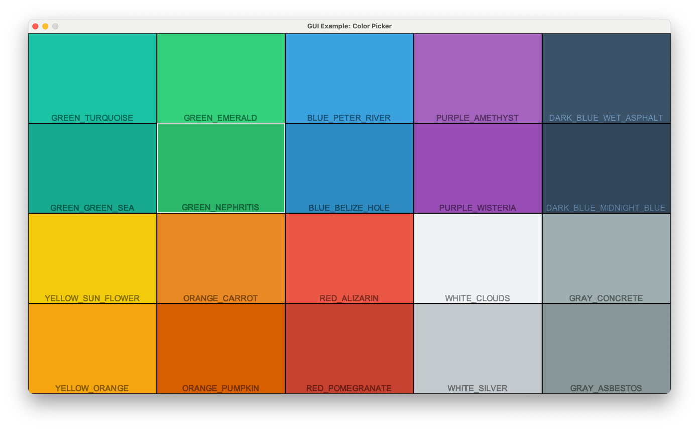

:orphan:

.. _gui_5_uicolor_picker:

GUI UIColor Picker
==================

Arcade provides constants for colors, which work great for GUI widgets.
They are based on FlatUI colors.

This example provides an interactive color picker, widgets can be used as a util
to find the right color for your GUI widgets.

.. literalinclude:: ../../arcade/examples/gui/5_uicolor_picker.py
    :caption: 5_uicolor_picker.py
    :linenos:
