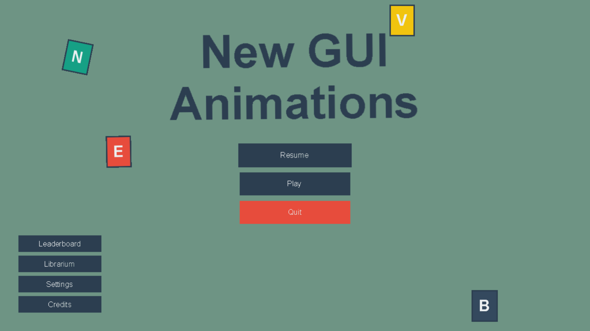

:orphan:

.. _gui_exp_animations:

GUI Animations
===============

The following example demonstrates how to make use of the experimental
``UIAnimatedGroup`` and ``animate()`` to build an animated main menu:
widgets popping in, a pulsing and swaying title, buttons that pop and
wiggle on hover, and decorative spinning tiles.

.. literalinclude:: ../../arcade/examples/gui/exp_animations.py
    :caption: exp_animations.py
    :linenos:
