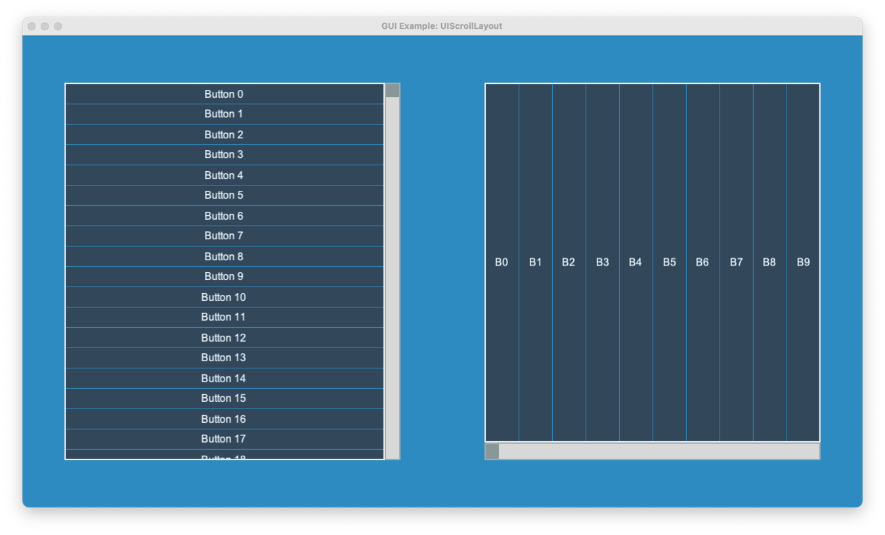

:orphan:

.. _gui_exp_scroll_area:

GUI Scroll Area
===============

The following example demonstrates how to make use of the experimental UIScrollLayout widget.

.. literalinclude:: ../../arcade/examples/gui/exp_scroll_area.py
    :caption: exp_scroll_area.py
    :linenos:
