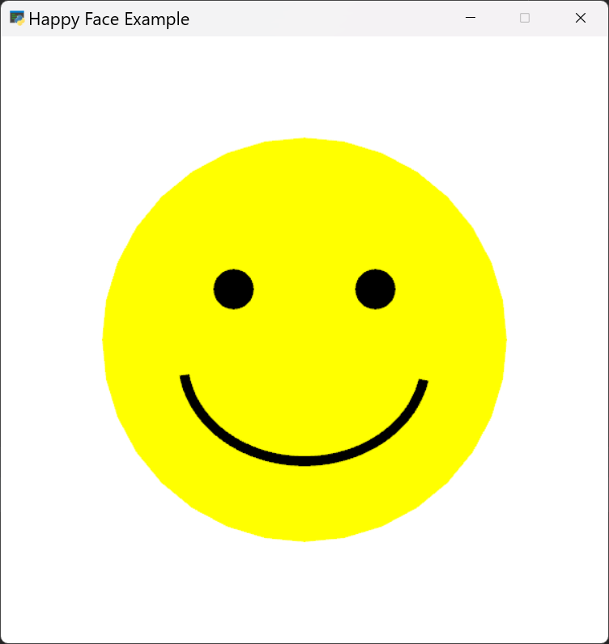

:orphan:

.. _happy_face:

Happy Face
==========

This example shows how to use the Arcade drawing commands. This is one of the simplest things that can be done with
Arcade and a great way to get started learning how to do graphics.

For a more detailed step-through on how to draw with Python Arcade see
`How to Draw with Your Computer <https://learn.arcade.academy/en/latest/chapters/05_drawing/drawing.html>`_.

For ideas on what to do, see:

* `Draw a Picture <https://learn.arcade.academy/en/latest/labs/lab_02_drawing/drawing.html>`_
* `Drawing with Functions <https://learn.arcade.academy/en/latest/labs/lab_03_function_drawing/function_drawing.html>`_

To look up all the available commands search for the Drawing Primitives in the :ref:`quick_index`. To see some of these
commands in action see :ref:`drawing_primitives`.

To keep things simple, this example does not have many of the things commonly shown in the :ref:`starting_template`.

.. literalinclude:: ../../arcade/examples/happy_face.py
    :caption: happy_face.py
    :linenos:
