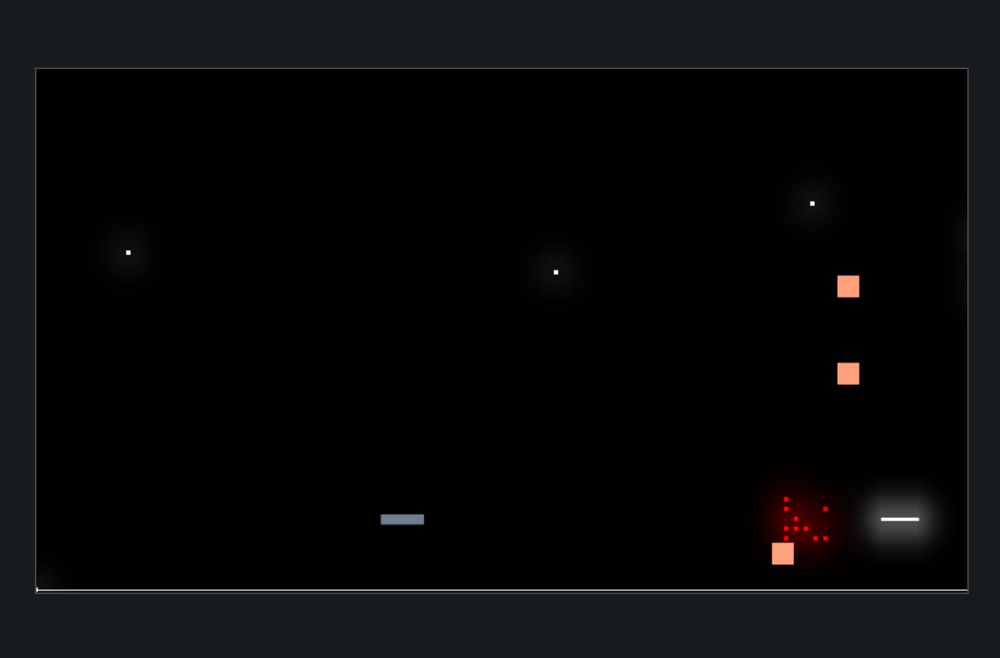

:orphan:

.. _bloom_defender:

Bloom-Effect Defender
=====================

Creating a "glowing" effect can enhance 2D games. This example shows how to
do it.

Create Frame Buffer and Post-Processor
--------------------------------------

Lines 176-202

Here we create the frame buffer, and add a color attachment to store the
pixel data into.

It also creates a post-processor that will do a gaussian blur on what is rendered.
There are a lot of parameters to the blur, depending on how you want it to look.

Render To Framebuffer
---------------------

Lines 239-252

When we draw, we render the objects we want to be blurred to our frame buffer,
then run the post-processor to do the blur.

Note: This buffer is not transparent! Anything behind it will be hidden. So
multiple layers of glow are not possible at this time, nor can you put anything
'behind' the glow.

Render Framebuffer To Screen
----------------------------

Lines 264-265

Finally we render that buffer to the screen.

.. literalinclude:: ../../../arcade/examples/bloom_defender.py
    :caption: mini_map_defender.py
    :linenos:
    :emphasize-lines: 176-202, 239-252, 264-265