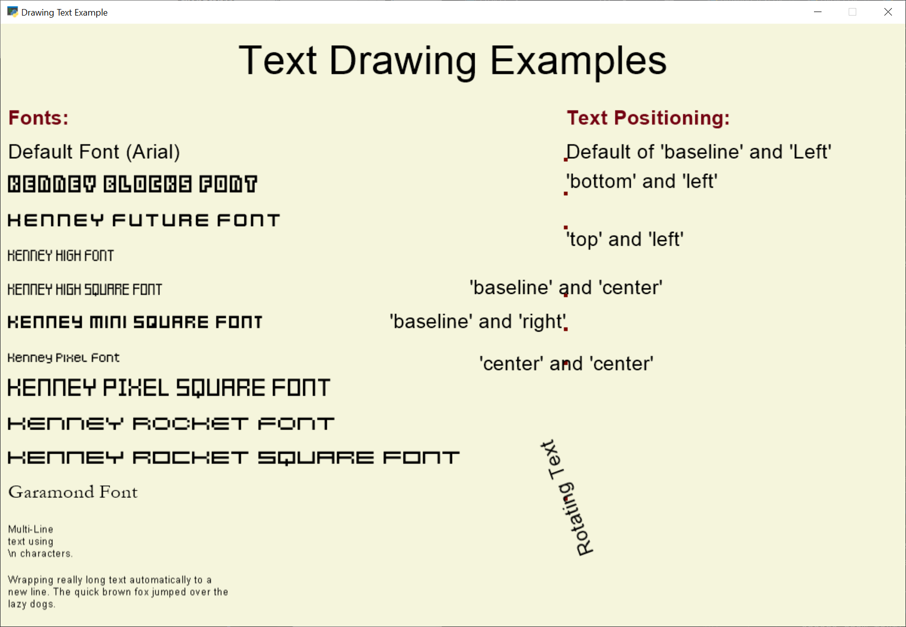

:orphan:

.. _drawing_text:

Slow but Easy Text Drawing
==========================

This example shows how to draw text. While it is simple to draw using the
techniques shown here, it is also slow. Using "text objects" can result in
significant performance improvements. See :ref:`drawing_text_objects`.

.. literalinclude:: ../../../arcade/examples/drawing_text.py
    :caption: drawing_text.py
    :linenos:
