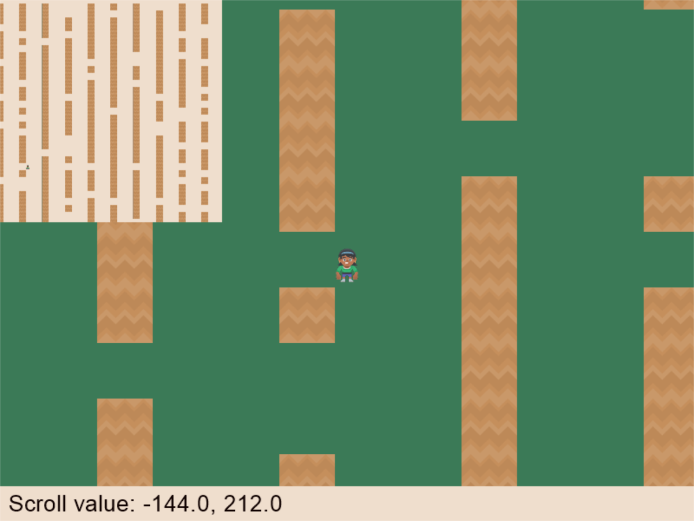

:orphan:

.. _minimap:

Mini-Map
========

This example shows how to create a 'mini-map' using frame buffers.

.. literalinclude:: ../../arcade/examples/minimap_texture.py
    :caption: minimap.py
    :linenos:
    :emphasize-lines: 32-37, 53-58, 99-114, 134-138