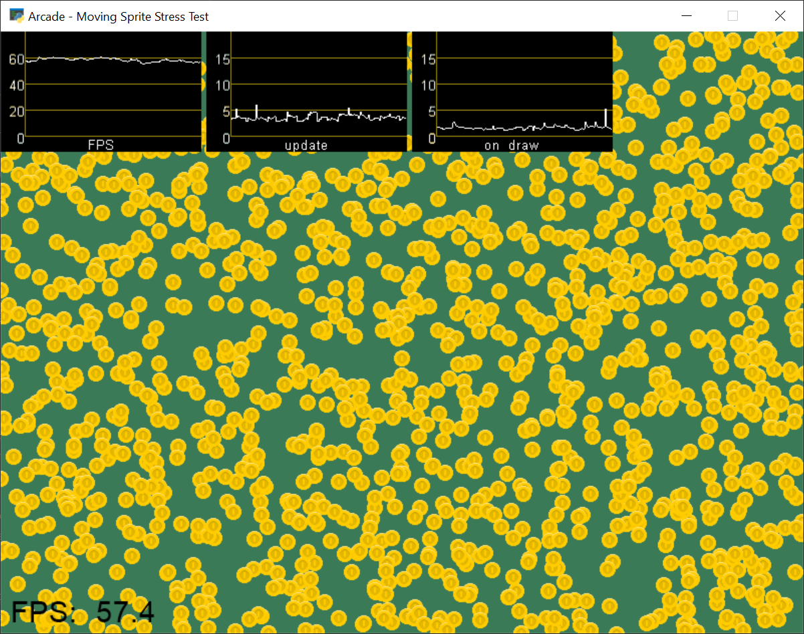

:orphan:

.. _performance_statistics_example:

Performance Statistics
======================

Arcade includes performance monitoring tools to help you optimize your
game. This example demonstrates the following performance api features:

* :meth:`arcade.enable_timings`
* :class:`arcade.PerfGraph`
* :meth:`arcade.get_fps`
* :meth:`arcade.print_timings`
* :meth:`arcade.clear_timings`

If you do not want to display graphs in your game window, you can use
:func:`arcade.print_timings` to print out the count and average time for
all dispatched events with the function. The output looks like this:

.. code-block:: text

    Event          Count Average Time
    -------------- ----- ------------
    on_activate        1       0.0000
    on_resize          1       0.0000
    on_show            1       0.0000
    on_update         59       0.0000
    on_expose          1       0.0000
    on_draw           59       0.0021
    on_mouse_enter     1       0.0000
    on_mouse_motion  100       0.0000

See :ref:`perf_info_api` for more information about the performance api.

.. literalinclude:: ../../arcade/examples/performance_statistics.py
    :caption: performance_statistics.py
    :linenos:
    :emphasize-lines: 43-45, 114-141, 152-157, 164-166
