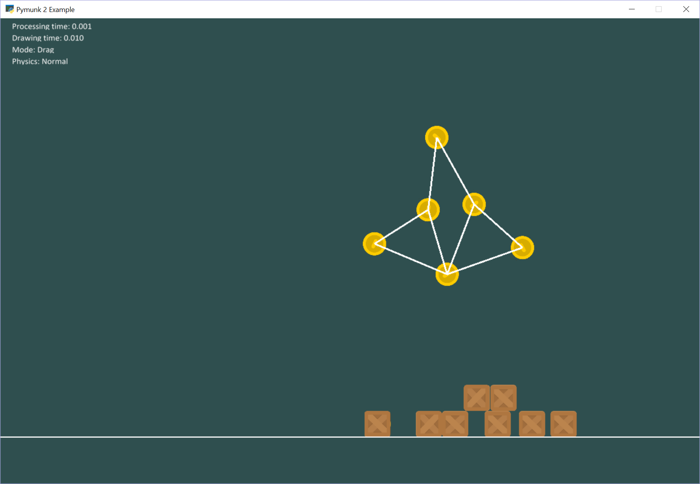

:orphan:

.. _pymunk_joint_builder:

Pymunk Physics Engine - Joint Builder
=====================================

This uses the Pymunk physics engine to simulate items with joints

.. literalinclude:: ../../arcade/examples/pymunk_joint_builder.py
    :caption: pymunk_joint_builder.py
    :linenos:

