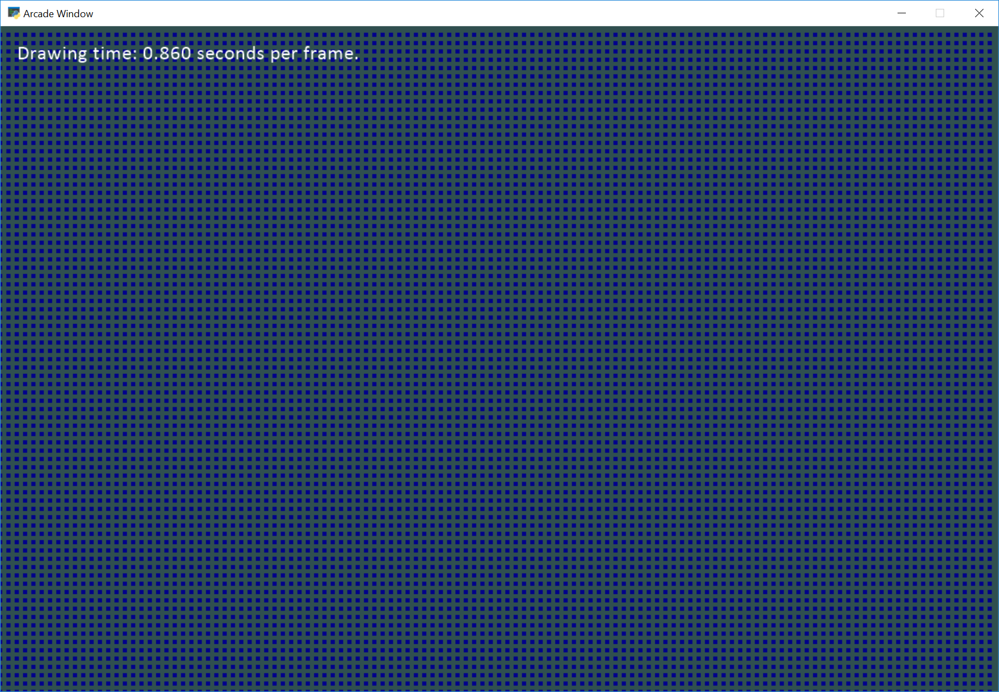

:orphan:

.. _shape_list_demo:

ShapeElementList Explanation
============================

If you are drawing a lot of items on your screen, the :class:`arcade.ShapeElementList` can
speed your drawing. How does it work?

Say we have a screen with about 9,600 rectangles:

Those rectangles are created with 38,400 points + 9,600 colors
+ 9,600 angles. They need
to be sent to the graphics card 60 times per second. This quickly balloons into 3.5 million numbers
being sent to the graphics card each second to display a bunch of rectangles that aren't even moving.

What we want to do instead is package all these rectangles up, send them to the graphics
card, and then have them be drawn in just one command. This takes us from 3.5 million items per
second down to about 60.

There are three examples here:

* First, no shape lists. Just drawing rectangles.
* Second, each rectangle is individually buffered to the GPU.
* Third, all rectangles are buffered to the GPU as and drawn as a group.

Example One - No Shape Lists
----------------------------

.. literalinclude:: ../../arcade/examples/shape_list_demo_1.py
    :caption: shape_list_demo_1.py
    :linenos:

Example Two - Simple Shape Lists
--------------------------------

.. literalinclude:: ../../arcade/examples/shape_list_demo_2.py
    :caption: shape_list_demo_2.py
    :linenos:

Example Three - Complex Shape Lists
-----------------------------------

.. literalinclude:: ../../arcade/examples/shape_list_demo_3.py
    :caption: shape_list_demo_3.py
    :linenos:
