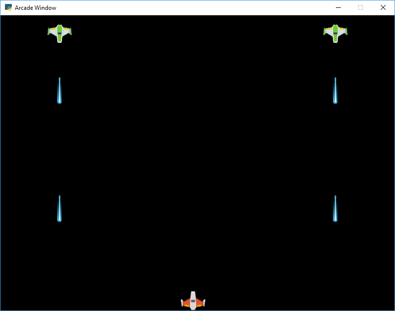

:orphan:

.. _sprite_bullets_periodic:

Have Enemies Periodically Shoot
===============================

Having enemies shoot every *x* seconds is a bit more complex than shooting
randomly as shown in :ref:`sprite_bullets_random`. This is because we need
to track how often we shoot, and how long it has been since we last shot.

This example uses custom sub-class ``EnemySprite``. The extra attributes allow
us to track the periodic timing. See the highlighted lines for what is specific
to this example.

.. literalinclude:: ../../arcade/examples/sprite_bullets_periodic.py
    :caption: sprite_bullets_periodic.py
    :linenos:
    :emphasize-lines: 14-48, 76-79, 86-89, 107-108
