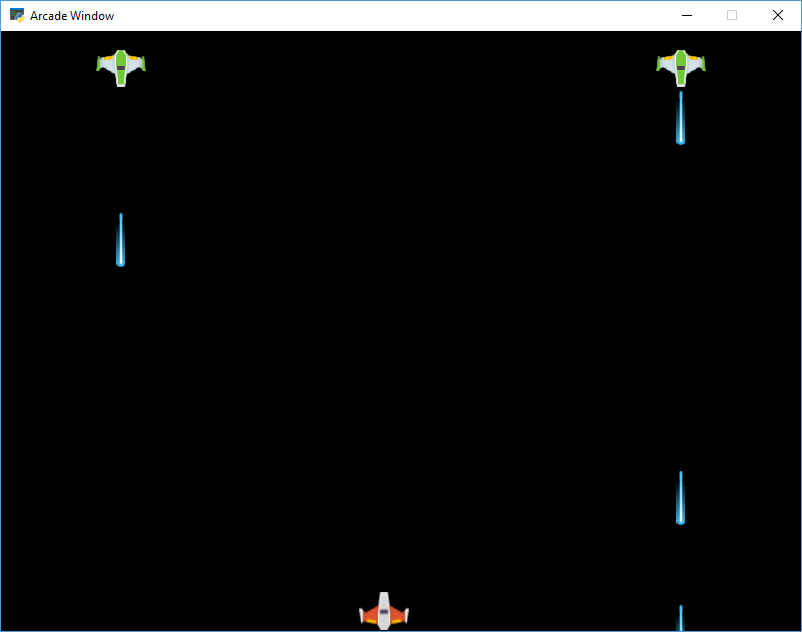

:orphan:

.. _sprite_bullets_random:

Have Enemies Randomly Shoot
===========================

Having enemies randomly shoot is easier than periodically shooting enemies as shown
in :ref:`sprite_bullets_periodic`. This is because we don't have to track how
long it has been since we last fired.

See the highlighted lines for what is specific to this example.

.. literalinclude:: ../../arcade/examples/sprite_bullets_random.py
    :caption: sprite_bullets_random.py
    :linenos:
    :emphasize-lines: 66-81