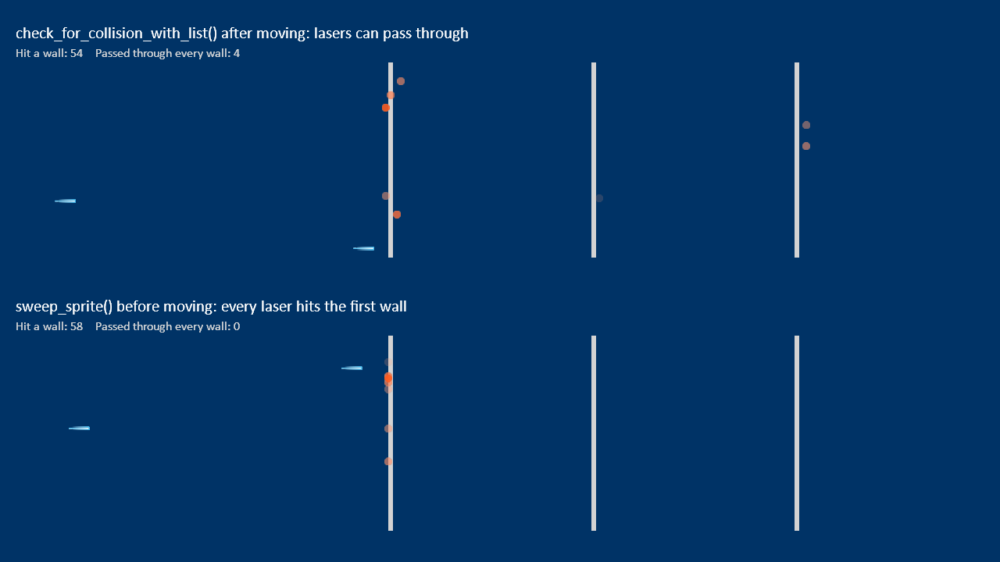

:orphan:

.. _sprite_bullets_sweep:

Fast Bullets and Thin Walls
===========================

A sprite that moves far enough in one frame can jump right over a thin wall,
because :py:func:`arcade.check_for_collision_with_list` only checks where a
sprite is, not where it went. In the top lane, lasers move and then check
for collisions, so some pass through. In the bottom lane, each laser uses
:py:func:`arcade.sweep_sprite` to check its whole path before moving, so it
always stops at the first wall.

.. literalinclude:: ../../arcade/examples/sprite_bullets_sweep.py
    :caption: sprite_bullets_sweep.py
    :linenos:
