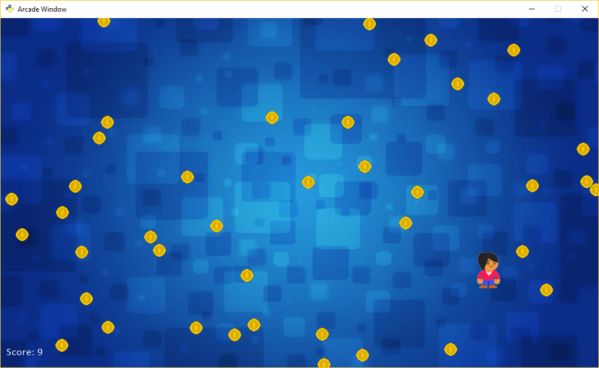

:orphan:

.. _sprite_collect_coins_background:

Using a Background Image
========================

.. literalinclude:: ../../arcade/examples/sprite_collect_coins_background.py
    :caption: sprite_collect_coins_background.py
    :linenos:
    :emphasize-lines: 41-42, 62-65, 99-102
