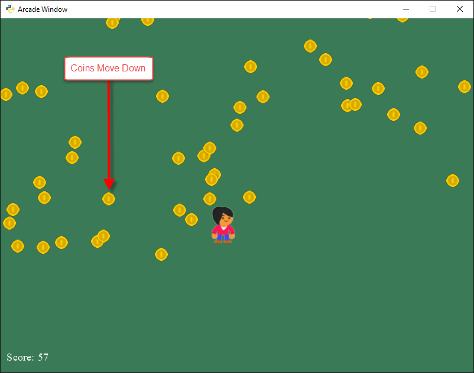

:orphan:

.. _sprite_collect_coins_move_down:

Collect Coins Moving Down
=========================

For a complete explanation, see `Chapter 22 of Arcade Academy - Learn Python <academy_py_ch22_>`_.

.. _academy_py_ch22: https://learn.arcade.academy/en/latest/chapters/22_moving_sprites/moving_sprites.html#moving-sprites-down

.. literalinclude:: ../../arcade/examples/sprite_collect_coins_move_down.py
    :caption: sprite_collect_coins_move_down.py
    :linenos:
