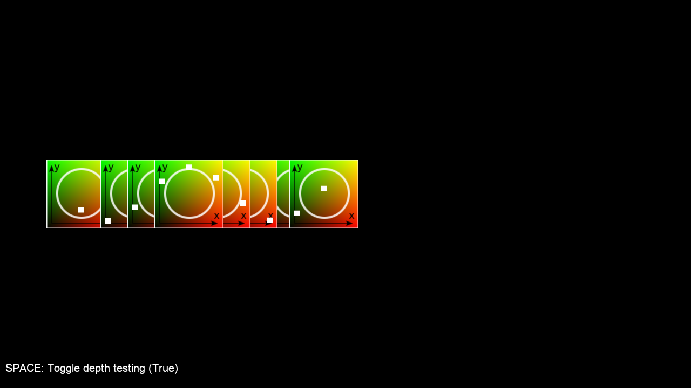

:orphan:

.. _sprite_depth_cosine:

Sprite Depth Controlled by a Cosine Wave
========================================

.. literalinclude:: ../../arcade/examples/sprite_depth_cosine.py
    :caption: sprite_depth_cosine.py
    :linenos:
