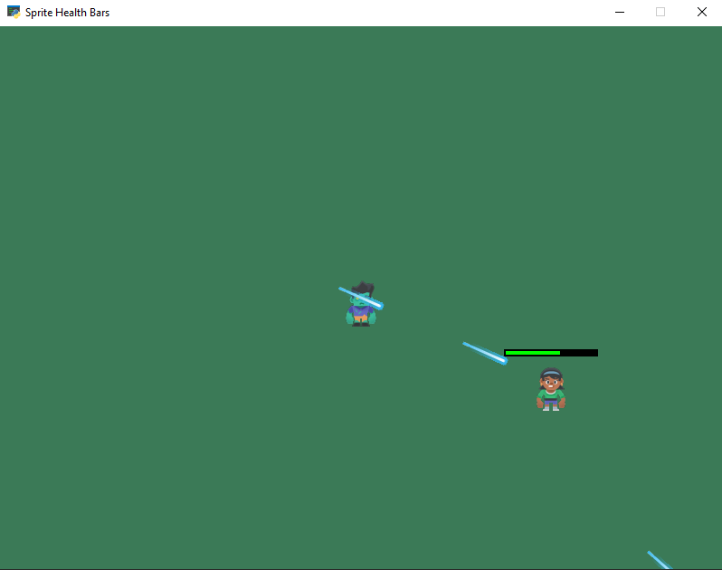

:orphan:

.. _sprite_health:

Hit Points and Health Bars
==========================

This example demonstrates a reasonably efficient way of drawing a health
bar above a character.

The enemy at the center of the screen shoots
bullets at the player, while the player attempts to dodge the bullets
by moving the mouse. Each bullet that hits the player reduces the
player's health, which is shown by the bar above the player's head.
When the player's health bar is empty (zero), the game ends.

.. literalinclude:: ../../arcade/examples/sprite_health.py
    :caption: sprite_health.py
    :linenos:
