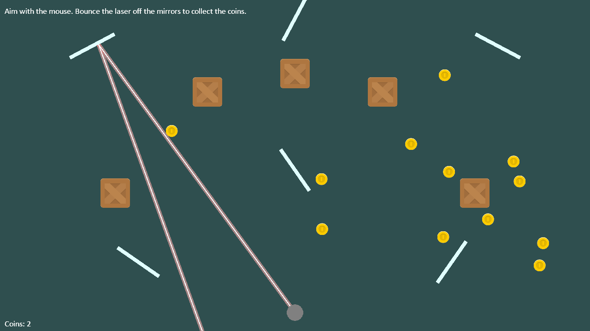

.. _sprite_laser_mirrors:

Lasers and Mirrors
==================

A laser shoots from the turret toward the mouse. It stops at the first crate
in its way, bounces off the rotating mirrors, and collects any coins it
touches.

The laser doesn't move like a bullet: it reaches as far as it goes the moment
it's fired. Each straight part of the beam uses :py:func:`arcade.sweep_line`
to find the first sprite in its way. The hit's
:py:attr:`~arcade.SweepInfo.normal` points out of the surface it hit, which
is all a mirror needs to reflect the beam.

.. literalinclude:: ../../arcade/examples/sprite_laser_mirrors.py
    :caption: sprite_laser_mirrors.py
    :linenos:
