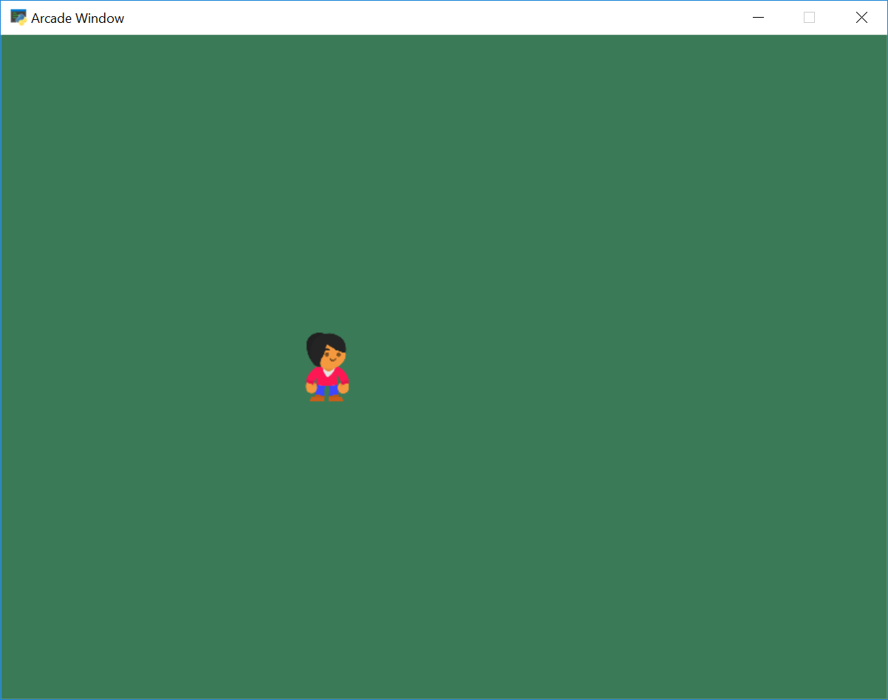

:orphan:

.. _sprite_move_keyboard:

Move By Keyboard
================

.. literalinclude:: ../../arcade/examples/sprite_move_keyboard.py
    :caption: sprite_move_keyboard.py
    :linenos:
    :emphasize-lines: 25-44, 96-97, 99-110, 112-122
