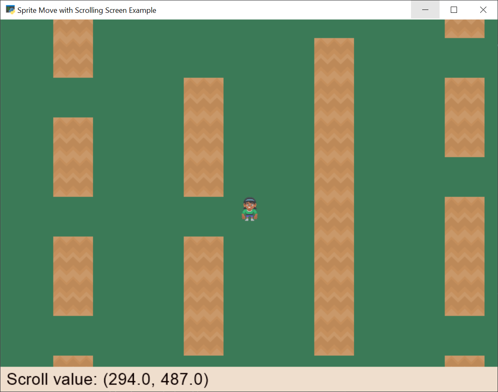

:orphan:

.. _sprite_move_scrolling:

Move with a Scrolling Screen - Centered
=======================================

Using a :class:`arcade.Camera`, a program can easily scroll around a larger
"world" while only showing part of it on the screen.

If you are displaying a GUI or some other items that should NOT scroll, you'll
need two cameras. One that shows the unscrolled GUI, and one that shows the scrolled
sprites.

See also :ref:`sprite_move_scrolling_box`.

.. literalinclude:: ../../arcade/examples/sprite_move_scrolling.py
    :caption: sprite_move_scrolling.py
    :linenos:
    :emphasize-lines: 56-59, 96-97, 103-104, 160-161, 163-174, 176-182
