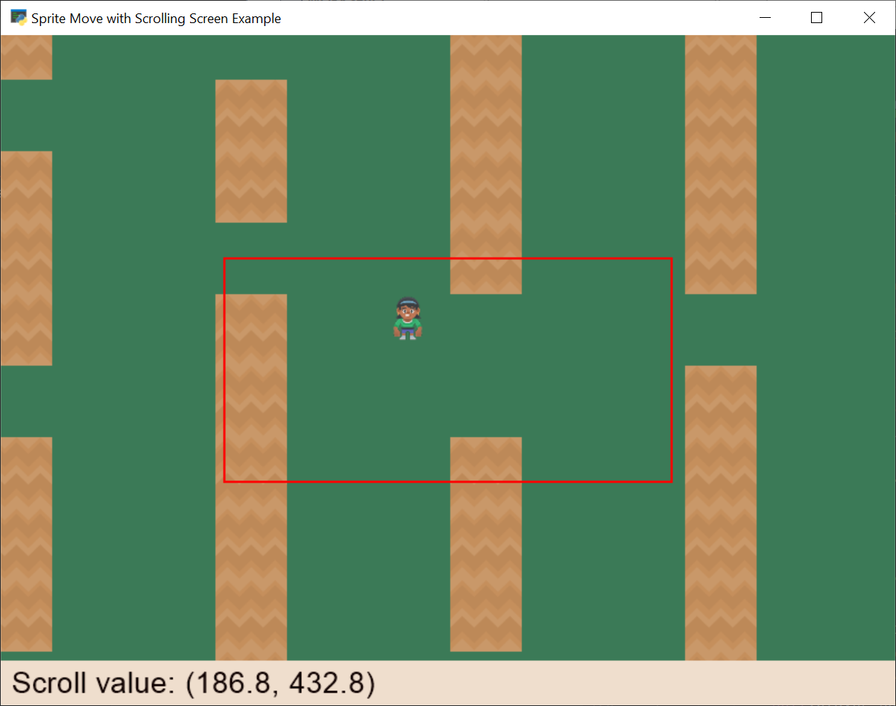

:orphan:

.. _sprite_move_scrolling_box:

Move with a Scrolling Screen - Margins
======================================

Unlike the :ref:`sprite_move_scrolling` which centers the camera on the player,
this example only moves the camera if the user gets within so many pixels of the
edge. It allows for a 'box' in the middle where the user can move around and NOT
move the camera.

.. literalinclude:: ../../arcade/examples/sprite_move_scrolling_box.py
    :caption: sprite_move_scrolling_box.py
    :linenos:
