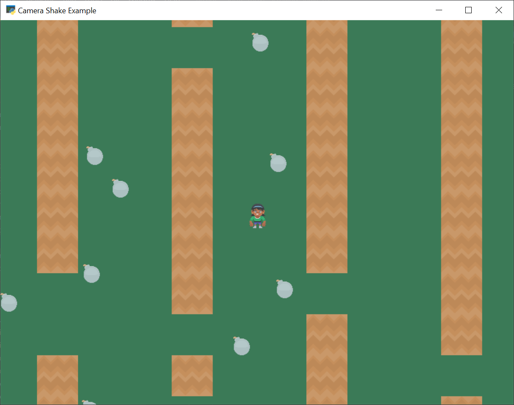

:orphan:

.. _sprite_move_scrolling_shake:

Camera Shake
============

You can cause the camera to shake, as this example does when the player encounters a bomb.
See the highlighted lines below.

.. literalinclude:: ../../arcade/examples/sprite_move_scrolling_shake.py
    :caption: sprite_move_scrolling_shake.py
    :linenos:
    :emphasize-lines: 154-171
