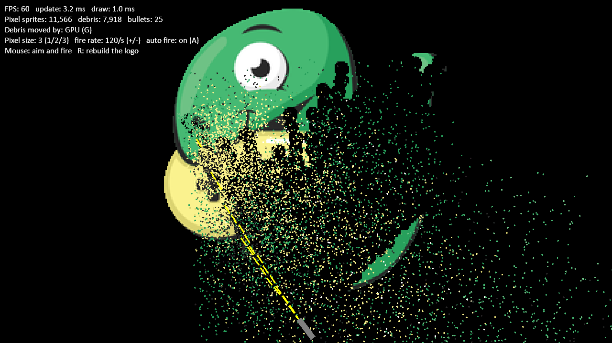

:orphan:

.. _sprite_pixel_demolition:

Pixel Demolition
================

Every pixel of the Arcade logo is a sprite: about 28,000 of them, or 71,000
with the smallest pixels. A turret fires up to 240 bullets a second. Each
bullet explodes when it hits, and every pixel in the blast flies off as a
piece of debris, thousands at a time.

It shows a few ways to keep that many sprites fast:

* All the pixels are in one :py:class:`~arcade.SpriteList`, drawn with a
  single call.
* The pixels are in a spatial hash with a cell size close to the sprites'
  size, so each bullet and each blast only checks the pixels near it.
* Hit pixels are removed from the list. Many removals in the same frame
  are applied together in one pass.

Press **G** to switch how the debris moves. As Python sprites, each piece
is moved every frame, which slows down as thousands fly at once. On the
GPU, each piece is written to a buffer once, and a shader works out where
it is from the time since it was launched, so even 15,000 pieces cost
almost nothing.

Press **1**, **2**, or **3** for bigger or smaller pixels, **+** and **-**
to change the fire rate, and click to aim and fire yourself.

.. literalinclude:: ../../arcade/examples/sprite_pixel_demolition.py
    :caption: sprite_pixel_demolition.py
    :linenos:
