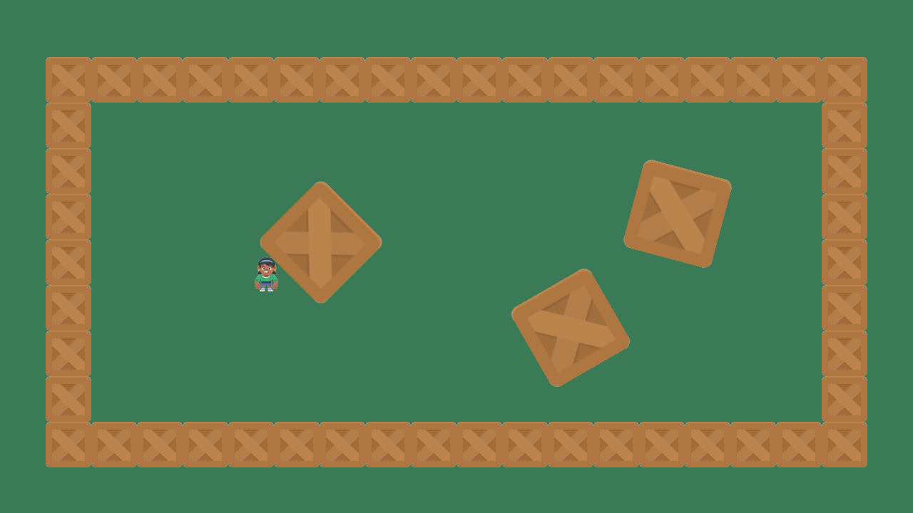

.. _sprite_push_out:

Push a Sprite Out of Walls
==========================

Instead of a physics engine, this example moves the player freely and then
uses :py:func:`arcade.get_collision_info_with_list` to push it back out of
any walls it overlaps. Because the push is along the smallest overlap, the
player slides along walls, including rotated ones.

.. literalinclude:: ../../arcade/examples/sprite_push_out.py
    :caption: sprite_push_out.py
    :linenos:
