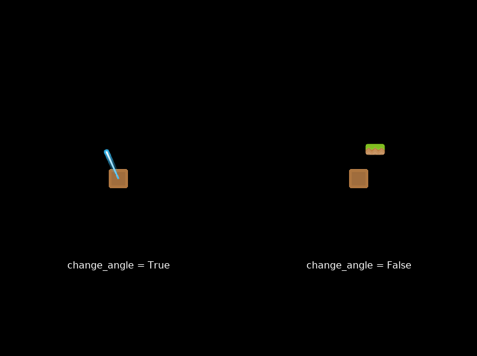

:orphan:

.. _sprite_rotate_around_point:

Sprite Rotation Around a Point
==============================

This non-interactive example demonstrates two applications of rotating
a sprite around a point:

#. On the left, a beam spinning around a point in a circle
#. On the right, a platform rotating around a point while staying flat 

Although this behavior is inspired by platformers, it could be useful
for other types of games.

The base class used in this example offers circular movement with finer
control than the one in :ref:`sprite_collect_coins_move_circle`.

For a related example demonstrating how to mix rotation around a point
with user input, see :ref:`sprite_rotate_around_tank`. 

.. literalinclude:: ../../arcade/examples/sprite_rotate_around_point.py
    :caption: sprite_rotate_around_point.py
    :linenos:
    :emphasize-lines: 30-48, 91-98
