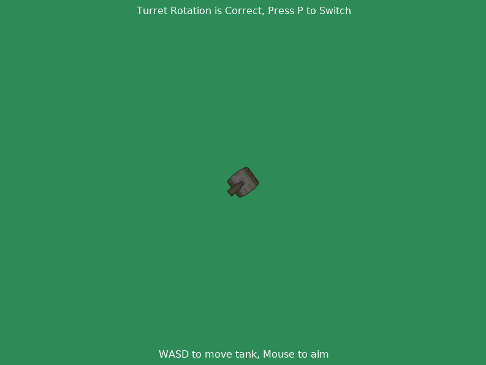

:orphan:

.. _sprite_rotate_around_tank:

Move By Keyboard, Fire Towards Mouse
====================================

This example uses a player-controlled tank to demonstrate the
difference between the right and wrong way of rotating a turret
around an attachment point. In both modes, the tank's barrel follows
the mouse. The turret sprite is ommitted to keep the rotation visible.

See the docstring, comments, and on screen instructions for further info.

.. literalinclude:: ../../arcade/examples/sprite_rotate_around_tank.py
    :caption: sprite_rotation_around_tank.py
    :linenos:
    :emphasize-lines: 58-72, 135-160
