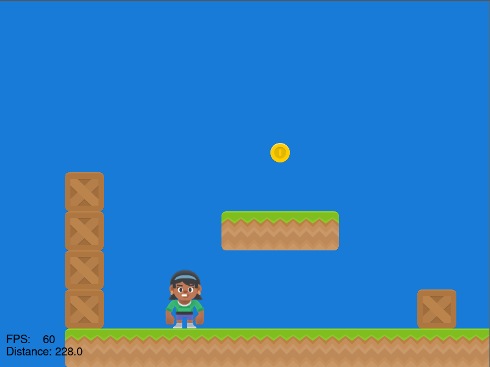

:orphan:

.. _sprite_tiled_map:

Work with loading in a Tiled map file
=====================================

Below is a quick example on using a Tiled map. For more information, see:

* :ref:`platformer_tutorial`
* :ref:`pymunk_platformer_tutorial`
* `Platformers <https://learn.arcade.academy/en/latest/chapters/29_platformers/platformers.html>`_

.. literalinclude:: ../../arcade/examples/sprite_tiled_map.py
    :caption: sprite_tiled_map.py
    :linenos:
