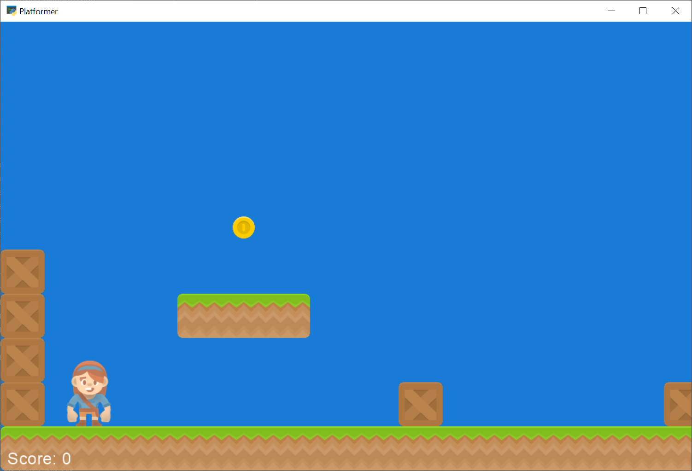

:orphan:

.. _template_platformer:

Platformer Template
===================

Quickly get started creating your own platformer!

About This Template
-------------------

This is a template to get you started coding a side-scrolling platformer as quickly as possible.
I recommend the following steps:

1. Create a folder to hold the code. Copy this example to that folder, and call it ``main.py``.
2. Make sure the example code runs fine.
3. Copy the tile images you want to use to a subdirectory of the folder that holds your code.
4. Create a very simple Tiled Map using the `Tiled Map Editor <https://www.mapeditor.org/>`_. I suggest just
   creating a floor and nothing else. For more detail on how to create a tiled map, see
   :ref:`platformer_part_nine`.
5. Save the file to the same directory as your source code. If you create a separate tileset, also save it to
   the same directory as your code.
6. Update the code to load your file instead of the map.
7. Test and make sure it works.
8. Now that you are sure things work, make your own platformer!

.. warning:: Watch the directories!

   One of the most frequent mistakes is to save maps and tile sets to a directory that isn't the same directory
   as your code. Or to not have the tile images in that folder. If everything isn't in the same folder (or a
   subfolder of that) it is hard to package it up later.

For more detailed instructions, see the tutorial :ref:`platformer_tutorial`.

Source Code
-----------
.. literalinclude:: ../../arcade/examples/template_platformer.py
    :caption: template_platformer.py
    :linenos:
