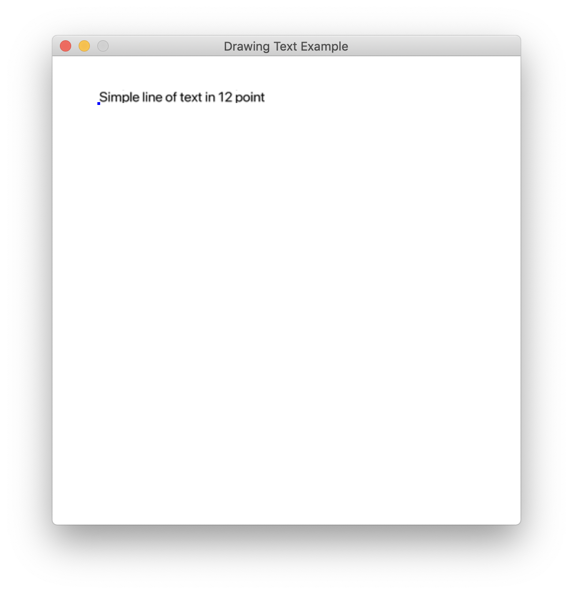
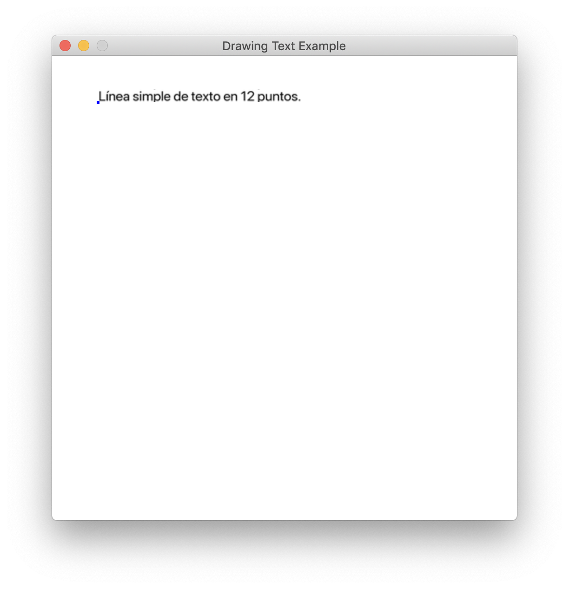

:orphan:

.. _text_loc_example:

Text Localization
=================

Let's start by making a stripped down version of of :ref:`drawing_text`. We're going to be performing work on multiple
files here, so I'm going to be putting all of them and doing all work in
a folder called ``text_loc_example``.

Create ``text_loc_example/text_loc_example.py`` with the following code:

.. literalinclude:: ../../arcade/examples/text_loc_example_start.py
    :caption: text_loc_example_start.py
    :linenos:

This code should run.

We're going to translate that "Simple line of text in 12 point" line
that shows on the screen into Spanish. I've adapted the instructions
from `this blog
post <https://inventwithpython.com/blog/2014/12/20/translate-your-python-3-program-with-the-gettext-module/>`__
to do this.

We'll do this in the following steps:

- Extract the lines we want to translate from the ``text_loc_example.py`` file into a ``text_loc_example.pot`` file.
- Translate the lines manually.
- Create a database usable by Python's ``gettext`` module from this translation.
- Load this translation into the game.

Extract the lines we want to translate from the ``text_loc_example.py`` file.
-----------------------------------------------------------------------------

First, wrap all user-facing strings with ``_("my string")``.

So in ``text_loc_example.py``, we'll just wrap the line facing the user:

.. code:: python

            arcade.draw_text(
                "Simple line of text in 12 point", start_x, start_y, arcade.color.BLACK, 12
            )

becomes

.. code:: python

            arcade.draw_text(
                _("Simple line of text in 12 point"), start_x, start_y, arcade.color.BLACK, 12
            )

At this point, your program will not run (because it's looking for a
function ``_`` that's not defined). This is fine, and we'll fix it in a
bit.

Now we need to extract those strings into a ``.pot`` file. We need an
external script for this- the ``pygettext.py`` script.

Download the ``pygettext.py`` program from `the GitHub CPython
repo <https://raw.githubusercontent.com/python/cpython/master/Tools/i18n/pygettext.py>`__
(Right click the page, then select the "Save Page as" option to save it.
I recommend saving it to our working ``text_loc_example`` folder to
keeps things simple).

From this folder:

.. code:: python

    python ./pygettext.py -d text_loc_example text_loc_example.py

This creates ``text_loc_example/text_loc_example.pot``. This is a text
file with a format we'll be able to use. It looks like this:

::

    # SOME DESCRIPTIVE TITLE.
    # Copyright (C) YEAR ORGANIZATION
    # FIRST AUTHOR <EMAIL@ADDRESS>, YEAR.
    #
    msgid ""
    msgstr ""
    "Project-Id-Version: PACKAGE VERSION\n"
    "POT-Creation-Date: 2019-05-06 12:19-0400\n"
    "PO-Revision-Date: YEAR-MO-DA HO:MI+ZONE\n"
    "Last-Translator: FULL NAME <EMAIL@ADDRESS>\n"
    "Language-Team: LANGUAGE <LL@li.org>\n"
    "MIME-Version: 1.0\n"
    "Content-Type: text/plain; charset=UTF-8\n"
    "Content-Transfer-Encoding: 8bit\n"
    "Generated-By: pygettext.py 1.5\n"

    #: text_loc_example.py:46
    msgid "Simple line of text in 12 point"
    msgstr ""

Translate the "Simple line of text in 12 point" line by changing the
``msgstr`` value below it (I used `Google
Translate <https://translate.google.com>`__ for this).

::

    msgid "Simple line of text in 12 point"
    msgstr "Línea simple de texto en 12 puntos."

Save this file as ``text_loc_example/text_loc_example.po`` (we changed
the ``.pot`` extension to ``.po``.).

Let's move on to the next step:

Create a database usable by Python's ``gettext`` module from this translation.
------------------------------------------------------------------------------

We need another Python script for this. Download the ``msgfmt.py``
script from `the GitHub CPython
repo <https://raw.githubusercontent.com/python/cpython/master/Tools/i18n/msgfmt.py>`__
(right click the page, then select the "Save Page as" option to save
it).

We need to put our translation into the right folder structure so our
library will be able to find it. Create the ``my_app.mo`` folder
heirarchy. Because we're translating it into Spanish (whose `country
code <https://www.iso.org/obp/ui/>`__ is ``es``), we have to make
a ``locale/es/LC_MESSAGES`` directory for it.

::

    # If you're on Mac/Linux:
    mkdir -p ./text_loc_example_locale/es/LC_MESSAGES

::

    # If you're on Windows (TODO: test):
    mkdir .\text_loc_example_locale\es\LC_MESSAGES

Create the ``text_loc_example.mo`` file:

::

    python msgfmt.py -o ./text_loc_example_locale/es/LC_MESSAGES/text_loc_example.mo text_loc_example.po

Load this translation into the game.
------------------------------------

Add the following code to load your new translation database! I've
inserted ``...`` around where I put it.

.. code:: python

    ...
    import arcade
    import gettext
    es = gettext.translation('text_loc_example', localedir='text_loc_example_locale', languages=['es'])
    es.install()

    SCREEN_WIDTH = 500
    ...

Now you should be able to run the game with the ``es`` translation!

Auto-translating to your user's language
----------------------------------------

Setting the language to ``es`` proves that our translation works, of
course, but most of the time, we want our game to load the correct
language for the user automatically. For this, replace the lines

.. code:: python

    es = gettext.translation('text_loc_example', localedir='text_loc_example_locale', languages=['es'])
    es.install()

with

.. code:: python

    gettext.install('text_loc_example', localedir='text_loc_example_locale')

As `the
documentation <https://docs.python.org/3/library/gettext.html#gettext.find>`__
says, this code searches the user's computer for the language being
used, then the ``locale`` folder for an appropriate translation to find
the right language to show on the screen.

We can test this by setting the ``LANG`` variable before running the
program:

::

    # MacOS / Linux
    export LANG=es
    python text_loc_example.py

::

    # Windows
    set LANG=es
    python test_loc_example.py

Final Code
----------

.. literalinclude:: ../../arcade/examples/text_loc_example_done.py
    :caption: text_loc_example_done.py
    :linenos:

Final Directory structure
-------------------------

::

    text_loc_example/
    ├── README.md
    ├── text_loc_example_locale
    │   └── es
    │       └── LC_MESSAGES
    │           └── text_loc_example.mo
    ├── msgfmt.py
    ├── pygettext.py
    ├── text_loc_example.po
    ├── text_loc_example.pot
    └── text_loc_example.py
