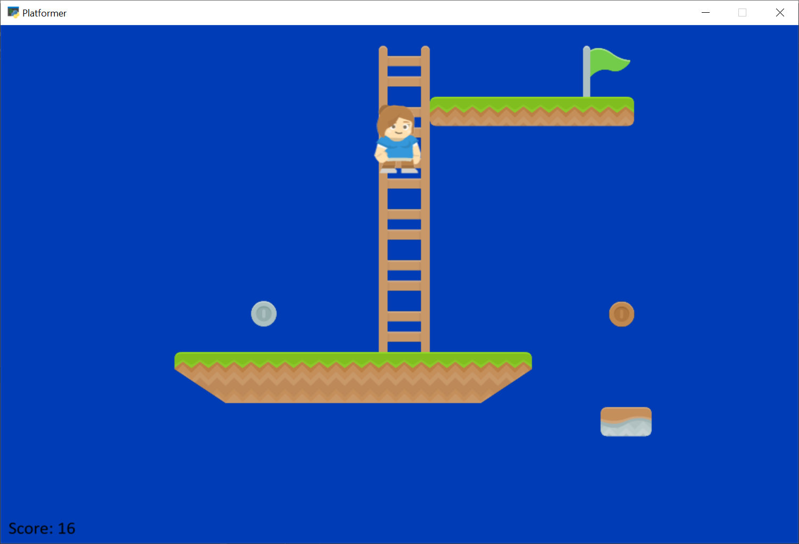

:orphan:

.. _10_ladders_and_more:

TMX Map With Ladders and More
=============================

Supports:

* Ladders
* Coins with attributes that contain points
* Moving Platforms defined in tiled object layer

.. literalinclude:: ../../arcade/examples/platform_tutorial/10_ladders_and_more.py
    :caption: platform_tutorial/10_ladders_and_more.py
    :linenos:
