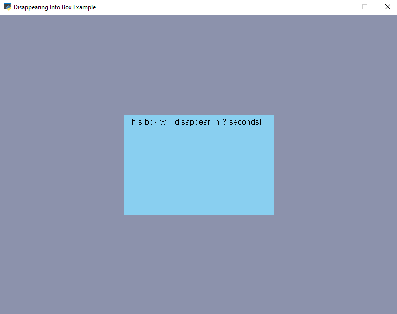

:orphan:

.. _gui_disappearing_info_box:

Disappearing Info Box
==============

For an introduction the GUI system, see :ref:`gui_concepts`.

This example shows how to display an info box that will disappearing after a given
time using the :class:`arcade.gui.UIDisappearingInfoBox` class.

