.. _example-code:

Example Code
============

.. contents::
   :depth: 3
   :local:

Starting Template
-----------------

.. figure:: thumbs/starting_template.png
   :figwidth: 170px

   :ref:`starting_template`

Drawing
-------

Drawing Primitives
^^^^^^^^^^^^^^^^^^

.. figure:: thumbs/happy_face.png
   :figwidth: 170px

   :ref:`happy_face`

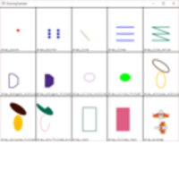

   :ref:`drawing_primitives`

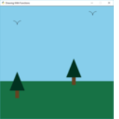

   :ref:`drawing_with_functions`

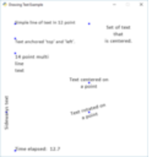

   :ref:`drawing_text`

Animating Drawing Primitives
^^^^^^^^^^^^^^^^^^^^^^^^^^^^

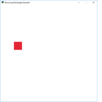

   :ref:`bouncing_rectangle`

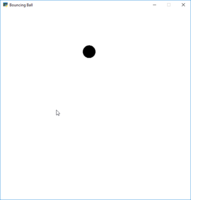

   :ref:`bouncing_ball`

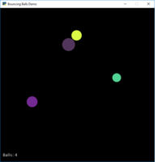

   :ref:`bouncing_balls`

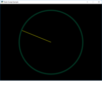

   :ref:`radar_sweep`

Drawing with Loops
^^^^^^^^^^^^^^^^^^

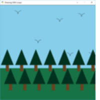

   :ref:`drawing_with_loops`

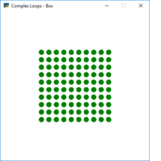

   :ref:`nested_loops_box`

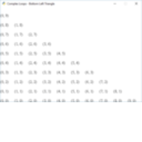

   :ref:`nested_loops_bottom_left_triangle`

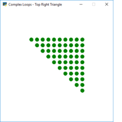

   :ref:`nested_loops_top_right_triangle`

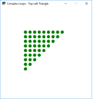

   :ref:`nested_loops_bottom_left_triangle`

   :ref:`nested_loops_top_right_triangle`

.. figure:: thumbs/snow.png
   :figwidth: 170px

   :ref:`snow`

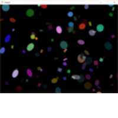

   :ref:`shapes-slow`

.. _shape-element-lists:

Faster Drawing with ShapeElementLists
^^^^^^^^^^^^^^^^^^^^^^^^^^^^^^^^^^^^^

.. figure:: thumbs/shapes_buffered.png
   :figwidth: 170px

   :ref:`shapes-fast`

.. figure:: thumbs/shape_list_demo.png
   :figwidth: 170px

   :ref:`shape_list_demo`

.. figure:: thumbs/lines_buffered.png
   :figwidth: 170px

   :ref:`lines_buffered`

.. figure:: thumbs/shape_list_demo_skylines.png
   :figwidth: 170px

   :ref:`shape_list_demo_skylines`

.. figure:: thumbs/shape_list_demo_person.png
   :figwidth: 170px

   :ref:`shape_list_demo_person`

.. figure:: thumbs/gradients.png
   :figwidth: 170px

   :ref:`gradients`

.. _sprites:

Sprites
-------

.. _sprite_player_movement:

Sprite Player Movement
^^^^^^^^^^^^^^^^^^^^^^

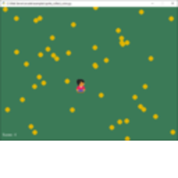

   :ref:`sprite_collect_coins`

   :ref:`sprite_move_keyboard`

   :ref:`sprite_move_keyboard_better`

   :ref:`sprite_move_keyboard_accel`

.. figure:: thumbs/sprite_face_left_or_right.png
   :figwidth: 170px

   :ref:`sprite_face_left_or_right`

   :ref:`sprite_move_joystick`

.. figure:: thumbs/sprite_move_angle.png
   :figwidth: 170px

   :ref:`sprite_move_angle`

.. figure:: thumbs/dual_stick_shooter.png
   :figwidth: 170px

   :ref:`dual_stick_shooter`

Sprite Non-Player Movement
^^^^^^^^^^^^^^^^^^^^^^^^^^

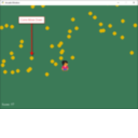

   :ref:`sprite_collect_coins_move_down`

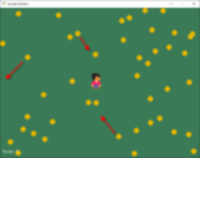

   :ref:`sprite_collect_coins_move_bouncing`

.. figure:: thumbs/sprite_bouncing_coins.png
   :figwidth: 170px

   :ref:`sprite_bouncing_coins`

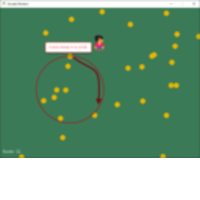

   :ref:`sprite_collect_coins_move_circle`

.. figure:: thumbs/sprite_collect_rotating.png
   :figwidth: 170px

   :ref:`sprite_collect_rotating`

.. figure:: thumbs/sprite_follow_simple.png
   :figwidth: 170px

   :ref:`sprite_follow_simple`

.. figure:: thumbs/sprite_follow_simple_2.png
   :figwidth: 170px

   :ref:`sprite_follow_simple_2`

Sprite Properties
^^^^^^^^^^^^^^^^^

.. figure:: thumbs/sprite_properties.png
   :figwidth: 170px

   :ref:`sprite_properties`

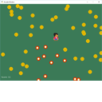

   :ref:`sprite_change_coins`

Games with Levels
^^^^^^^^^^^^^^^^^

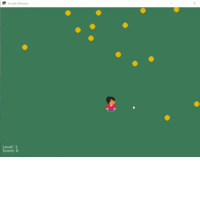

   :ref:`example-sprite-collect-coins-diff-levels`

.. figure:: thumbs/sprite_rooms.png
   :figwidth: 170px

   :ref:`sprite_rooms`

Shooting with Sprites
^^^^^^^^^^^^^^^^^^^^^

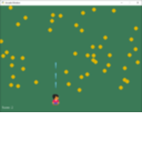

   :ref:`sprite_bullets`

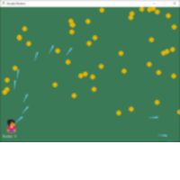

   :ref:`sprite_bullets_aimed`

.. figure:: thumbs/sprite_bullets_periodic.png
   :figwidth: 170px

   :ref:`sprite_bullets_periodic`

.. figure:: thumbs/sprite_bullets_random.png
   :figwidth: 170px

   :ref:`sprite_bullets_random`

.. figure:: thumbs/sprite_bullets_enemy_aims.png
   :figwidth: 170px

   :ref:`sprite_bullets_enemy_aims`

.. figure:: thumbs/sprite_explosion.png
   :figwidth: 170px

   :ref:`sprite_explosion`

Sound
-----

.. figure:: thumbs/sound_demo.png
   :figwidth: 170px

   :ref:`sound_demo`

.. figure:: thumbs/background_music.png
   :figwidth: 170px

   :ref:`background_music`

Platformers
-----------

Basic Platformers
^^^^^^^^^^^^^^^^^

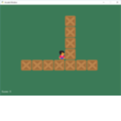

   :ref:`sprite_move_walls`

.. figure:: thumbs/sprite_no_coins_on_walls.png
   :figwidth: 170px

   :ref:`sprite_no_coins_on_walls`

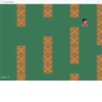

   :ref:`sprite_move_scrolling`

.. figure:: thumbs/sprite_move_animation.gif
   :figwidth: 170px

   :ref:`sprite_move_animation`

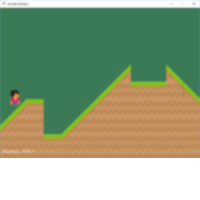

   :ref:`sprite_ramps`

.. figure:: thumbs/sprite_moving_platforms.png
   :figwidth: 170px

   :ref:`sprite_moving_platforms`

.. figure:: thumbs/sprite_enemies_in_platformer.png
   :figwidth: 170px

   :ref:`sprite_enemies_in_platformer`

.. figure:: thumbs/11_animate_character.png
   :figwidth: 170px

   :ref:`platformer_tutorial`

Using Tiled Map Editor to Create Maps
^^^^^^^^^^^^^^^^^^^^^^^^^^^^^^^^^^^^^

.. figure:: thumbs/08_load_map.png
   :figwidth: 170px

   :ref:`sprite_tiled_map`

.. figure:: thumbs/sprite_tiled_map_with_levels.png
   :figwidth: 170px

   :ref:`sprite_tiled_map_with_levels`

.. figure:: thumbs/09_endgame.png
   :figwidth: 170px

   :ref:`09_endgame`

.. figure:: thumbs/10_ladders_and_more.png
   :figwidth: 170px

   :ref:`10_ladders_and_more`

Procedural Generation
^^^^^^^^^^^^^^^^^^^^^

.. figure:: thumbs/maze_recursive.png
   :figwidth: 170px

   :ref:`recursive_maze`

.. figure:: thumbs/maze_depth_first.png
   :figwidth: 170px

   :ref:`depth_first_maze`

.. figure:: thumbs/procedural_caves_cellular.png
   :figwidth: 170px

   :ref:`procedural_caves_cellular`

.. figure:: thumbs/procedural_caves_bsp.png
   :figwidth: 170px

   :ref:`procedural_caves_bsp`

.. figure:: thumbs/mountains_midpoint_displacement.png
   :figwidth: 170px

   :ref:`mountains_midpoint_displacement`

.. figure:: thumbs/mountains_random_walk.png
   :figwidth: 170px

   :ref:`mountains_random_walk`

User Interface
--------------

Instruction Screens and Game Over Screens
^^^^^^^^^^^^^^^^^^^^^^^^^^^^^^^^^^^^^^^^^

.. figure:: thumbs/view_screens_minimal.png
   :figwidth: 170px

   :ref:`view_screens_minimal`

.. figure:: thumbs/view_instructions_and_game_over.png
   :figwidth: 170px

   :ref:`view_instructions_and_game_over`

.. figure:: thumbs/view_pause_screen.png
   :figwidth: 170px

   :ref:`view_pause_screen`

Resizable Window and Fullscreen Games
^^^^^^^^^^^^^^^^^^^^^^^^^^^^^^^^^^^^^

.. figure:: thumbs/resizable_window.png
   :figwidth: 170px

   :ref:`resizable_window`

.. figure:: thumbs/full_screen_example.png
   :figwidth: 170px

   :ref:`full_screen_example`

Buttons and Dialog Boxes
^^^^^^^^^^^^^^^^^^^^^^^^

.. figure:: thumbs/gui_button.png
   :figwidth: 170px

   :ref:`gui_button`

.. figure:: thumbs/gui_dialogue_box.png
   :figwidth: 170px

   :ref:`gui_dialogue_box`

.. figure:: thumbs/gui_text_box.png
   :figwidth: 170px

   :ref:`gui_text_box`

.. figure:: thumbs/gui_text_button.png
   :figwidth: 170px

   :ref:`gui_text_button`

Grid-Based Games
----------------

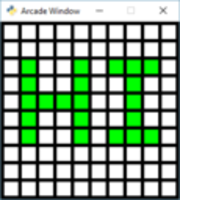

   :ref:`array_backed_grid`

   :ref:`array_backed_grid_buffered`
.. figure:: thumbs/tetris.png
   :figwidth: 170px

   :ref:`tetris`

Advanced
--------

Using PyMunk for Physics
^^^^^^^^^^^^^^^^^^^^^^^^

.. figure:: thumbs/pymunk_box_stacks.png
   :figwidth: 170px

   :ref:`pymunk_box_stacks`

.. figure:: thumbs/pymunk_pegboard.png
   :figwidth: 170px

   :ref:`pymunk_pegboard`

.. figure:: thumbs/pymunk_joint_builder.png
   :figwidth: 170px

   :ref:`pymunk_joint_builder`

.. figure:: thumbs/pymunk_platformer.png
   :figwidth: 170px

   :ref:`pymunk_platformer`

Particle System
^^^^^^^^^^^^^^^

.. figure:: thumbs/particle_fireworks.png
   :figwidth: 170px

   :ref:`particle_fireworks`

.. figure:: thumbs/particle_systems.png
   :figwidth: 170px

   :ref:`particle_systems`

Concept Games
-------------

.. figure:: thumbs/asteroid_smasher.png
   :figwidth: 170px

   :ref:`asteroid_smasher`

.. figure:: thumbs/slime_invaders.png
   :figwidth: 170px

   :ref:`slime_invaders`

.. figure:: thumbs/2048.png
   :figwidth: 170px

   `2048 <https://github.com/pvcraven/2048>`_

.. figure:: thumbs/rogue_like.png
   :figwidth: 170px

   `Rogue-Like <https://github.com/pythonarcade/roguelike>`_

Stress Tests
------------

.. figure:: thumbs/stress_test_draw_moving.png
   :figwidth: 170px

   :ref:`stress_test_draw_moving`

.. figure:: thumbs/stress_test_collision.png
   :figwidth: 170px

   :ref:`stress_test_collision`

Odds and Ends
-------------

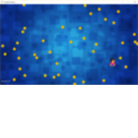

   :ref:`sprite_collect_coins_background`

.. figure:: thumbs/sprite_collect_coins_with_stats.png
   :figwidth: 170px

   :ref:`sprite_collect_coins_with_stats`

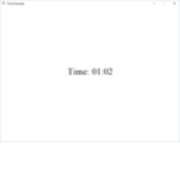

   :ref:`timer`

.. figure:: thumbs/texture_transform.png
   :figwidth: 170px

   :ref:`texture_transform`

.. figure:: thumbs/text_loc_example_translated.png
   :figwidth: 170px

   :ref:`text_loc_example`

