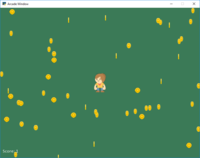

.. _example-code:

Example Code
============

Starting Templates
------------------

.. figure:: starting_template.png
   :figwidth: 170px

   :ref:`starting_template`

Drawing
-------

.. figure:: happy_face.png
   :figwidth: 170px

   :ref:`happy_face`

.. figure:: drawing_primitives.png
   :figwidth: 170px

   :ref:`drawing_primitives`

.. figure:: drawing_with_functions.png
   :figwidth: 170px

   :ref:`drawing_with_functions`

.. figure:: drawing_text.png
   :figwidth: 170px

   :ref:`drawing_text`

.. figure:: array_backed_grid.png
   :figwidth: 170px

   :ref:`array_backed_grid`

Animation
---------

.. figure:: bouncing_rectangle.png
   :figwidth: 170px

   :ref:`bouncing_rectangle`

.. figure:: bouncing_ball.png
   :figwidth: 170px

   :ref:`bouncing_ball`

.. figure:: bouncing_balls.png
   :figwidth: 170px

   :ref:`bouncing_balls`

.. figure:: radar_sweep.png
   :figwidth: 170px

   :ref:`radar_sweep`

Drawing with Loops
------------------

.. figure:: drawing_with_loops.png
   :figwidth: 170px

   :ref:`drawing_with_loops`

.. figure:: nested_loops_box.png
   :figwidth: 170px

   :ref:`nested_loops_box`

.. figure:: nested_loops_bottom_left_triangle.png
   :figwidth: 170px

   :ref:`nested_loops_bottom_left_triangle`

.. figure:: nested_loops_top_right_triangle.png
   :figwidth: 170px

   :ref:`nested_loops_top_right_triangle`

.. figure:: nested_loops_top_left_triangle.png
   :figwidth: 170px

   :ref:`nested_loops_bottom_left_triangle`

.. figure:: nested_loops_top_right_triangle.png
   :figwidth: 170px

   :ref:`nested_loops_top_right_triangle`

.. figure:: shapes.png
   :figwidth: 170px

   :ref:`shapes`

.. figure:: snow.png
   :figwidth: 170px

   :ref:`snow`

User Control
------------

These show how to move non-sprite items. For Sprites, see :ref:`sprite_player_movement`.

.. figure:: move_mouse.png
   :figwidth: 170px

   :ref:`move_mouse`

.. figure:: move_keyboard.png
   :figwidth: 170px

   :ref:`move_keyboard`

.. figure:: move_joystick.png
   :figwidth: 170px

   :ref:`move_joystick`

.. figure:: joystick.png
   :figwidth: 170px

   :ref:`joystick`

Sprites
-------

.. _sprite_player_movement:

Sprite Player Movement
^^^^^^^^^^^^^^^^^^^^^^

.. figure:: sprite_collect_coins.png
   :figwidth: 170px

   :ref:`sprite_collect_coins`

.. figure:: sprite_collect_coins.png
   :figwidth: 170px

   :ref:`sprite_move_keyboard`

.. figure:: sprite_face_left_or_right.png
   :figwidth: 170px

   :ref:`sprite_face_left_or_right`

.. figure:: sprite_collect_coins.png
   :figwidth: 170px

   :ref:`sprite_move_joystick`

Sprite Movement
^^^^^^^^^^^^^^^

.. figure:: sprite_collect_coins_move_down.png
   :figwidth: 170px

   :ref:`sprite_collect_coins_move_down`

.. figure:: sprite_collect_coins_move_bouncing.png
   :figwidth: 170px

   :ref:`sprite_collect_coins_move_bouncing`

.. figure:: sprite_collect_coins_move_circle.png
   :figwidth: 170px

   :ref:`sprite_collect_coins_move_circle`

.. figure:: sprite_collect_rotating.png
   :figwidth: 170px

   :ref:`sprite_collect_rotating`

.. figure:: sprite_follow_simple.png
   :figwidth: 170px

   :ref:`sprite_follow_simple_2`

.. figure:: sprite_follow_simple_2.png
   :figwidth: 170px

   :ref:`sprite_follow_simple_2`

Levels
^^^^^^

.. figure:: sprite_collect_coins_diff_levels.png
   :figwidth: 170px

   :ref:`example-sprite-collect-coins-diff-levels`

.. figure:: sprite_rooms.png
   :figwidth: 170px

   :ref:`sprite_rooms`

Bullets
^^^^^^^

.. figure:: sprite_bullets.png
   :figwidth: 170px

   :ref:`sprite_bullets`

.. figure:: sprite_bullets_aimed.png
   :figwidth: 170px

   :ref:`sprite_bullets_aimed`

.. figure:: sprite_bullets_periodic.png
   :figwidth: 170px

   :ref:`sprite_bullets_periodic`

.. figure:: sprite_bullets_random.png
   :figwidth: 170px

   :ref:`sprite_bullets_random`

.. figure:: sprite_bullets_enemy_aims.png
   :figwidth: 170px

   :ref:`sprite_bullets_enemy_aims`

.. figure:: sprite_explosion.png
   :figwidth: 170px

   :ref:`sprite_explosion`

Platformers
^^^^^^^^^^^

.. figure:: sprite_move_walls.png
   :figwidth: 170px

   :ref:`sprite_move_walls`

.. figure:: sprite_no_coins_on_walls.png
   :figwidth: 170px

   :ref:`sprite_no_coins_on_walls`

.. figure:: sprite_move_scrolling.png
   :figwidth: 170px

   :ref:`sprite_move_scrolling`

   :ref:`sprite_move_animation`

.. figure:: sprite_tiled_map.png
   :figwidth: 170px

   :ref:`sprite_tiled_map`

.. figure:: sprite_ramps.png
   :figwidth: 170px

   :ref:`sprite_ramps`

.. figure:: sprite_moving_platforms.png
   :figwidth: 170px

   :ref:`sprite_moving_platforms`

.. figure:: sprite_enemies_in_platformer.png
   :figwidth: 170px

   :ref:`sprite_enemies_in_platformer`

Graphical User Interface
------------------------

.. figure:: gui_text_button.png
   :figwidth: 170px

   :ref:`gui_text_button`

Procedural Generation
---------------------

.. figure:: maze_recursive.png
   :figwidth: 170px

   :ref:`recursive_maze`

.. figure:: maze_depth_first.png
   :figwidth: 170px

   :ref:`depth_first_maze`

.. figure:: procedural_caves_cellular.png
   :figwidth: 170px

   :ref:`procedural_caves_cellular`

.. figure:: procedural_caves_bsp.png
   :figwidth: 170px

   :ref:`procedural_caves_bsp`

PyMunk
------

.. figure:: pymunk_box_stacks.png
   :figwidth: 170px

   :ref:`pymunk_box_stacks`

.. figure:: pymunk_pegboard.png
   :figwidth: 170px

   :ref:`pymunk_pegboard`

.. figure:: pymunk_platformer.png
   :figwidth: 170px

   :ref:`pymunk_platformer`

ShapeElementLists
-----------------

.. figure:: shape_list_demo.png
   :figwidth: 170px

   :ref:`shape_list_demo`

.. figure:: lines_buffered.png
   :figwidth: 170px

   :ref:`lines_buffered`

.. figure:: shape_list_demo_skylines.png
   :figwidth: 170px

   :ref:`shape_list_demo_skylines`

.. figure:: shape_list_demo_person.png
   :figwidth: 170px

   :ref:`shape_list_demo_person`

.. figure:: gradients.png
   :figwidth: 170px

   :ref:`gradients`

Stress Tests
------------

.. figure:: stress_test_draw_simple.png
   :figwidth: 170px

   :ref:`stress_test_draw_simple`

.. figure:: stress_test_draw_moving.png
   :figwidth: 170px

   :ref:`stress_test_draw_moving`

.. figure:: stress_test_collision.png
   :figwidth: 170px

   :ref:`stress_test_collision`

Decorators
----------

.. figure:: decorator_drawing_example.png
   :figwidth: 170px

   :ref:`decorator_drawing_example`

.. figure:: mountains_midpoint_displacement.png
   :figwidth: 170px

   :ref:`mountains_midpoint_displacement`

Other
-----

.. figure:: resizable_window.png
   :figwidth: 170px

   :ref:`resizable_window`

.. figure:: full_screen_example.png
   :figwidth: 170px

   :ref:`full_screen_example`

.. figure:: sprite_collect_coins_background.png
   :figwidth: 170px

   :ref:`sprite_collect_coins_background`

.. figure:: timer.png
   :figwidth: 170px

   :ref:`timer`

.. figure:: sprite_change_coins.png
   :figwidth: 170px

   :ref:`sprite_change_coins`

.. figure:: instruction_and_game_over_screens.png
   :figwidth: 170px

   :ref:`instruction_and_game_over_screens`

.. figure:: asteroid_smasher.png
   :figwidth: 170px

   :ref:`asteroid_smasher`

.. toctree::
   :maxdepth: 3

   examples_to_do
