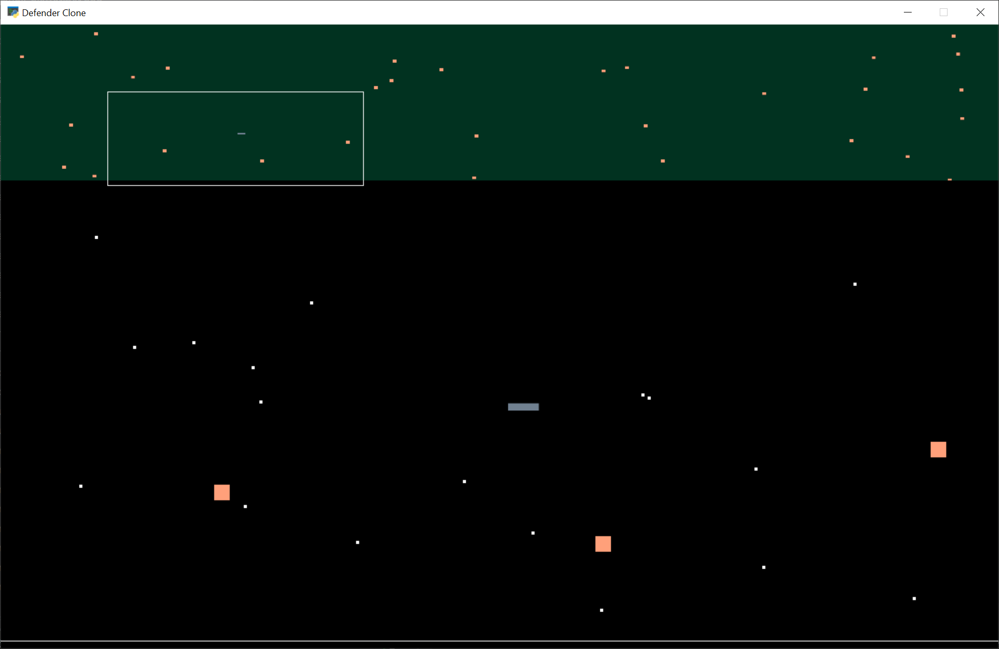

:orphan:

.. _mini_map_defender:

Mini-Map Defender
=================

.. note::

   This example runs in the Arcade 2.4 set of code. You'll need to specifically
   install the pre-release alpha or beta versions.

This example shows how to create a 'mini-map' using frame buffers.
Frame buffers allow us to draw off-screen. We can then take that image and draw
it elsewhere.

Section 1 - Define Constants
----------------------------

Lines 26-32

At the start of our code, define some constants that specify how large your
mini-map is. In this case, our mini-map is at the top of the screen, and
the main playing field is below.

Section 2 - Create Frame Buffer
-------------------------------

Lines 172-189

As our window opens up, we need to define a frame buffer that will hold our
mini-map.

* Figure out the size and position.
* Create an OpenGL shader program. This is a simple pre-defined shader that just
  passes through vertex and texture data.
* Create a color attachment, which holds what color each pixel is.
* Create a frame buffer, and tell it to use the color attachment to hold data.
* Create a rectangle that defines where we will draw the mini-map.

Section 3 - Draw to Mini-Map
----------------------------

Lines 226-238

Any time we want to draw to the frame buffer instead of the screen, there's a
``use`` method in the frame buffer. So in this case, we can do:

``self.mini_map_screen.use()``

To switch back to the screen, use the windows ``use`` method:

``self.use()``

Once we select the frame buffer, we set the viewport to encompass our entire
playing field. Then we draw the sprites we want in the mini-map. Note that this
example doesn't draw the background stars or bullets to the mini-map. The program
can easily select what should appear in the mini-map this way.

Section 4 - Draw Mini-Map to Screen
-----------------------------------

Lines 263-280

While we've drawn the mini-map, it is off-screen and we can't see it.
In this case, we render it to the pre-defined location with:

.. code-block:: python

    self.mini_map_color_attachment.use(0)
    self.mini_map_rect.render(self.program)

The rest of the code in this section calculates a rectangle on the mini-map
that outlines what the user can see on the mini-map.

.. literalinclude:: ../../arcade/examples/mini_map_defender.py
    :caption: mini_map_defender.py
    :linenos:
    :emphasize-lines: 26-32, 172-189, 226-238, 263-280