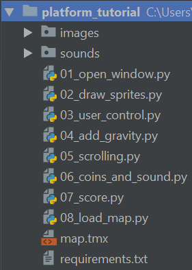
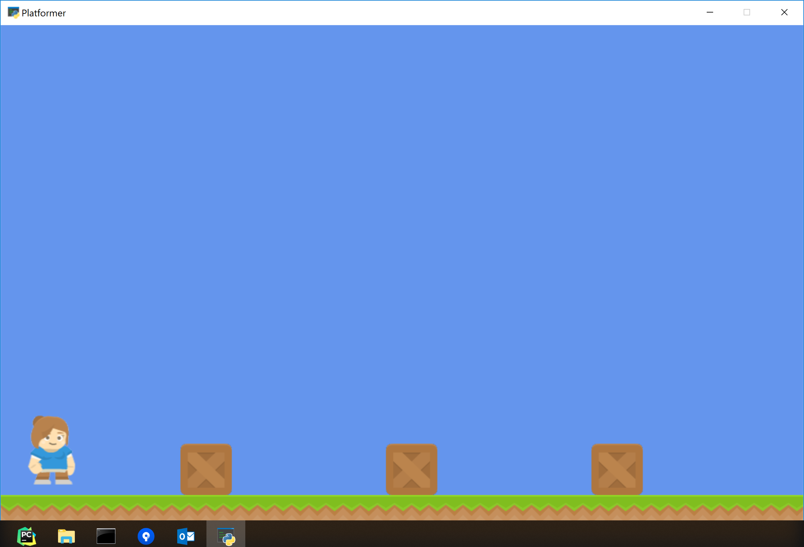
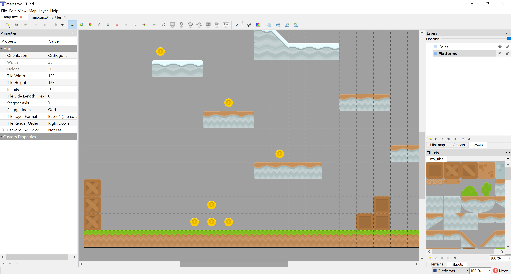
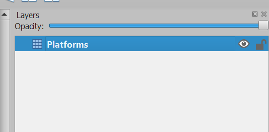

.. _platformer_tutorial:

Platformer Tutorial
===================

.. image:: intro_screen.png
    :width: 70%

(Originally presented at the 2019 PyCon in Cleveland, Ohio,
this tutorial is updated with new code.)

In this tutorial, use Python 3.6+ and the Arcade_ library to create your own 2D platformer.
Learn to work with Sprites and the `Tiled Map Editor`_ to create your own games.
Add coins, ramps, moving platforms, enemies, and more.

.. _Tiled Map Editor: https://www.mapeditor.org/
.. _2019 PyCon: https://us.pycon.org/2019/about/
.. _video of the tutorial: https://youtu.be/Djtm1DzWSvo
.. _Arcade: http://arcade.academy

The tutorial is divided into these parts:

* :ref:`platformer_part_one`
* :ref:`platformer_part_two`
* :ref:`platformer_part_three`
* :ref:`platformer_part_four`
* :ref:`platformer_part_five`
* :ref:`platformer_part_six`
* :ref:`platformer_part_seven`
* :ref:`platformer_part_eight`
* :ref:`platformer_part_nine`
* :ref:`platformer_part_ten`
* :ref:`platformer_part_eleven`

At the end of each step, if you have time explore the items listed in the "Note".

.. _platformer_part_one:

Step 1 - Install and Open a Window
----------------------------------

Installation
~~~~~~~~~~~~
* Make sure Python is installed. `Download Python here <https://www.python.org/downloads/>`_
  if you don't already have it.
* `Download this bundle with code, images, and sounds <../../_static/platform_tutorial.zip>`_.
  (Images are from `kenney.nl`_.)
  Your file structure should look like:

* Make sure the `Arcade library <https://pypi.org/project/arcade/>`_ is installed.

  * Install Arcade with ``pip install arcade`` on Windows
    or ``pip3 install arcade`` on Mac/Linux. Or install by using a venv.
  * Here are the longer, official :ref:`installation-instructions`.

.. _kenney.nl: https://kenney.nl/

Open a Window
~~~~~~~~~~~~~

The example below opens up a blank window. Set up a project and get the code
below working. (It is also in the zip file as
``01_open_window.py``.)

(It is possible to have a :ref:`resizable_window`, but there are more interesting
things we can do first. Therefore we'll stick with a set-size window for this
tutorial.)

.. literalinclude:: ../../../arcade/examples/platform_tutorial/01_open_window.py
    :caption: 01_open_window.py - Open a Window
    :linenos:

.. note::

    Once you get the code working, figure out how to:

    * Change the screen size
    * Change the title
    * Change the background color

      * Documentation for :ref:`color`
      * Documentation for :ref:`csscolor`

    * Read the documentation for the `Window <../../arcade.html#arcade.Window>`_ class.

.. _platformer_part_two:

Step 2 - Add Sprites
--------------------

Setup vs. Init
~~~~~~~~~~~~~~

In the next code example, we have both an ``__init__`` method and a
``setup`` method that we will use for setting up our game.

The ``__init__`` only sets up the variables, but doesn't create any class
instances. They just default to 0 or ``None``. The ``setup`` actually creates
the object instances, such as graphical sprites.

There's a reason they are split into two.
With a ``setup`` method split out, later
on we can easily add "restart/play again" functionality to the game.
A simple call to ``setup`` will reset everything.
We can also add additional levels and have ``setup_level_1`` and ``setup_level_2``.

Add Sprites To Game
~~~~~~~~~~~~~~~~~~~

Once we have the window up and working, the next step is to put in some
graphics.
"Sprites" are the graphical items that you can interact with, such as player characters,
coins, and walls. To work with sprites we'll use the ``Sprite`` class.

We create a sprite by creating an instance of the ``Sprite`` class:

.. code-block::

    self.player_sprite = arcade.Sprite("images/player_1/player_stand.png", CHARACTER_SCALING)

Give the Sprite class reference to the image you want it to use, and (optionally)
you can scale it up or down. If the second parameter is 0.5, and the the sprite
is 128x128, then both width and height will be scaled down 50% for a 64x64
sprite.

Next, we need to tell *where* the sprite goes. You can use the attributes
``center_x`` and ``center_y`` to position the sprite. You can also use ``top``,
``bottom``, ``left``, and ``right`` to get or set the sprites location by an
edge instead of the center. You can also use ``position`` attribute to set both the
x and y at the same time.

.. code-block::

    self.player_sprite.center_x = 64
    self.player_sprite.center_y = 120

Finally, all instances of the ``Sprite`` class need to go in a ``SpriteList``
class.

.. code-block::

    self.player_list.append(self.player_sprite)

We manage groups of sprites by the list that they are in.
In the example below there's a ``wall_list`` that will hold everything that the
player character can't walk through, and
a ``coin_list`` for sprites we can pick up to get points. There's also a ``player_list``
which holds only the player.

* Documentation for the `Sprite class <../../arcade.html#arcade.Sprite>`_
* Documentation for the `SpriteList class <../../arcade.html#arcade.SpriteList>`_

Notice that the code creates ``Sprites`` three ways:

* Creating a ``Sprite`` class, positioning it, adding it to the list
* Create a series of sprites in a loop
* Create a series of sprites using coordinates

.. literalinclude:: ../../../arcade/examples/platform_tutorial/02_draw_sprites.py
    :caption: 02_draw_sprites - Draw and Position Sprites
    :linenos:
    :emphasize-lines: 11-14, 27-34, 40-70, 78-81

.. note::

    Once the code example is up and working:

    * Adjust the code and try putting sprites in new positions.
    * Use different images for sprites (see the images folder).
    * Practice placing individually, via a loop, and by coordinates in a list.

.. _platformer_part_three:

Step 3 - Add User Control
-------------------------

Now we need to be able to get the user to move around. Here how to do it:

* Each sprite has ``center_x`` and ``center_y`` attributes. Changing these will
  change the location of the sprite. (There are also attributes for top, bottom,
  left, right, and angle that will move the sprite.)
* Each sprite has ``change_x`` and ``change_y`` variables. These can be used to
  hold the velocity that the sprite is moving with. We will adjust these
  based on what key the user hits. If the user hits the right arrow key
  we want a positive value for ``change_x``. If the value is 5, it will move
  5 pixels per frame.
* We can call ``update`` on the sprite list which will move all the sprites
  according to their velocity. We can also use a (very) simple physics engine
  called
  `PhysicsEngineSimple class <../../arcade.html#arcade.PhysicsEngineSimple>`_
  to move sprites, but keep  them from running through walls.

.. literalinclude:: ../../../arcade/examples/platform_tutorial/03_user_control.py
    :caption: 03_user_control.py - Control User By Keyboard
    :linenos:
    :emphasize-lines: 16-17, 78-79, 92-102, 104-114, 116-120

.. note::

    If you are interested in a somewhat better, and someone more complex
    method of keyboard control, see the differences between this and the
    :ref:`sprite_move_keyboard_better` example.

.. _platformer_part_four:

Step 4 - Add Gravity
--------------------

The example above works great for top-down, but what if it is a side view with
jumping? We need to add gravity.

The example below will allow the user to jump and walk on platforms.

.. literalinclude:: ../../../arcade/examples/platform_tutorial/04_add_gravity.py
    :caption: 04_add_gravity.py - Add Gravity
    :linenos:
    :emphasize-lines: 18-19, 80-83, 99-102, 110-113

.. note::

    You can change how the user jumps by changing the gravity and jump constants.
    Lower values for both will make for a more "floaty" character. Higher values make
    for a faster-paced game.

.. _platformer_part_five:

Step 5 - Add Scrolling
----------------------

We can have our window be a small viewport into a much larger world by adding
scrolling.

The viewport margins control how close you can get to the edge of the screen
before the camera starts scrolling.

.. literalinclude:: ../../../arcade/examples/platform_tutorial/05_scrolling.py
    :caption: Add Scrolling
    :linenos:
    :emphasize-lines: 21-26, 51-53, 137-177

.. note::

    Work at changing the viewport margins to something that you like.

.. _platformer_part_six:

Step 6 - Add Coins And Sound
----------------------------

.. image:: listing_06.png
    :width: 70%

The code below adds coins that we can collect. It also adds a sound to be played
when the user hits a coin, or presses the jump button.

We check to see if the user hits a coin by the ``arcade.check_for_collision_with_list``
function. Just pass the player sprite, along with a ``SpriteList`` that holds
the coins. The function returns a list of coins in contact with the player sprite.
If no coins are in contact, the list is empty.

The method ``Sprite.remove_from_sprite_lists`` will remove that sprite from all
lists, and effectively the game.

Notice that any transparent "white-space" around the image counts as the hitbox.
You can trim the space in a graphics editor, or in the second section,
we'll show you how to specify the hitbox.

.. literalinclude:: ../../../arcade/examples/platform_tutorial/06_coins_and_sound.py
    :caption: Add Coins and Sound
    :linenos:
    :emphasize-lines: 55-57, 71, 100-105, 120, 129, 149-158

.. note::

    Spend time placing the coins where you would like them.
    If you have extra time, try adding more than just coins. Also add gems or keys
    from the graphics provided.

    You could also subclass the coin sprite and add an attribute for a score
    value. Then you could have coins worth one point, and gems worth 5, 10, and
    15 points.

.. _platformer_part_seven:

Step 7 - Display The Score
--------------------------

Now that we can collect coins and get points,
we need a way to display the score on the screen.

This is a bit more complex
than just drawing the score at the same x, y location every time because
we have to "scroll" the score right with the player if we have a scrolling
screen. To do this, we just add in the ``view_bottom`` and ``view_left`` coordinates.

.. literalinclude:: ../../../arcade/examples/platform_tutorial/07_score.py
    :caption: Display The Score
    :linenos:
    :emphasize-lines: 55-56, 71-72, 129-132, 170-171

.. note::

    You might also want to add:

    * A count of how many coins are left to be collected.
    * Number of lives left.
    * A timer: :ref:`timer`
    * This example shows how to add an FPS timer: :ref:`stress_test_draw_moving`

Explore On Your Own
~~~~~~~~~~~~~~~~~~~

* Practice creating your own layout with different tiles.
* Add background images. See :ref:`sprite_collect_coins_background`
* Add moving platforms. See :ref:`sprite_moving_platforms`
* Add ramps. See :ref:`sprite_ramps`
* Change the character image based on the direction she is facing.
  See :ref:`sprite_face_left_or_right`
* Add instruction and game over screens.

.. _platformer_part_eight:

Step 8 - Use a Map Editor
-------------------------

Create a Map File
~~~~~~~~~~~~~~~~~

For this part, we'll restart with a new program. Instead of placing our tiles
by code, we'll use a map editor.

Download and install the `Tiled Map Editor`_. (Think about donating, as it is
a wonderful project.)

Open a new file with options similar to these:

* Orthogonal - This is a normal square-grid layout. It is the only version that
  Arcade supports very well at this time.
* Tile layer format - This selects how the data is stored inside the file. Any option works, but Base64
  zlib compressed is the smallest.
* Tile render order - Any of these should work. It simply specifies what order the tiles are
  added. Right-down has tiles added left->right and top->down.
* Map size - You can change this later, but this is your total grid size.
* Tile size - the size, in pixels, of your tiles. Your tiles all need to be the same size.
  Also, rendering works better if the tile size is a power of 2, such as
  16, 32, 64, 128, and 256.

.. image:: new_file.png
   :scale: 80%

Save it as ``map.tmx``.

Rename the layer "Platforms". We'll use layer names to load our data later. Eventually
you might have layers for:

* Platforms that you run into (or you can think of them as walls)
* Coins or objects to pick up
* Background objects that you don't interact with, but appear behind the player
* Foreground objects that you don't interact with, but appear in front of the player
* Insta-death blocks (like lava)
* Ladders

.. Note::

    Once you get multiple layers it is VERY easy to add items to the wrong
    layer.

Create a Tileset
~~~~~~~~~~~~~~~~

Before we can add anything to the layer we need to create a set of tiles.
This isn't as obvious or intuitive as it should be. To create a new tileset
click "New Tileset" in the window on the lower right:

.. image:: new_tileset.png
   :scale: 80%

Right now, Arcade only supports a "collection of images" for a tileset.
I find it convenient to embed the tileset in the map.

.. image:: new_tileset_02.png
   :scale: 80%

Once you create a new tile, the button to add tiles to the tileset is
hard to find. Click the wrench:

.. image:: new_tileset_03.png
   :scale: 80%

Then click the 'plus' and add in your tiles

.. image:: new_tileset_04.png
   :scale: 80%

Draw a Level
~~~~~~~~~~~~

At this point you should be able to "paint" a level. At the very least, put
in a floor and then see if you can get this program working. (Don't put
in a lot of time designing a level until you are sure you can get it to
load.)

The program below assumes there are layers created by the tiled
map editor for for "Platforms" and "Coins".

Test the Level
~~~~~~~~~~~~~~

.. literalinclude:: ../../../arcade/examples/platform_tutorial/08_load_map.py
    :caption: Load a .tmx file from Tiled Map Editor
    :linenos:
    :emphasize-lines: 88-114

.. note::

    You can set the **background color** of the map by selecting "Map...Map Properties".
    Then click on the three dots to pull up a color picker.

    You can edit the **hitbox** of a tile to make ramps
    or platforms that only cover a portion of the rectangle in the grid.

    To edit the hitbox, use the polygon tool (only) and draw a polygon around
    the item. You can hold down "CTRL" when positioning a point to get the exact
    corner of an item.

    .. image:: collision_editor.png
       :scale: 20%

.. _platformer_part_nine:

Step 9 - Multiple Levels and Other Layers
-----------------------------------------

Here's an expanded example:

* This adds foreground, background, and "Don't Touch" layers.

  * The background tiles appear behind the player
  * The foreground appears in front of the player
  * The Don't Touch layer will reset the player to the start (228-237)

* The player resets to the start if they fall off the map (217-226)
* If the player gets to the right side of the map, the program attempts to load another layer

  * Add ``level`` attribute (69-70)
  * Updated ``setup`` to load a file based on the level (76-144, specifically lines 77 and 115)
  * Added end-of-map check(245-256)

.. literalinclude:: ../../../arcade/examples/platform_tutorial/09_endgame.py
    :caption: More Advanced Example
    :linenos:
    :emphasize-lines: 69-70, 77, 114-115, 245-256

.. note::

    What else might you want to do?

    * :ref:`sprite_enemies_in_platformer`
    * :ref:`sprite_face_left_or_right`
    * Bullets (or something you can shoot)

      * :ref:`sprite_bullets`
      * :ref:`sprite_bullets_aimed`
      * :ref:`sprite_bullets_enemy_aims`

    * Add :ref:`sprite_explosion`
    * Add :ref:`sprite_move_animation`

.. _platformer_part_ten:

Step 10 - Add Ladders, Properties, and a Moving Platform
--------------------------------------------------------

.. image:: 10_ladders_and_more.png
   :scale: 40%

This example shows using:

* Ladders
* Properties to define point value of coins and flags
* Properties and an object layer to define a moving platform.

.. literalinclude:: ../../../arcade/examples/platform_tutorial/10_ladders_and_more.py
    :caption: Ladders, Animated Tiles, and Moving Platforms
    :linenos:

.. _platformer_part_eleven:

Step 11 - Add Character Animations, and Better Keyboard Control
---------------------------------------------------------------

Add character animations!

.. raw:: html

    <iframe width="560" height="315" src="https://www.youtube.com/embed/TZtXhqDOLy0" frameborder="0" allow="accelerometer; autoplay; encrypted-media; gyroscope; picture-in-picture" allowfullscreen></iframe>

.. literalinclude:: ../../../arcade/examples/platform_tutorial/11_animate_character.py
    :caption: Animate Characters
    :linenos:
