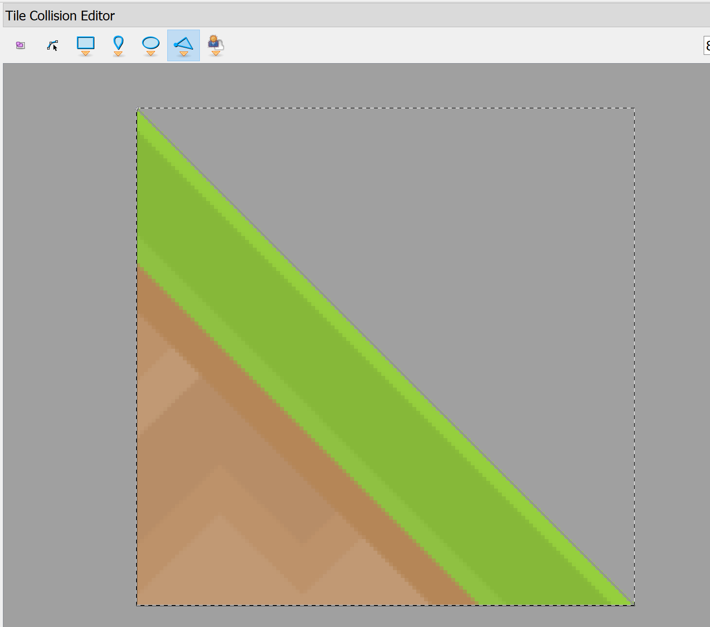

Build Your Own 2D Platformer Game
=================================

(To be presented at the `2019 PyCon`_ in Cleveland, Ohio.)

In this tutorial, use Python 3.6+ and the Arcade_ library to create your own 2D platformer.
Learn to work with Sprites and the `Tiled Map Editor`_ to create your own games.
Add coins, ramps, moving platforms, enemies, and more.

.. _Tiled Map Editor: https://www.mapeditor.org/
.. _2019 PyCon: https://us.pycon.org/2019/about/
.. _Arcade: http://arcade.academy

Part One - Create a Platformer
------------------------------

Introduction to the Arcade library - 15 minutes

45 minutes - Self-paced tutorial with different steps that cover how to:

Installation
~~~~~~~~~~~~
* Make sure Python and the Arcade library are installed.
* Make sure you are using Python 3.6 or greater.
* Install Arcade with ``pip install arcade`` on Windows
  or ``pip3 install arcade`` on Mac/Linux. Or install via a venv.
* Download bundle with images and sounds from `kenney.nl`_

.. _kenney.nl: https://kenney.nl/

Open a Window
~~~~~~~~~~~~~

This example shows how to open a window. 
Take some time and:

* Change the screen size
* Change the title
* Change the background color

  * :ref:`color`
  * :ref:`csscolor`
  
It is possible to have a :ref:`resizable_window`, but there are more interesting things
we can do in first.

.. literalinclude:: ../../../arcade/examples/platform_tutorial/01_open_window.py
    :caption: Open a Window
    :linenos:

Add Sprites To Game
~~~~~~~~~~~~~~~~~~~

Sprites are the graphic items that you can interact with, such as players,
coins, and objects the player can run into.

All sprites go into a list. We manage the sprites by the list that they are in.
There's a ``wall_list`` that will hold everything that we can't run into, and
a ``coin_list`` for sprites we can pick up to get points. There's a ``player_list``
which holds only the player.

* Documentation for the `Sprite class <../../arcade.html#arcade.Sprite>`_
* Documentation for the `SpriteList class <../../arcade.html#arcade.SpriteList>`_

It might seem logical to put code that creates the sprites in the ``__init__``
method. Instead the program below puts it in the ``setup`` method. Why? Later
on when you want to add "restart" functionality to the game, a simple call to
``setup`` will allow you to restart.

Take time to:

* Put sprites in new positions
* Use different images for sprites
* Practice placing individually, via a loop, and by coordinates in a list.

.. literalinclude:: ../../../arcade/examples/platform_tutorial/02_draw_sprites.py
    :caption: Place Sprites
    :linenos:
    :emphasize-lines: 11-14, 27-34, 39-43, 45-76, 84-87

Add User Control
~~~~~~~~~~~~~~~~

Now we need to be able to get the user to move around. There are the main
components to doing this:

* Each sprite has a ``center_x`` and ``center_y`` variable. Changing this will
  change the location of the sprite.
* Each sprite has a ``change_x`` and ``change_y`` variable. This can be used to
  hold the velocity that the sprite is moving in. We adjust this based on what
  key the user hits.
* We can call ``update`` on the sprite list which will move all the sprites
  according to their velocity. We can also use a (very) simple physics engine
  called
  `PhysicsEngineSimple class <../../arcade.html#arcade.PhysicsEngineSimple>`_
  to move sprites, but keep  them from running through walls.

If you are interested in a somewhat better, and someone more complex
method of keyboard control, see
:ref:`sprite_move_keyboard_better`.

.. literalinclude:: ../../../arcade/examples/platform_tutorial/03_user_control.py
    :caption: Control User By Keyboard
    :linenos:
    :emphasize-lines: 16-17, 84-85, 98-108, 110-120, 122-127

Add Gravity
~~~~~~~~~~~

The example above works great for top-down, but what if it is a side view with
jumping? We need to add gravity.

Modify the example by changing the gravity and jump constants.

.. literalinclude:: ../../../arcade/examples/platform_tutorial/04_add_gravity.py
    :caption: Add Gravity
    :linenos:
    :emphasize-lines: 18-19, 87-89, 105-107, 116-119

Add Scrolling
~~~~~~~~~~~~~

We can have our window be a small viewport into a much larger world by adding
scrolling.

Work at changing the viewport margins to something that you like.

.. literalinclude:: ../../../arcade/examples/platform_tutorial/05_scrolling.py
    :caption: Add Scrolling
    :linenos:
    :emphasize-lines: 21-26, 51-53, 144-184

Add Coins And Sound
~~~~~~~~~~~~~~~~~~~

Try adding more than just coins.

Notice that any transparent "white-space" around the image counts as the hitbox.
You can trim the space, or in the second section, we'll show you how to specify
the hitbox.

You could subclass the coin sprite and add an attribute for a score value. Then
you could have coins worth one point, and gems worth 5, 10, and 15 points.

.. literalinclude:: ../../../arcade/examples/platform_tutorial/06_coins_and_sound.py
    :caption: Add Coins and Sound
    :linenos:
    :emphasize-lines: 55-57, 71, 99-104, 128, 149-159

Display The Score
~~~~~~~~~~~~~~~~~

Now we need to display the score on the screen.

This is a bit more complex
than just drawing the score at the same x, y location every time because
we have to "scroll" the score right with the player if we have a scrolling
screen. To do this, we just add in the ``view_bottom`` and ``view_left`` coordinates.

.. literalinclude:: ../../../arcade/examples/platform_tutorial/07_score.py
    :caption: Display The Score
    :linenos:
    :emphasize-lines: 55-56, 71-72, 128-131, 170-171

Explore On Your Own
~~~~~~~~~~~~~~~~~~~

* Practice creating your own layout with different tiles.
* Add background images. See :ref:`sprite_collect_coins_background`
* Add moving platforms. See :ref:`sprite_moving_platforms`
* Add ramps. See :ref:`sprite_ramps`
* Change the character image based on the direction she is facing.
  See :ref:`sprite_face_left_or_right`
* Add instruction and game over screens. See :ref:`instruction_and_game_over_screens`

Part Two - Use a Map Editor
---------------------------

For this part, we'll restart with a new program. Instead of placing our tiles
by code, we'll use a map editor.

Download and install the `Tiled Map Editor`_. (Think about donating, as it is
a wonderful project.)

Open a new file with options similar to these:

* Orthogonal - This is a normal square-grid layout. It is the only version that
  Arcade supports very well at this time.
* Tile layer format - This selects how the data is stored inside the file. Any option works, but Base64
  zlib compressed is the smallest.
* Tile render order - Any of these should work. It simply specifies what order the tiles are
  added. Right-down has tiles added left->right and top->down.
* Map size - You can change this later, but this is your total grid size.
* Tile size - the size, in pixels, of your tiles. Your tiles all need to be the same size.
  Also, rendering works better if the tile size is a power of 2 (16, 32, 64, 128, 256)

.. image:: new_file.png
   :size: 80%

Save it as ``map.tmx``.

Rename the layer "Platforms". We'll use layer names to load our data later. Eventually
you might have layers for:

* Platforms that you run into (or you can think of them as walls),
* Coins or objects to pick up
* Background objects that you don't interact with
* Insta-death (like lava)
* Ladders

It is VERY easy to add items to the wrong layer.

.. image:: platforms.png
   :size: 80%

Before we can add anything to the layer we need to create a set of tiles.
This isn't as obvious or intuitive as it should be. To create a new tileset
click "New Tileset" in the window on the lower right:

.. image:: new_tileset.png
   :size: 80%

Right now, Arcade only supports a "collection of images" for a tileset.
I find it convenient to embed the tileset in the map.

.. image:: new_tileset_02.png
   :size: 80%

Once you create a new tile, the button to add tiles to the tileset is
hard to find. Click the wrench:

.. image:: new_tileset_03.png

Then click the 'plus' and add in your tiles

.. image:: new_tileset_04.png

At this point you should be able to "paint" a level. At the very least, put
in a floor and then see if you can get this program working. (Don't put
in a lot of time designing a level until you are sure you can get it to
load.)

The program below assumes there are layers created by the tiled
map editor for for "Platforms" and "Coins".

.. literalinclude:: ../../../arcade/examples/platform_tutorial/08_load_map.py
    :caption: Load a .tmx file from Tiled Map Editor
    :linenos:
    :emphasize-lines: 87-115

You can edit the collision / hitbox of a tile to make ramps
or platforms that only 

* Add a sudden death layer (like lava)
* Add enemies

Explore On Your Own
~~~~~~~~~~~~~~~~~~~

* Multiple levels
* Insta-death layer
* Make ramps

Part Three - Spruce It Up
-------------------------

15 minutes - Talk about additional items that could be added to the game

45 minutes - Self paced section where students can:

* Continue their prior work or
* Add explosions
* Add animations
* Add bullets (or something you can shoot)
* Add multiple levels

